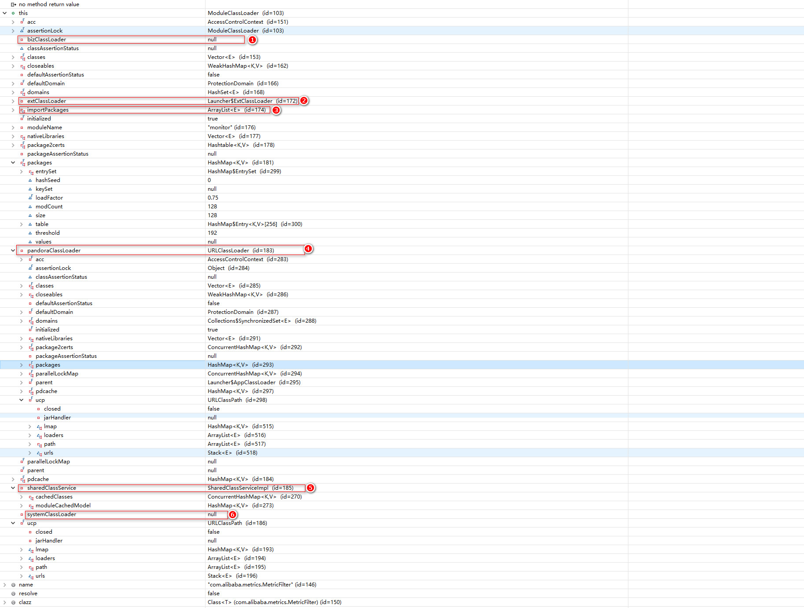

### 前言

最近从阿里云主机上拿到了alitomcat的二进制文件，网上查阅到的资料介绍是ali对开源的tomcat做了一些定制化的开发，特别是Pandora隔离容器，具体介绍可以参考这篇博客 **[中间件技术及双十一实践·应用服务器篇](http://jm.taobao.org/%2F2014%2F03%2F07%2F3495%2F)** 。但是并没有开源，本篇主要简单介绍下如何在本机启动起来以及分析下它的ClassLoader层次

### 启动

解压后查看目录如下，可以看到，对比tomcat的目录多了tools、deploy目录

```shell
root@XXX:/mnt/d/BaiduNetdiskDownload/taobao-tomcat-production-7.0.59.3# ll
total 88
drwxrwxrwx 0 root root   512 Jun  5 15:16 ./
drwxrwxrwx 0 root root   512 Jun 11 21:24 ../
drwxrwxrwx 0 root root   512 Jun  5 15:16 bin/
-rwxrwxrwx 1 root root     6 Jun  5 15:16 catalina.pid*
drwxrwxrwx 0 root root   512 Jun  5 14:16 conf/
drwxrwxrwx 0 root root   512 Jun  5 14:14 deploy/
drwxrwxrwx 0 root root   512 Mar  9 11:25 lib/
-rwxrwxrwx 1 root root 56846 Mar  5 23:00 LICENSE*
drwxrwxrwx 0 root root   512 Jun  5 14:16 logs/
-rwxrwxrwx 1 root root  1239 Mar  5 23:00 NOTICE*
-rwxrwxrwx 1 root root  9021 Mar  5 23:00 RELEASE-NOTES*
-rwxrwxrwx 1 root root 16242 Mar  5 23:00 RUNNING.txt*
drwxrwxrwx 0 root root   512 Mar  9 11:25 temp/
drwxrwxrwx 0 root root   512 Mar  9 11:25 tools/
drwxrwxrwx 0 root root   512 Mar  5 23:00 webapps/
drwxrwxrwx 0 root root   512 Jun  5 14:16 work/
```
<!-- more -->
我们尝试用启动tomcat的方式启动一下这个tomcat：

```shell
root@XXX:/mnt/d/BaiduNetdiskDownload/taobao-tomcat-production-7.0.59.3/bin# ./startup.sh
Cannot find /home/admin/taobao-tomcat-production-7.0.59.3/bin/setclasspath.sh
This file is needed to run this program
```

发现并不能启动成功，很明显路径不对（因为从阿里云运行机器上下载下来的），清理logs，然后使用如下脚本查找和替换成正确的路径，然后再次启动：

```shell
# 查找
root@XXX:/mnt/d/BaiduNetdiskDownload/taobao-tomcat-production-7.0.59.3# find -name '*.*' |xargs grep '/home/admin'
grep: .: Is a directory
./bin/alitomcat-setenv.sh:#PANDORA_TMP_PATH="/home/admin/pandora2"
./bin/setenv.sh:export CATALINA_HOME=/home/admin/taobao-tomcat-production-7.0.59.3
./bin/setenv.sh:export CATALINA_BASE=/home/admin/taobao-tomcat-production-7.0.59.3
./bin/setenv.sh:export CATALINA_PID=/home/admin/taobao-tomcat-production-7.0.59.3/catalina.pid
./bin/setenv.sh:export CATALINA_OPTS="-Dproject.name=17cbc5e0-6cac-4bf2-a0fb-a2cac8f667df  -Dtenant.id=f2a23865-ded0-4e5d-ad5a-5eee9d3bfdd5  -Dpandora.accept.foreign.ip=false  -Dlog4j.defaultInitOverride=false  -Dspas.identity=/home/admin/.spas_key/default  -Daddress.server.domain=addr-hz-internal.edas.aliyun.com -Daddress.server.port=8080  -Dconfigserver.client.port=8000  -DJM.LOG.RETAIN.COUNT=7 -DJM.LOG.FILE.SIZE=300MB  -Dtomcat.monitor.http.binding.host=172.16.105.111  "
./conf/Catalina/localhost/ROOT.xml:<Context docBase='/home/admin/app/17cbc5e0-6cac-4bf2-a0fb-a2cac8f667df/hello-edas'/>
grep: ./deploy/taobao-hsf.sar: Is a directory

# 替换
root@XXX:/mnt/d/BaiduNetdiskDownload/taobao-tomcat-production-7.0.59.3# sed  -i 's/\/home\/admin/\/mnt\/d\/BaiduNetdiskDownload/g' bin/*
root@XXX:/mnt/d/BaiduNetdiskDownload/taobao-tomcat-production-7.0.59.3# sed  -i 's/\/home\/admin/\/mnt\/d\/BaiduNetdiskDownload/g' ./conf/Catalina/localhost/ROOT.xml
注意：还需要将-Dtomcat.monitor.http.binding.host=172.16.105.111替换为本机的ip地址或者直接删除这个属性，否则monitor监控服务无法开启
```

又会出现如下异常信息，原来是应用路径不对，ROOT.xml中随便改为webapps下的一个应用即可，再次启动：

```shell
# 异常信息
SEVERE: Error starting static Resources
java.lang.IllegalArgumentException: Document base /mnt/d/BaiduNetdiskDownload/app/17cbc5e0-6cac-4bf2-a0fb-a2cac8f667df/hello-edas does not exist or is not a readable directory
SEVERE: Error deploying configuration descriptor /mnt/d/BaiduNetdiskDownload/taobao-tomcat-production-7.0.59.3/conf/Catalina/localhost/ROOT.xml
# 修改
<Context docBase='/mnt/d/BaiduNetdiskDownload/taobao-tomcat-production-7.0.59.3/webapps/examples'/>
```

日志文件中启动信息如下：

```shell
*******************HSF PORT:12200 **************
*************Pandora QOS PORT:12201 **************
*************Tomcat Monitor Port:8006 **************
*******************Sentinel PORT:8719 **************
log4j:WARN No appenders could be found for logger (io.netty.util.internal.logging.InternalLoggerFactory).
log4j:WARN Please initialize the log4j system properly.
log4j:WARN See http://logging.apache.org/log4j/1.2/faq.html#noconfig for more info.


	****************************************************************************************
	**                                                                                    **
	**	                                 Pandora Container                                **
	**                                                                                    **
	**	Pandora Host:     192.168.1.110                                                   **
	**	Pandora Version:  2.1.4                                                           **
	**	SAR Version:      edas.sar.V3.4.4                                                 **
	**	Package Time:     2018-05-17 08:29:15                                             **
	**                                                                                    **
	**	Plug-in Modules: 18                                                               **
	**                                                                                    **
	**	   metrics .......................................... 1.7.0                       **
	**	   edas-assist ...................................... 2.0                         **
	**	   pandora-qos-service .............................. edas215                     **
	**	   pandolet ......................................... 1.0.0                       **
	**	   spas-sdk-client .................................. 1.2.7                       **
	**	   tddl-driver ...................................... 1.0.5-SNAPSHOT              **
	**	   eagleeye-core .................................... 1.7.4.1-SNAPSHOT            **
	**	   vipserver-client ................................. 4.6.8-SNAPSHOT              **
	**	   diamond-client ................................... 3.8.8                       **
	**	   configcenter-client .............................. 1.0.3                       **
	**	   spas-sdk-service ................................. 1.2.7                       **
	**	   config-client .................................... 1.9.4                       **
	**	   unitrouter ....................................... 1.0.11                      **
	**	   monitor .......................................... 1.2.3-SNAPSHOT              **
	**	   sentinel-plugin .................................. 2.12.11                     **
	**	   ons-client ....................................... 1.7.1-EagleEye-SNAPSHOT     **
	**	   hsf .............................................. 2.2.5.7                     **
	**	   pandora-framework ................................ 2.0.8                       **
	**                                                                                    **
	**	[WARNING] All these plug-in modules will override maven pom.xml dependencies.     **
	**	More: http://gitlab.alibaba-inc.com/middleware-container/pandora/wikis/home       **
	**                                                                                    **
	****************************************************************************************
java.lang.RuntimeException: fail to get diamond-server serverlist! env:default, not connnect url:http://addr-hz-internal.edas.aliyun.com:8080/diamond-server/diamond这条异常信息可以忽略，因为我们没有edas配置中心，阿里云上有edas-config-center简易版，可以下载下来使用下，配置好后就不会有这个异常，这个主要的作用就是开发服务提供者和消费者的注册中心

# 访问应用正常
curl 'http://localhost:65000'
# http方式访问tomcat-monitor模块：
root@XXX:/mnt/d/BaiduNetdiskDownload/taobao-tomcat-production-7.0.59.3/bin# curl 'http://localhost:8006/'
----------------------------------------------------------------------
|                    Hi, This is Tomcat Monitor.                     |
|    Tomcat Monitor uses WADL to describe services it can offer:     |
----------------------------------------------------------------------
|(1) send 'GET' request to http://localhost:8006/application.wadl    |
| for all deployed resources.                                        |
----------------------------------------------------------------------
|(2) send 'OPTIONS' request to each individual resource              |
|for example: curl -X OPTIONS -v http://localhost:8006/memory/info   |
----------------------------------------------------------------------
# 查看所有的监控资源
http://localhost:8006/application.wadl
还有一些功能可以自己去探索
```

### ClassLoader分析

#### examples应用

首先通过Greys的sc指令来查看examples中SessionListener类的ClassLoader层次：

```shell
ga?>sc -d *.SessionListener
+----------------+-------------------------------------------------------------------------------+
|     class-info | listeners.SessionListener                                                     |
+----------------+-------------------------------------------------------------------------------+
|    code-source | /mnt/d/BaiduNetdiskDownload/taobao-tomcat-production-7.0.59.3/webapps/example |
|                | s/WEB-INF/classes/                                                            |
+----------------+-------------------------------------------------------------------------------+
|   class-loader | org.apache.catalina.loader.ParallelWebappClassLoader                          |
|                |   `-java.net.URLClassLoader@3a9c7650                                          |
|                |     `-sun.misc.Launcher$AppClassLoader@3ad6a0e0                               |
|                |       `-sun.misc.Launcher$ExtClassLoader@60dbf04d                             |
+----------------+-------------------------------------------------------------------------------+
# org.apache.catalina.loader.ParallelWebappClassLoader: 应用的类加载器，继承自WebappClassLoaderBase，用于加载应用
# java.net.URLClassLoader@3a9c7650：commonClassloader主要加载tomcat下lib下的jar
对于应用来说，和开源的tomcat没有什么区别
```

#### Pandora隔离容器

我们关注的重点来了，Pandora的隔离容器，查看deploy\taobao-hsf.sar\plugins目录，会发现有很多的插件，每个插件有单独的lib、conf，我们找monitor这个来看看，通过Greys的sc指令查看monitor中ThreadBusyInfoResource类的ClassLoader层次：

```shell
ga?>sc -d *.ThreadBusyInfoResource
+----------------+-------------------------------------------------------------------------------+
|     class-info | com.taobao.tomcat.monitor.rest.thread.ThreadBusyInfoResource                  |
+----------------+-------------------------------------------------------------------------------+
|    code-source | file:/mnt/d/BaiduNetdiskDownload/taobao-tomcat-production-7.0.59.3/deploy/    |
|                | taobao-hsf.sar/plugins/monitor/lib/monitor-1.2.3-SNAPSHOT.jar!/               |
+----------------+-------------------------------------------------------------------------------+
|   class-loader | monitor's ModuleClassLoader                                                   |
+----------------+-------------------------------------------------------------------------------+
```

只发现了一个ModuleClassLoader， parent根本没有，这个是不对的，因为你总得加载jdk的类吧，除非ModuleClassLoader里loadClass做了手脚。我们sc一下这个类，可以猜测 taobao-hsf.sar就是整个pandora的框架，而且重新构造了一个classloader加载其lib下的jar：

```shell
ga?>sc -d *.ModuleClassLoader
+----------------+-------------------------------------------------------------------------------+
|     class-info | com.taobao.pandora.service.loader.ModuleClassLoader                           |
+----------------+-------------------------------------------------------------------------------+
|    code-source | /mnt/d/BaiduNetdiskDownload/taobao-tomcat-production-7.0.59.3/deploy/         |
|                | taobao-hsf.sar/lib/pandora.container-2.1.4.jar                                |
+----------------+-------------------------------------------------------------------------------+
|   class-loader | `-java.net.URLClassLoader@3dee6ab9                                            |
|                |    `-sun.misc.Launcher$AppClassLoader@3ad6a0e0                                |
|                |      `-sun.misc.Launcher$ExtClassLoader@60dbf04d                              |
+----------------+-------------------------------------------------------------------------------+
```

但是ModuleClassLoader的疑问依然存在，最后只有反编译调试和看代码了，看下这个classloader的属性，重要属性已经标识出来，跟踪他们是如何设置进来的可以直接打断点调试，这里就不讲解过程了：



对于插件plugin的加载，则是用ModuleClassloader,parent=null,pandoraClassloader就是上面的Pandora容器的classloader—java.net.URLClassLoader@3dee6ab9 ，ModuleClassloader详细定义了plugin的加载过程，这样来做到各个插件的隔离以及与tomcat的隔离，直接定位到loadClass方法，代码和分析如下：

```java
protected synchronized Class<?> loadClass(String name, boolean resolve) throws ClassNotFoundException {
    if (log.isDebugEnabled()) {
        log.debug("Module-Loader", "{} wants to load: {}", new Object[]{this.moduleName, name});
    }

    if (StringUtils.isEmpty(name)) {
        throw new PandoraLoaderException("class name is blank.");
    }
    // 从已经加载的类中加载
    Class clazz = resolveLoaded(name);
    if (clazz != null) {
        debugClassLoaded(clazz, "resolveLoaded", name);
        return clazz;
    }
    // 从extClassLoader中加载
    clazz = resolveBootstrap(name);
    if (clazz != null) {
        debugClassLoaded(clazz, "resolveBootstrap", name);
        return clazz;
    }
    // 从pandoraClassLoader中加载
    clazz = resolvePandoraClass(name);
    if (clazz != null) {
        debugClassLoaded(clazz, "resolvePandoraClass", name);
        return clazz;
    }
    // 从sharedClassService中加载，这个类中保存了其他plugin中加载的类—各个插件下conf/export.index中的类、export.properties中jar、package、class中的类
    clazz = resolveShared(name);
    if (clazz != null) {
        debugClassLoaded(clazz, "resolveShared", name);
        return clazz;
    }
    // 从各个插件下conf/import.peroperties的import.packages中加载，使用bizclassloader（如果usebizclassloader=true），实际为ParallelWebappClassLoader
    clazz = resolveImport(name);
    if (clazz != null) {
        debugClassLoaded(clazz, "resolveImport", name);
        return clazz;
    }
    // 从ucp中加载：插件下lib   
    clazz = resolveClassPath(name);
    if (clazz != null) {
        debugClassLoaded(clazz, "resolveClassPath", name);
        return clazz;
    }

    if (name.startsWith("groovy.runtime.metaclass")) {
        throw new PandoraLoaderException("[Module-Loader] " + this.moduleName + ": fail to load groovy class "
                                         + name + " due to HSF's limitation.");
    }
    // 从外部加载，使用bizclassloader（如果usebizclassloader=true）实际为ParallelWebappClassLoader
    clazz = resolveExternal(name);
    if (clazz != null) {
        debugClassLoaded(clazz, "resolveExternal", name);
        return clazz;
    }
    // 从SystemClassLoader中加载(如果import.peroperties存在useSystemClassLoader=true)
    clazz = resolveSystemClassLoader(name);
    if (clazz != null) {
        debugClassLoaded(clazz, "resolveSystemClassLoader", name);
        if (resolve) {
            if (log.isDebugEnabled()) {
                log.debug("Module-Loader", "{} resolve class: {}", new Object[]{this.moduleName, name});
            }
            resolveClass(clazz);
        }
        return clazz;
    }
    if (log.isDebugEnabled()) {
        log.debug("Module-Loader", "{} can not load class: {}", new Object[]{this.moduleName, name});
    }
    throw new PandoraLoaderException(
        "[Module-Loader] " + this.moduleName + ": can not load class {" + name + "} after all phase.");
}

Class<?> resolveBootstrap(String name) throws PandoraLoaderException {
    if (this.extClassLoader != null) {
        debugClassLoading("resolveBootstrap", name);
        try {
            return this.extClassLoader.loadClass(name);
        } catch (ClassNotFoundException localClassNotFoundException) {
        } catch (Throwable t) {
            throwClassLoadError(name, "resolveBootstrap", t);
        }
    }
    return null;
}

Class<?> resolveClassPath(String name) throws PandoraLoaderException {
    debugClassLoading("resolveClassPath", name);
    try {
        return findClass(name);
    } catch (ClassNotFoundException localClassNotFoundException) {
    } catch (Throwable t) {
        throwClassLoadError(name, "resolveClassPath", t);
    }
    return null;
}

Class<?> resolveExternal(String name) throws PandoraLoaderException {
    if (this.bizClassLoader != null) {
        debugClassLoading("resolveExternal", name);
        try {
            return this.bizClassLoader.loadClass(name);
        } catch (ClassNotFoundException localClassNotFoundException) {
        } catch (Throwable t) {
            throwClassLoadError(name, "resolveExternal", t);
        }
    }
    return null;
}

Class<?> resolveImport(String name) throws PandoraLoaderException {
    if ((this.importPackages != null) && (this.bizClassLoader != null)) {
        debugClassLoading("resolveImport", name);
        for (String packageName : this.importPackages) {
            if ((StringUtils.isNotEmpty(packageName)) && (name.startsWith(packageName))) {
                try {
                    return this.bizClassLoader.loadClass(name);
                } catch (ClassNotFoundException localClassNotFoundException) {
                } catch (Throwable t) {
                    throwClassLoadError(name, "resolveImport", t);
                }
            }
        }
    }
    return null;
}

Class<?> resolveLoaded(String name) throws PandoraLoaderException {
    debugClassLoading("resolveLoaded", name);
    try {
        return findLoadedClass(name);
    } catch (Throwable t) {
        throwClassLoadError(name, "resolveLoaded", t);
    }
    return null;
}

Class<?> resolvePandoraClass(String name) throws PandoraLoaderException {
    if ((this.pandoraClassLoader != null) && (name.startsWith("com.taobao.pandora"))) {
        debugClassLoading("resolvePandoraClass", name);
        try {
            return this.pandoraClassLoader.loadClass(name);
        } catch (ClassNotFoundException localClassNotFoundException) {
        } catch (Throwable t) {
            throwClassLoadError(name, "resolvePandoraClass", t);
        }
    }
    return null;
}

Class<?> resolveShared(String name) throws PandoraLoaderException {
    debugClassLoading("resolveShared", name);
    return this.sharedClassService.getClass(name);
}

Class<?> resolveSystemClassLoader(String name) throws PandoraLoaderException {
    if (this.systemClassLoader != null) {
        debugClassLoading("resolveSystemClassLoader", name);
        try {
            return this.systemClassLoader.loadClass(name);
        } catch (ClassNotFoundException localClassNotFoundException) {
        } catch (Throwable t) {
            throwClassLoadError(name, "resolveSystemClassLoader", t);
        }
    }
    return null;
}
```

