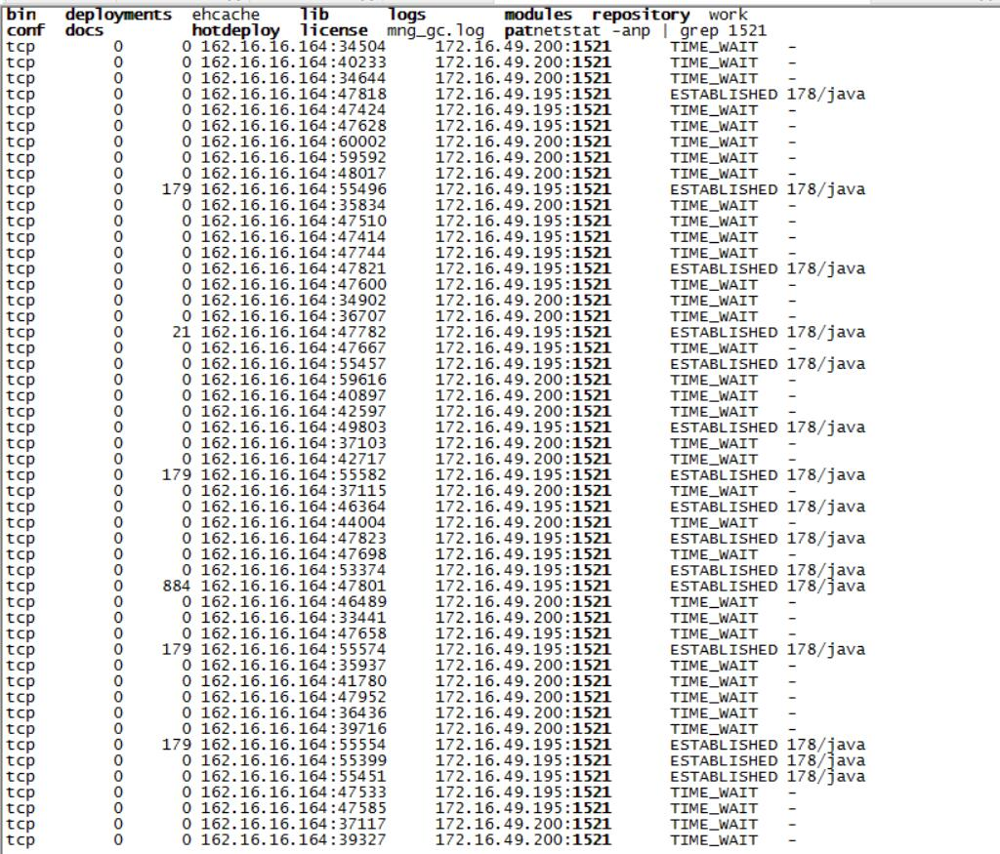
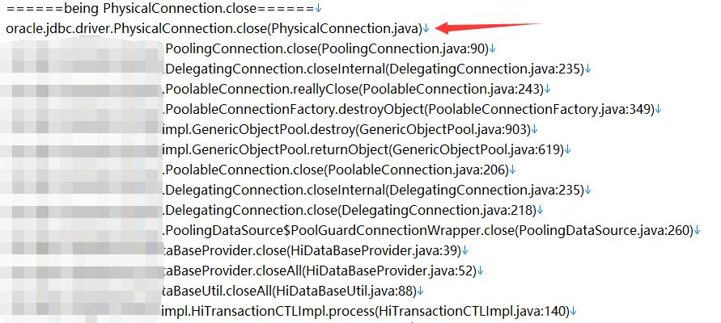

### 前言
- 这几天技术支持人员在客户现场进行应用迁移，从weblogic到公司研发的应用服务器，进行压力测试时，出现大量数据库连接TIME_WAIT问题，在weblogic上未出现，和大佬们一起解决了，记录下。


具体环境如下：

- Linux 64位
- Java JDK 1.7以上
- oracle驱动ojdbc6.jar
<!--more-->

### 检查配置
首先检查了现场测试环境的JdbcResource配置文件，重点关注的是初始化连接数、最小空闲连接数、最大连接数、连接超时时间，依次设置为8，0，200，10800000，分析这份配置，目前无法定位为什么会关闭数据库连接。

### 追踪代码
既然配置没有错误，但是实际又有大量TIME_WAIT，那么如何确定一定是数据库连接关闭了？很简单，打印出关闭连接的调用栈信息即可，至此Btrace工具闪亮登场。通过反编译ojdbc6.jar,找到了真正关闭jdbc连接的位置oracle.jdbc.driver.PhysicalConnection.close(),可以编写btrace脚本了，
如下：
```
import com.sun.btrace.BTraceUtils;
import com.sun.btrace.annotations.BTrace;
import com.sun.btrace.annotations.OnMethod;
import com.sun.btrace.annotations.Self;

@BTrace
public class Trace_BES95_JDBC_CLOSE_CON {

    @OnMethod(clazz = "oracle.jdbc.driver.PhysicalConnection", method = "close")
	public static void close(@Self Object obj) {
		BTraceUtils.println("======being PhysicalConnection.close======");
		BTraceUtils.jstack(); //打印调用栈
		BTraceUtils.println("======end PhysicalConnection.close======");
	}

}

```
用这个脚本跟踪到的调用栈信息如下：

可以清楚的看到确实是我们的代码将数据库连接给关闭了。下面就要去分析我们的代码逻辑，从调用栈信息中我们可以看到一个GenericObjectPool.returnObject(GenericObjectPool.java:619)，想到jdbc连接池的实现就可以想到，这个是归还连接到池中的逻辑，我们找到这段代码：
```
    int maxIdleSave = getMaxIdle();
    if ((isClosed()) || ((maxIdleSave > -1) && (maxIdleSave <= this.idleObjects.size()))) {
      try {
        destroy(p); //真正关闭连接
      } catch (Exception e) {
        swallowException(e);
      }
    } else {
      if (getLifo())
        this.idleObjects.addFirst(p);
      else {
        this.idleObjects.addLast(p);
      }
      if (isClosed())
      {
        clear();
      }
    }
```
当满足if条件时，执行关闭操作，但是if条件中出现了一个maxIdle（最大空闲连接数）,这个在前面的配置中一直没有出现，这个if的翻译就是当连接池已经关闭或者maxIdle（默认8）大于-1并且小于等于空闲连接个数时，关闭当前连接。前面的配置中最大的连接数为200，在并发测试环境下，idleObjects.size()肯定会大于maxIdle，因此当连接池连接数超过8之后，很有可能新建的连接用完就直接关闭，不会回到池中，也就解释了出现大量TIME_WAIT的问题。解决方案就是将maxIdle配置河最大连接数一样即可。