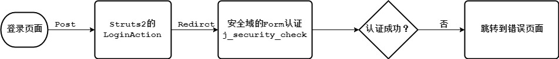
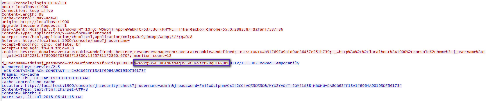
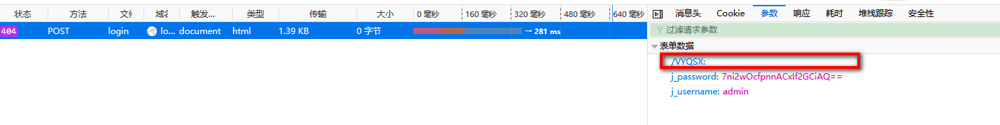
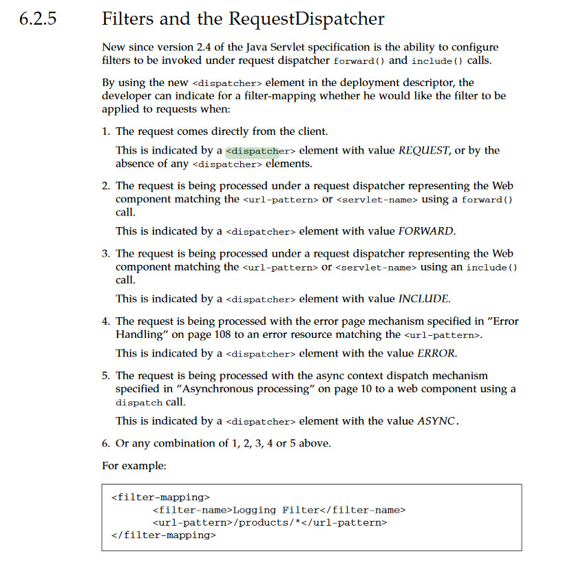

### 前言

最近bes8.2遇到了问题，场景如下：

>1、domain的1900端口开启https
>
>2、进入到控制台登录页面之后使用错误的用户名和密码登录，提示用户名和密码错误
>
>3、再输入正确的用户名和密码继续登录仍然失败，且会返回来404页面，url为接受登录请求的/login
>
>4、同样的步骤，在http模式下，步骤3是可以登录成功的

### 控制台登录方案

控制台登录的基本流程如下：



<!-- more -->

### 问题定位分析

#### 404从何而来？

这个是最直接的问题，步骤3为什么一个明显存在的请求路径会出现404？通过greys我们来定位代码，脚本如下

```shell
ga?>stack *.*Response setStatus 'params[0] == 404'
org.apache.coyote.Response.setStatus(Response.java:-1)
at org.apache.coyote.tomcat5.CoyoteResponse.sendError(CoyoteResponse.java:1275)
at org.apache.coyote.tomcat5.CoyoteResponse.sendError(CoyoteResponse.java:1243)
at org.apache.coyote.tomcat5.CoyoteResponseFacade.sendError(CoyoteResponseFacade.java:412)
at org.apache.catalina.servlets.DefaultServlet.serveResource(DefaultServlet.java:716)
at org.apache.catalina.servlets.DefaultServlet.doGet(DefaultServlet.java:360)
at org.apache.catalina.servlets.DefaultServlet.doPost(DefaultServlet.java:396)
at javax.servlet.http.HttpServlet.service(HttpServlet.java:712)
at javax.servlet.http.HttpServlet.service(HttpServlet.java:805)
```

这个还是不能看出什么，但是之所以会404，是由于DeafultServlet执行时，处理静态资源无法找到，那继续追踪究竟请求什么资源？

```shell
ga?>watch -f *.DefaultServlet serveResource params[0] -x 1
Press Ctrl+D to abort.
Affect(class-cnt:1 , method-cnt:1) cost in 101 ms.
@ApplicationHttpRequest[
    sm=@StringManager[org.apache.catalina.util.StringManager@3e0a52d3],
    requestedSessionVersion=null,
    isSessionVersioningSupported=@Boolean[false],
 context=@WebModule[StandardEngine[com.bes.appserv].StandardHost[__dmsVS].StandardContext[/console]],
    contextPath=@String[/console],
    crossContext=@Boolean[false],
    dispatcherType=@Integer[1],
    info=@String[org.apache.catalina.core.ApplicationHttpRequest/1.0],
    parameters=null,
    parsedParams=@Boolean[false],
    pathInfo=null,
    queryParamString=null,
    queryString=null,
    requestDispatcherPath=@String[/WEB-INF/frame/errors/403.ftl],
    requestURI=@String[/console/WEB-INF/frame/errors/403.ftl],
    servletPath=@String[/WEB-INF/frame/errors/403.ftl],
    session=null,
    specialAttributes=@HashMap[isTop=false;size=5],
    isIncludeDispatch=@Boolean[false],
]
@ApplicationHttpRequest[
    sm=@StringManager[org.apache.catalina.util.StringManager@3e0a52d3],
    requestedSessionVersion=null,
    isSessionVersioningSupported=@Boolean[false],
    context=@WebModule[StandardEngine[com.bes.appserv].StandardHost[__dmsVS].StandardContext[/console]],
    contextPath=@String[/console],
    crossContext=@Boolean[false],
    dispatcherType=@Integer[1],
    info=@String[org.apache.catalina.core.ApplicationHttpRequest/1.0],
    parameters=null,
    parsedParams=@Boolean[false],
    pathInfo=null,
    queryParamString=null,
    queryString=null,
    requestDispatcherPath=@String[/WEB-INF/frame/errors/404.ftl],
    requestURI=@String[/console/WEB-INF/frame/errors/404.ftl],
    servletPath=@String[/WEB-INF/frame/errors/404.ftl],
    session=null,
    specialAttributes=@HashMap[isTop=false;size=5],
    isIncludeDispatch=@Boolean[false],
]
```

可以看到，这里先找了403对应的页面，然后找了404对应的页面，查看web.xml确实有这段配置，但是实际上这个页面路径配置错了，应该在/WEB-INF/system/errors/下，因此逻辑应该时这样：有一段逻辑设置了403，容器处理时找对应的静态资源，发现403.ftl也找不到，因此又设置404，404.ftl也找不到，最后返回到console

```xml
	<!-- error pages -->
	<error-page>
		<exception-type>java.lang.Throwable</exception-type>
		<location>/WEB-INF/frame/errors/500.ftl</location>
	</error-page>
	<error-page>
		<error-code>500</error-code>
		<location>/WEB-INF/frame/errors/500.ftl</location>
	</error-page>
	<error-page>
		<error-code>404</error-code>
		<location>/WEB-INF/frame/errors/404.ftl</location>
	</error-page>
	<error-page>
		<error-code>403</error-code>
		<location>/WEB-INF/frame/errors/403.ftl</location>
	</error-page>
```

ApplicationDispatcher代码位置：

```java
  public void forward(ServletRequest request, ServletResponse response)
    throws ServletException, IOException
  {
    if (Globals.IS_SECURITY_ENABLED) {
      try {
        PrivilegedForward dp = new PrivilegedForward(request, response);
        AccessController.doPrivileged(dp);

        ApplicationDispatcherForward.commit((HttpServletRequest)request, (HttpServletResponse)response, this.context, this.wrapper);
      }
      catch (PrivilegedActionException pe)
      {
        Exception e = pe.getException();
        if (e instanceof ServletException)
          throw ((ServletException)e);
        throw ((IOException)e);
      }
    } else {
      //根据403状态路由到403页面，不存在则设置404状态
      doForward(request, response);
	 //重新根据404状态路由到404页面，不存在则设置404状态
      ApplicationDispatcherForward.commit((HttpServletRequest)request, (HttpServletResponse)response, this.context, this.wrapper);
    }
  }
```

那么现在的问题就是哪儿设置 了403？

#### CSRF过滤器为何设置403状态？

继续使用greys定位，发现问题在CSRF的过滤器上

```shell
ga?>stack *.*Response setStatus 'params[0] == 403'
Press Ctrl+D to abort.
Affect(class-cnt:5 , method-cnt:9) cost in 330 ms.
thread_name="httpSSLWorkerThread-1900-6" thread_id=0x4c;is_daemon=true;priority=10;
@org.apache.coyote.Response.setStatus(Response.java:-1)
at org.apache.coyote.tomcat5.CoyoteResponse.sendError(CoyoteResponse.java:1275)
at org.apache.coyote.tomcat5.CoyoteResponse.sendError(CoyoteResponse.java:1243)
at org.apache.coyote.tomcat5.CoyoteResponseFacade.sendError(CoyoteResponseFacade.java:412)
at org.apache.coyote.http11.filters.CsrfPreventionFilter.doFilter(CsrfPreventionFilter.java:195)
at org.apache.catalina.core.ApplicationFilterChain.internalDoFilter(ApplicationFilterChain.java:204)
at org.apache.catalina.core.ApplicationFilterChain.doFilter(ApplicationFilterChain.java:172)
at org.apache.coyote.http11.filters.XssPreventionFilter.doFilter(XssPreventionFilter.java:54)
at org.apache.catalina.core.ApplicationFilterChain.internalDoFilter(ApplicationFilterChain.java:204)
at org.apache.catalina.core.ApplicationFilterChain.doFilter(ApplicationFilterChain.java:172)
```

查阅CSRF的资料对照代码，我们知道如果请求路径没有在entryPoints中，同时session存在，但不包含对应的Nonce，就会直接返回403(SC_FORBIDDEN)。 那么可以分析，上面步骤3输入正确的密码发送的登录请求中并没包含Nonce信息或者Nonce信息不对，这时我们需要验证我们的分析是否正确。

http模式下步骤3的数据包：



http模式下步骤3的数据包：



可以明显看到确实https模式下没有Nonce信息，证实了我们的分析，但是为什么没有呢？我们在登录页面找到了这么一段代码，发现了踪迹，原来是页面生成时会将Nonce信息返回到页面中，最后随着请求一起提交，当然为了安全数据经过encode了，这里比较明显的就是bes.\$besCsrfNonce$这个值。

```javascript
var name=document.getElementById('j_username');
var password=document.getElementById('j_password');
var certcode = document.getElementById('j_certcode');
var error=document.getElementById('login_error');
if(name.value.trim() == '' ){
  var h='<div class=\\'ActionErrorsImg\\'><div class=\\'ActionErrors\\'>' ;
  h+='<nodr>${bundle('username.not.allow.null')}</nodr></div></div>';
  error.innerHTML=h;
  name.focus();
  return false;
}else if(password.value == ''){
  var h='<div class=\\'ActionErrorsImg\\'><div class=\\'ActionErrors\\'>' ;
  h+='<nodr>${bundle('password.not.allow.null')}</nodr></div></div>';
  error.innerHTML=h;
  password.focus();
  return false;
} else if(certcode && certcode.value.trim() ==''){
 var h='<div class=\\'ActionErrorsImg\\'><div class=\\'ActionErrors\\'>' ;
 h+='<nodr>${bundle('certcode.not.allow.null')}</nodr></div></div>';
 error.innerHTML=h;
 certcode.focus();
 return false;
}
password.value = encrypt(password.value);
var id = bes.encode('/login');
var inputNode=$(id);
if(inputNode == null) {
    inputNode = dojo.create('input',{
                    id:id,
                    type:'hidden',
                    name:id
                  },
                  $('loginFrom')
                );
}
inputNode.value = bes.encode(bes.$besCsrfNonce$);
return true;
```

后端代码对应如下：

```java
public String getBesCsrfNonce() {
    HttpSession session = getServletRequest().getSession(false);
    if ((session == null) || (session.getAttribute("org.apache.catalina.filters.CSRF_NONCE") == null)) {
      return null;
    }
    String requestUrl = "/";
    String encodeUrl = getServletResponse().encodeURL(requestUrl);
    int beginIndex = encodeUrl.indexOf("=");
    String besCsrfNonce = null;
    if (beginIndex > 0) {
      besCsrfNonce = encodeUrl.substring(beginIndex + 1);
    }
    return besCsrfNonce;
 }
```

那么getBesCsrfNonce拿不到值只有两种可能：

>1、session中没有放入org.apache.catalina.filters.CSRF_NONCE信息
>
>2、getServletResponse().encodeURL(requestUrl)没有对应的Nonce信息

但是仔细分析都是CsrfPreventionFilter过滤器没有执行导致，因为org.apache.catalina.filters.CSRF_NONCE只在这个过滤器中放入，同时也只在这个过滤器中封装response对象为CsrfResponseWrapper。要确定这个filter是否执行了，又要使用比较法了，我们知道第一次登录时LoginAction一定执行了，所以对比http和https两种模式的调用栈，会发现https模式的ApplicationFilterChain上确实少了CsrfPreventionFilter，而且只有StrutsFilter执行了。在线程栈中，https模式下跳转到安全域的错误页面使用的forward方式，非安全使用的redirect方式。

```java
  protected void forwardToErrorPage(HttpRequest request, HttpResponse response, LoginConfig config)
  {
    ServletContext sc = this.context.getServletContext();
    try {
      if (request.getRequest().isSecure()) {
        RequestDispatcher disp = sc.getRequestDispatcher(config.getErrorPage());

        disp.forward(request.getRequest(), response.getResponse());
      } else {
        ((HttpServletResponse)response.getResponse()).sendRedirect(sc.getContextPath() + config.getErrorPage());
      }
    }
    catch (Throwable t) {
      log.warn("Unexpected error forwarding or redirecting to error page", t);
    }
  }
```

下面的问题就是确定CsrfPreventionFilter为什么没有执行？

#### 过滤器配置

查看web.xml对filter的配置

```xml
	<!-- Xss Prevention filter -->
	<filter>
		<filter-name>XssFilter</filter-name>
		<filter-class>org.apache.coyote.http11.filters.XssPreventionFilter</filter-class>
	</filter>

	<filter-mapping>
		<filter-name>XssFilter</filter-name>
		<url-pattern>/*</url-pattern>
	</filter-mapping>
	<!-- Csrf Prevention filter -->
	<filter>
		<filter-name>CsrfFilter</filter-name>
		<filter-class>org.apache.coyote.http11.filters.CsrfPreventionFilter</filter-class>
        <init-param>
            <param-name>entryPoints</param-name>
            <param-value>/j_security_check,/home,/login,/index.jsp,/favicon.ico</param-value>
        </init-param>
        <init-param>
            <param-name>entryPrefixPoints</param-name>
            <param-value>/image/,/style/,/script/,/docs/,/docs_en/</param-value>
        </init-param>
	</filter>

	<filter-mapping>
		<filter-name>CsrfFilter</filter-name>
		<url-pattern>/*</url-pattern>
	</filter-mapping>
	<!-- Struts2 filter -->
	<filter>
		<filter-name>struts2Filter</filter-name>
		<filter-class>com.bes.console.frame.controller.StrutsFilter</filter-class>
	</filter>

	<filter-mapping>
		<filter-name>struts2Filter</filter-name>
		<url-pattern>/*</url-pattern>
                <dispatcher>FORWARD</dispatcher>
                <dispatcher>REQUEST</dispatcher>
	</filter-mapping>
```

发现struts2Filter配置dispatcher为FORWARD、REQUEST，但是CsrfPreventionFilter并没有配置，因此可能时这个原因造成的。动手验证给CsrfPreventionFilter加上dispatcher为FORWARD、REQUEST后，步骤3可以登录成功。对于这个配置我们可以参考servlet规范。

### Dispatcher规范定义

