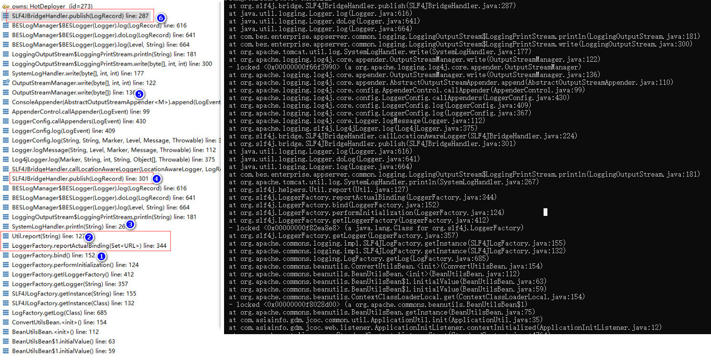
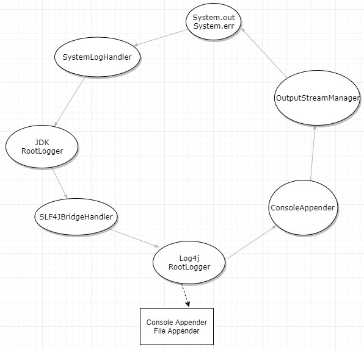
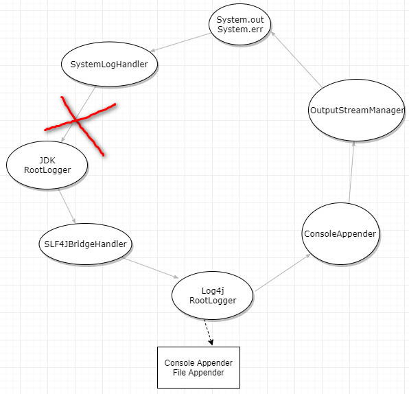
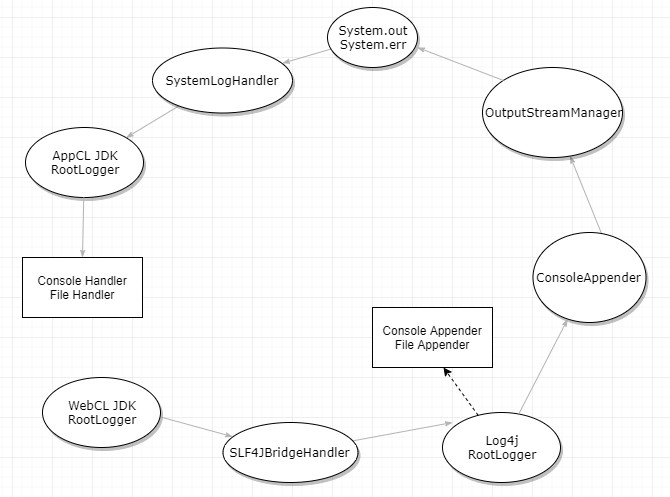

### 前言

最近客户应用部署到bes9.5失败了，没有任何异常信息，场景如下：
spring应用，关键lib库：
>jul-to-slf4j-1.7.7.jar
>log4j-1.2-api-2.1.jar
>log4j-1.2.16.jar
>log4j-api-2.1.jar
>log4j-core-2.1.jar
>log4j-jcl-2.1.jar
>log4j-slf4j-impl-2.1.jar
>log4j-web-2.1.jar
>slf4j-api-1.7.21.jar
>spring-context-4.2.9.RELEASE.jar
>spring-context-support-4.2.9.RELEASE.jar
>spring-core-4.2.9.RELEASE.jar
>spring-web-4.2.9.RELEASE.jar
>spring-webmvc-4.2.9.RELEASE.jar

<!-- more -->

日志配置log4j2.xml：

```xml
<?xml version="1.0" encoding="UTF-8"?>
<Configuration status="WARN" monitorInterval="60">
    ....
    <Appenders>
        .....
        <Console name="Console" target="SYSTEM_OUT">
            <PatternLayout pattern="${patternLayout}"/>
        </Console>
    </Appenders>
    <Loggers>
        .....
        <Root level="info"> 输出到文件和console，对应2个Handler
            <AppenderRef ref="Console"/>
            <AppenderRef ref="BusinessFile"/>
        </Root>
    </Loggers>
</Configuration>
```

现象日志：

> ##|2019-05-16 13:26:07.869|INFO|deployment|_ThreadID=63;_ThreadName=bes-deployment-scheduled-executor-thread.|Assembling app: D:\appserver\bes9.5\deployments\demo|##
> ##|2019-05-16 13:26:08.518|INFO|web|_ThreadID=63;_ThreadName=bes-deployment-scheduled-executor-thread.|At least one JAR was scanned for TLDs yet contained no TLDs. Enable debug logging for this logger for a complete list of JARs that were scanned but no TLDs were found in them. Skipping unneeded JARs during scanning can improve startup time and JSP compilation time.|##
> ##|2019-05-16 13:26:09.026|INFO|web|_ThreadID=63;_ThreadName=bes-deployment-scheduled-executor-thread.|No Spring WebApplicationInitializer types detected on classpath|##

### Spring和log4j如何初始化

具体过程不详细描述，web.xml配置了ApplicationInitListener监听器，StandardContext.listenerStart中触发listener初始化contextInitialized，看看ApplicationInitListener代码：

``` java
public class ApplicationInitListener implements ServletContextListener {
  public void contextInitialized(ServletContextEvent sce) {
    ApplicationUtil.init();
  }

  public void contextDestroyed(ServletContextEvent sce) {
  }
}
```

ApplicationUtil.java

``` java
  public static void init()  {
    //将整个web容器的rootlogger（只有一个）的handler全部remove
    SLF4JBridgeHandler.removeHandlersForRootLogger();
    //给rootlogger设置新的handler->SLF4JBridgeHandler,以后所有logger.log都由这个handler接管
    SLF4JBridgeHandler.install();
    BeanUtilsBean.getInstance().getConvertUtils().register(false, true, 0);
    ......
  }
```

在后续的BeanUtilsBean.getInstance()初始化过程中会涉及log4j的初始化，具体贴调用栈：



slf4j-api中LoggerFactory.bind()：

``` java
  private static final void bind() {
    try
    {
      Set staticLoggerBinderPathSet = null;

      if (!isAndroid()) {
        // 通过classloader查找org/slf4j/impl/StaticLoggerBinder.class所在的url
        // 此处会找到2个，应用中一份，容器一份
        //Binary file ./deployments/demo/WEB-INF/lib/log4j-slf4j-impl-2.1.jar matches
		//Binary file ./lib/3rd/org.slf4j.slf4j-jdk14_1.7.10.jar matches
        staticLoggerBinderPathSet = findPossibleStaticLoggerBinderPathSet();
        //report一些信息
        reportMultipleBindingAmbiguity(staticLoggerBinderPathSet);
      }
      ......
    }
  }
  
  private static void reportMultipleBindingAmbiguity(Set<URL> binderPathSet)  {
    if (isAmbiguousStaticLoggerBinderPathSet(binderPathSet)) {
      Util.report("Class path contains multiple SLF4J bindings.");
      for (URL path : binderPathSet) {
        Util.report("Found binding in [" + path + "]");
      }
      Util.report("See http://www.slf4j.org/codes.html#multiple_bindings for an explanation.");
    }
  }
```

关键地方在Util.report()，可以看到是通过System.err标准输出流输出数据。

``` java
  public static final void report(String msg) {
    System.err.println("SLF4J: " + msg);
  }
```

由于BES对System.out和System.out进行了重定向，默认重定向到了RootLogger中，即通过logger去输出。

### 问题分析

梳理下：

1、BES对System.out和System.out进行了重定向，默认重定向到JDK RootLogger中，即通过logger去输出

2、System.setOut设置成了SystemLogHandler（System.out）即out-》SystemLogHandler-》jdk loggger

3、JDK RootLogger的handler被替换为SLF4JBridgeHandler，即logger通过SLF4JBridgeHandler输出

4、SLF4JBridgeHandler采用log4j的 root logger输出，即输出到Console和文件，同时Console也是通过System.out标准输出，即又回到SystemLogHandler

report信息通过System.err输出，发现出现死循环了，最终StackOverflowError



### 解决方案

1、bes将System.out和System.err重定向到rootlogger关闭



2、（Tomcat方式）每一个classloader单独一个RootLogger（System.out使用的logger），即AppClassLoader单独一个，每个应用WebappClassLoader一个RootLogger，SLF4JBridgeHandler替换handler时只替换到当前应用的RootLogger，通过System.out输出信息会进入到AppClassLoader的logger，输出到console和file。而应用中logger输出-》SLF4JBridgeHandler-》log4j root logger -》 ConsoleAppender-》System.out-》AppClassLoader的logger-》console和file




