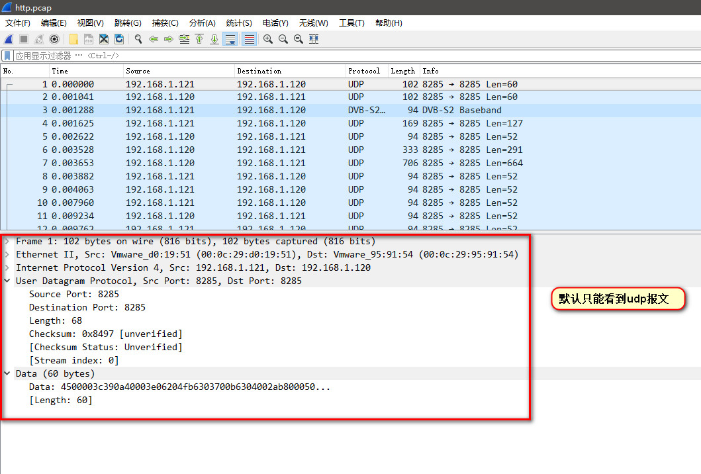
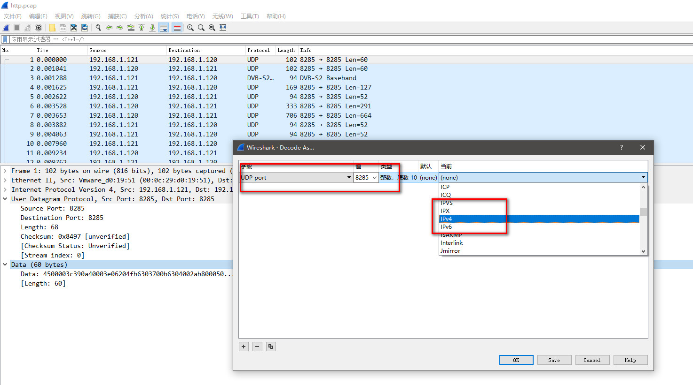
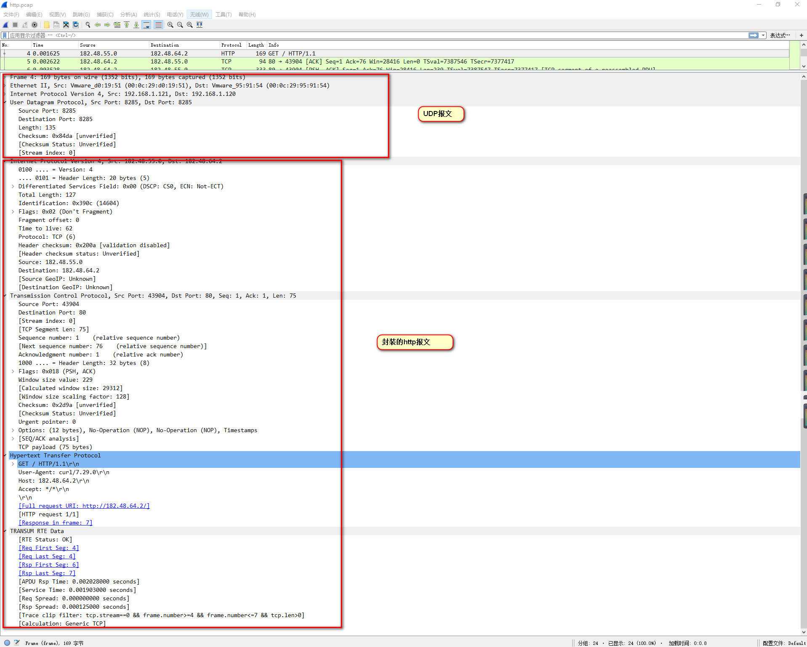

### 前言
上一篇已经介绍了Docker的四种网络模式，其中bridge模式下容器和主机之间是可以相互通信的，但是如果各个主机之间的容器如何通信呢？Docker跨主机容器间网络通信实现的工具有Pipework、Flannel、Weave、Open vSwitch（虚拟交换机）、Calico实现跨主机容器间的通信。[Flannel](https://github.com/coreos/flannel) 是CoreOS 下面的一个项目，目前被使用在 kubernetes 中，用于解决 docker 容器直接跨主机的通信问题。它的主要思路是：**预先留出一个网段，每个主机使用其中一部分，然后每个容器被分配不同的 ip；让所有的容器认为大家在同一个直连的网络，底层通过 UDP/VxLAN 等进行报文的封装和转发**，下面我们来分析一下Flannel是如何使用和基本的原理。

<!--more-->

###  Flannel 使用

#### 机器环境（centos7系统）

| 机器       | ip地址        | mac地址           | 描述                      |
| ---------- | ------------- | ----------------- | ------------------------- |
| k8s-master | 192.168.1.120 | 00:0c:29:95:91:54 | 部署etcd，flannel，docker |
| k8s-node   | 192.168.1.121 | 00:0c:29:d0:19:51 | 部署flannel，docker       |

#### k8s-master机器上操作

```shell
# 设置主机名以及配置host映射
[root@k8s-master ~]# hostnamectl --static set-hostname  k8s-master
[root@k8s-master ~]# vim /etc/hosts
192.168.1.120 k8s-master
192.168.1.120 etcd
192.168.1.121 k8s-node

# 关闭防火墙或者开启防火墙，打开2379和4001端口
[root@k8s-master ~]# systemctl disable firewalld.service
[root@k8s-master ~]# systemctl stop firewalld.service

# 安装docker
[root@k8s-master ~]# yum install -y docker

# 安装etcd
[root@k8s-master ~]# yum install -y etcd
# 编辑etcd配置文件，只列出了主要修改的配置
[root@k8s-master ~]# cp /etc/etcd/etcd.conf /etc/etcd/etcd.conf.backup
[root@k8s-master ~]# vim /etc/etcd/etcd.conf
ETCD_DATA_DIR="/var/lib/etcd/default.etcd"
ETCD_LISTEN_CLIENT_URLS="http://0.0.0.0:2379,http://0.0.0.0:4001"
ETCD_NAME="master"
ETCD_ADVERTISE_CLIENT_URLS="http://etcd:2379,http://etcd:4001"

# 启动etcd并验证状态
[root@k8s-master ~]# systemctl start etcd
[root@k8s-master ~]# ps -ef|grep etcd
etcd       1012      1  0 19:40 ?        00:00:09 /usr/bin/etcd --name=default --data-dir=/var/lib/etcd/default.etcd --listen-client-urls=http://0.0.0.0:2379,http://0.0.0.0:4001
root       1674   1140  0 19:56 pts/0    00:00:00 grep --color=auto etcd
[root@k8s-master ~]# etcdctl -C http://etcd:2379 cluster-health
member 8e9e05c52164694d is healthy: got healthy result from http://etcd:2379
cluster is healthy

# 安装Flannel
[root@k8s-master ~]# yum install -y flannel
# 配置Flannel
[root@k8s-master ~]# cp /etc/sysconfig/flanneld /etc/sysconfig/flanneld.bak
[root@k8s-master ~]# vim /etc/sysconfig/flanneld
FLANNEL_ETCD_ENDPOINTS="http://etcd:2379"
FLANNEL_ETCD_PREFIX="/atomic.io/network"
  
# Flannel使用Etcd进行配置，来保证多个Flannel实例之间的配置一致性，所以需要在etcd上进行如下配置（'/atomic.io/network/config'
这个key与上文/etc/sysconfig/flannel中的配置项FLANNEL_ETCD_PREFIX是相对应的，错误的话启动就会出错）

[root@k8s-master ~]# etcdctl mk /atomic.io/network/config '{ "Network": "182.48.0.0/16" }'
{ "Network": "182.48.0.0/16" }
# 提示：上面flannel设置的ip网段可以任意设定，随便设定一个网段都可以。容器的ip就是根据这个网段进行自动分配的，ip分配后，容器一般是可以对
外联网的（网桥模式，只要宿主机能上网就可以）
 
 # 启动Flannel
[root@k8s-master ~]# systemctl enable flanneld.service
[root@k8s-master ~]# systemctl start flanneld.service
[root@k8s-master ~]# ps -ef|grep flannel
root       1176      1  0 19:41 ?        00:00:00 /usr/bin/flanneld -etcd-endpoints=http://etcd:2379 -etcd-prefix=/atomic.io/network
root       1787   1140  0 20:05 pts/0    00:00:00 grep --color=auto flannel

# flannel服务需要先于docker启动。flannel服务启动时主要做了以下几步的工作：
从etcd中获取network的配置信息
划分subnet，并在etcd中进行注册
将子网信息记录到/run/flannel/subnet.env中
[root@k8s-master ~]# cat /run/flannel/subnet.env
FLANNEL_NETWORK=182.48.0.0/16
FLANNEL_SUBNET=182.48.64.1/24
FLANNEL_MTU=1472
FLANNEL_IPMASQ=false

# 高版本的flannel会自动将subnet.env转写成一个docker的环境变量文件/run/flannel/docker，低版本的会存在一个mk-docker-opts.sh用来手动转化
[root@k8s-master ~]#  cat /run/flannel/docker 
DOCKER_OPT_BIP="--bip=182.48.64.1/24"
DOCKER_OPT_IPMASQ="--ip-masq=true"
DOCKER_OPT_MTU="--mtu=1472"
DOCKER_NETWORK_OPTIONS=" --bip=182.48.64.1/24 --ip-masq=true --mtu=1472"

# 配置docker，sysetemctl show docker 将会发现在安装flannel后自动生成配置
FragmentPath=/usr/lib/systemd/system/docker.service
DropInPaths=/usr/lib/systemd/system/docker.service.d/flannel.conf
[root@k8s-master ~]# more /usr/lib/systemd/system/docker.service.d/flannel.conf
[Service]
EnvironmentFile=-/run/flannel/docker

# 故在docker的systemd文件中应用对应变量 DOCKER_NETWORK_OPTIONS 即可
[root@k8s-master ~]# vim /usr/lib/systemd/system/docker.service
ExecStart=/usr/bin/dockerd $DOCKER_NETWORK_OPTIONS

# 重启docker，这样Flannel配置分配的ip才能生效，即docker0虚拟网卡的ip会变成上面flannel设定的ip段
[root@k8s-master ~]# systemctl daemon-reload
[root@k8s-master ~]# systemctl restart docker 

# 查看网卡，docker0已经在设置网段内了，还多了flannel0网卡
[root@k8s-master ~]# ifconfig docker0
docker0: flags=4099<UP,BROADCAST,MULTICAST>  mtu 1500
        inet 182.48.64.1  netmask 255.255.255.0  broadcast 182.48.64.255
        ether 02:42:13:39:c7:21  txqueuelen 0  (Ethernet)
        RX packets 0  bytes 0 (0.0 B)
        RX errors 0  dropped 0  overruns 0  frame 0
        TX packets 0  bytes 0 (0.0 B)
        TX errors 0  dropped 0 overruns 0  carrier 0  collisions 0
eno16777736: flags=4163<UP,BROADCAST,RUNNING,MULTICAST>  mtu 1500
        inet 192.168.1.120  netmask 255.255.255.0  broadcast 192.168.1.255
        inet6 fe80::689b:8360:5fff:6fb1  prefixlen 64  scopeid 0x20<link>
        ether 00:0c:29:95:91:54  txqueuelen 1000  (Ethernet)
        RX packets 2296  bytes 183463 (179.1 KiB)
        RX errors 0  dropped 0  overruns 0  frame 0
        TX packets 1778  bytes 212378 (207.4 KiB)
        TX errors 0  dropped 0 overruns 0  carrier 0  collisions 0

flannel0: flags=4305<UP,POINTOPOINT,RUNNING,NOARP,MULTICAST>  mtu 1472
        inet 182.48.64.0  netmask 255.255.0.0  destination 182.48.64.0
        inet6 fe80::3b7c:2c82:e03e:b230  prefixlen 64  scopeid 0x20<link>
        unspec 00-00-00-00-00-00-00-00-00-00-00-00-00-00-00-00  txqueuelen 500  (UNSPEC)
        RX packets 0  bytes 0 (0.0 B)
        RX errors 0  dropped 0  overruns 0  frame 0
        TX packets 3  bytes 144 (144.0 B)
        TX errors 0  dropped 0 overruns 0  carrier 0  collisions 0

lo: flags=73<UP,LOOPBACK,RUNNING>  mtu 65536
        inet 127.0.0.1  netmask 255.0.0.0
        inet6 ::1  prefixlen 128  scopeid 0x10<host>
        loop  txqueuelen 1  (Local Loopback)
        RX packets 2493  bytes 143991 (140.6 KiB)
        RX errors 0  dropped 0  overruns 0  frame 0
        TX packets 2493  bytes 143991 (140.6 KiB)
        TX errors 0  dropped 0 overruns 0  carrier 0  collisions 0

# 启动一个容器，查看容器ip是否在我们设置的网段内
[root@k8s-master ~]# docker run -it centos /bin/bash
[root@b89c9bc580d5 /]# more /etc/hosts
127.0.0.1       localhost
::1     localhost ip6-localhost ip6-loopback
fe00::0 ip6-localnet
ff00::0 ip6-mcastprefix
ff02::1 ip6-allnodes
ff02::2 ip6-allrouters
182.48.64.2     b89c9bc580d5
```

#### k8s-node机器上操作

为了操作下低版本flannel的安装，这里选择安装flannel-0.4.0，可在github上下载

```shell
# 解压
[root@k8s-node Downloads]# tar -zxvf flannel-0.4.0-linux-amd64.tar.gz
# 进入解压目录
[root@k8s-node flannel-0.4.0]# ll
-rwxrwxrwx. 1 bes  bes  8903712 Apr 25  2015 flanneld
-rw-rw-r--. 1 bes  bes     1799 Apr 25  2015 mk-docker-opts.sh
-rw-rw-r--. 1 bes  bes     7374 Apr 25  2015 README.md
# 启动和配置与yum安装的flannel有所不同，查看help信息可知需要在命令后直接加参数
[root@k8s-node flannel-0.4.0]# ./flanneld --help
Usage: ./flanneld [OPTION]...
  -alsologtostderr=false: log to standard error as well as files
  -etcd-cafile="": SSL Certificate Authority file used to secure etcd communication
  -etcd-certfile="": SSL certification file used to secure etcd communication
  -etcd-endpoints="http://127.0.0.1:4001,http://127.0.0.1:2379": a comma-delimited list of etcd endpoints
  -etcd-keyfile="": SSL key file used to secure etcd communication
  -etcd-prefix="/coreos.com/network": etcd prefix
  -help=false: print this message
  -iface="": interface to use (IP or name) for inter-host communication
  -ip-masq=false: setup IP masquerade rule for traffic destined outside of overlay network
  -log_backtrace_at=:0: when logging hits line file:N, emit a stack trace
  -log_dir="": If non-empty, write log files in this directory
  -logtostderr=false: log to standard error instead of files
  -stderrthreshold=0: logs at or above this threshold go to stderr
  -subnet-file="/run/flannel/subnet.env": filename where env variables (subnet and MTU values) will be written to
  -v=0: log level for V logs
  -version=false: print version and exit
  -vmodule=: comma-separated list of pattern=N settings for file-filtered logging

# 启动flannel
[root@k8s-node flannel-0.4.0]# ./flanneld -etcd-endpoints="http://etcd:2379" -etcd-prefix="/atomic.io/network" -subnet-file="/run/flannel/subnet.env" &

# 将subnet.env转写成一个docker的环境变量文件/run/flannel/docker
[root@k8s-node flannel-0.4.0]# sh mk-docker-opts.sh -f /run/flannel/subnet.env  -d /run/flannel/docker
[root@k8s-node flannel-0.4.0]# more /run/flannel/docker
DOCKER_OPT_BIP="--bip=182.48.55.1/24"
DOCKER_OPT_MTU="--mtu=1472"
DOCKER_OPTS=" --bip=182.48.55.1/24 --mtu=1472 "

# 安装docker
[root@k8s-node ~]#  yum install -y docker

# 在docker的systemd文件中应用docker环境变量文件并设置对应变量参数
[root@k8s-node ~]# vim /usr/lib/systemd/system/docker.service
EnvironmentFile=-/run/flannel/docker
ExecStart=/usr/bin/dockerd $DOCKER_OPTS

# 重启docker，这样Flannel配置分配的ip才能生效，即docker0虚拟网卡的ip会变成上面flannel设定的ip段
[root@k8s-node ~]# systemctl daemon-reload
[root@k8s-node ~]# systemctl restart docker 

# 查看网卡，docker0已经在设置网段内了，还多了flannel0网卡
[root@k8s-node ~]# ifconfig
docker0: flags=4163<UP,BROADCAST,RUNNING,MULTICAST>  mtu 1500
        inet 182.48.55.1  netmask 255.255.255.0  broadcast 182.48.55.255
        inet6 fe80::42:96ff:fe1b:525b  prefixlen 64  scopeid 0x20<link>
        ether 02:42:96:1b:52:5b  txqueuelen 0  (Ethernet)
        RX packets 0  bytes 0 (0.0 B)
        RX errors 0  dropped 0  overruns 0  frame 0
        TX packets 16  bytes 1986 (1.9 KiB)
        TX errors 0  dropped 0 overruns 0  carrier 0  collisions 0

ens33: flags=4163<UP,BROADCAST,RUNNING,MULTICAST>  mtu 1500
        inet 192.168.1.121  netmask 255.255.255.0  broadcast 192.168.1.255
        inet6 fe80::7546:20aa:b1ae:a8da  prefixlen 64  scopeid 0x20<link>
        ether 00:0c:29:d0:19:51  txqueuelen 1000  (Ethernet)
        RX packets 3282  bytes 258756 (252.6 KiB)
        RX errors 0  dropped 0  overruns 0  frame 0
        TX packets 2550  bytes 219742 (214.5 KiB)
        TX errors 0  dropped 0 overruns 0  carrier 0  collisions 0

flannel0: flags=81<UP,POINTOPOINT,RUNNING>  mtu 1472
        inet 182.48.55.0  netmask 255.255.0.0  destination 182.48.55.0
        inet6 fe80::6b0:1535:87f7:e599  prefixlen 64  scopeid 0x20<link>
        unspec 00-00-00-00-00-00-00-00-00-00-00-00-00-00-00-00  txqueuelen 500  (UNSPEC)
        RX packets 0  bytes 0 (0.0 B)
        RX errors 0  dropped 0  overruns 0  frame 0
        TX packets 7  bytes 448 (448.0 B)
        TX errors 0  dropped 0 overruns 0  carrier 0  collisions 0

lo: flags=73<UP,LOOPBACK,RUNNING>  mtu 65536
        inet 127.0.0.1  netmask 255.0.0.0
        inet6 ::1  prefixlen 128  scopeid 0x10<host>
        loop  txqueuelen 1  (Local Loopback)
        RX packets 0  bytes 0 (0.0 B)
        RX errors 0  dropped 0  overruns 0  frame 0
        TX packets 0  bytes 0 (0.0 B)
        TX errors 0  dropped 0 overruns 0  carrier 0  collisions 0
 
# 启动一个容器，查看容器ip是否在我们设置的网段内
[root@k8s-node ~]# docker run -it centos /bin/bash
[root@32dbc0d0ff72 /]# more /etc/hosts
127.0.0.1       localhost
::1     localhost ip6-localhost ip6-loopback
fe00::0 ip6-localnet
ff00::0 ip6-mcastprefix
ff02::1 ip6-allnodes
ff02::2 ip6-allrouters
182.48.55.2     32dbc0d0ff72

```

相信看到这里应该知道为什么docker容器的ip会在我们设置ip段内了，其实只是用了docker自身的特性，这里面的“--bip=182.48.64.1/24”这个参数，它限制了所在节点容器获得的IP范围。执行如下命令

```shell
[root@k8s-master ~]# ps -ef|grep docker
root       1357      1  0 19:41 ?        00:00:11 /usr/bin/dockerd --bip=182.48.64.1/24 --ip-masq=true --mtu=1472
```

####  分析

在上面的操作之后，两台机器容器、主机之间都是可以ping通过的，那么数据流程是如何？在Flannel的GitHub页面有如下的一张原理图，默认的节点间数据通信方式是UDP转发:


那么一条网络报文是怎么从一个容器发送到另外一个容器的呢？

1. 容器直接使用目标容器的 ip 访问，默认通过容器内部的 eth0 发送出去
2. 报文通过 veth pair 被发送到 vethXXX
3. vethXXX 是直接连接到虚拟交换机 docker0 的，报文通过虚拟 bridge docker0 发送出去
4. 查找路由表，外部容器 ip 的报文都会转发到 flannel0 虚拟网卡，这是一个 P2P 的虚拟网卡（参考有关linux 有关tun/tap设备的知识），然后报文就被转发到监听在另一端的 flanneld
5. flanneld 通过 etcd 维护了各个节点之间的路由表，把原来的报文 UDP 封装一层，通过配置的 `iface` 发送出去
6. 报文通过主机之间的网络找到目标主机
7. 报文继续往上，到传输层，交给监听在 8285 端口的 flanneld 程序处理
8. 数据被解包，然后发送给 flannel0 虚拟网卡
9. 查找路由表，发现对应容器的报文要交给 docker0
10. docker0 找到连到自己的容器，把报文发送过去

通过上图可以看出，数据封装号之后肯定会经过主机的eth0网卡，我们tcpdump抓ping包分析下结构：

```shell
# 182.48.55.2(192.168.1.121)   ping   182.48.64.2(192.168.1.120) flannel默认监听8525端口
[root@k8s-node ~]# tcpdump -i ens33 udp -w /home/bes/ping.pcap
tcpdump: listening on ens33, link-type EN10MB (Ethernet), capture size 262144 bytes
33 packets captured
33 packets received by filter
0 packets dropped by kernel
[root@k8s-node ~]# 
```

在 wireshark 中看一下封装的报文，这个地方折腾了好久，一开始封装的报文是看不到的，全是UDP的DATA数据，需要使用wireshark 的 `decode as` 功能把被封装的报文显示出来。可以看到主机间是在 UDP 8285 端口通信的，报文中包含了容器间真正的网络报文，比如这里的 ping 包（ICMP 协议报文）。


182.48.55.2(192.168.1.121) 访问182.48.64.2(192.168.1.120) 上的nginx，http协议的报文：









### 参考

1.[Docker 配置Flannel网络过程及原理](https://blog.csdn.net/liukuan73/article/details/54897594)

2.[Docker网络解决方案-Flannel部署记录](http://www.cnblogs.com/kevingrace/p/6859114.html)

3.[flannel 网络模型](http://cizixs.com/2016/06/15/flannel-overlay-network)