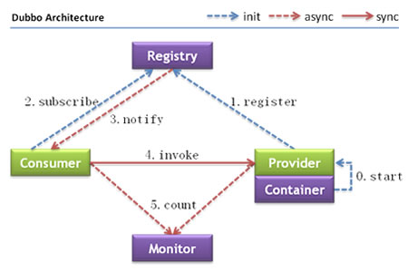
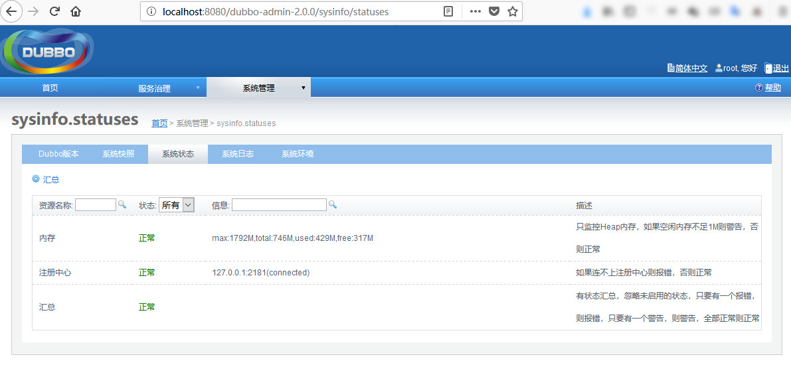
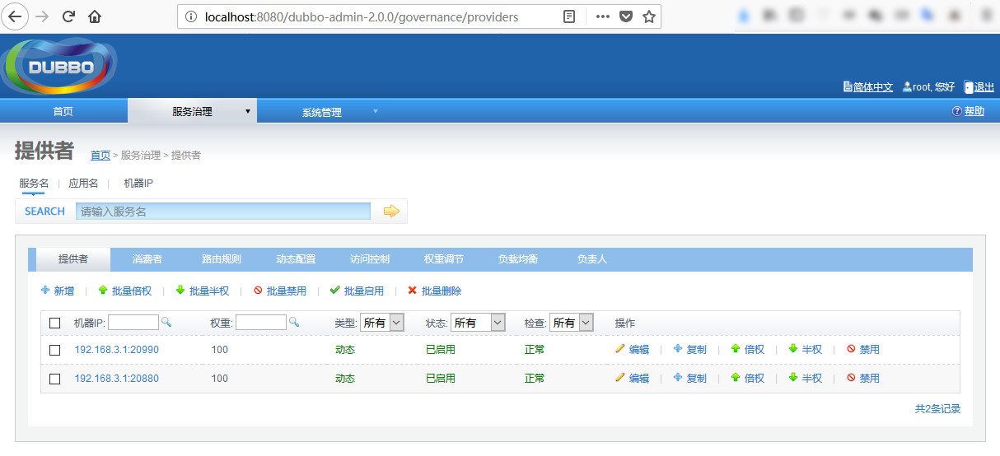
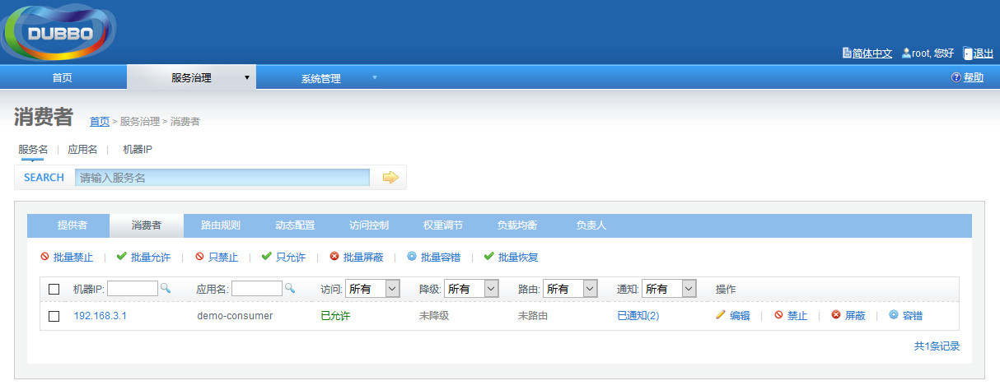
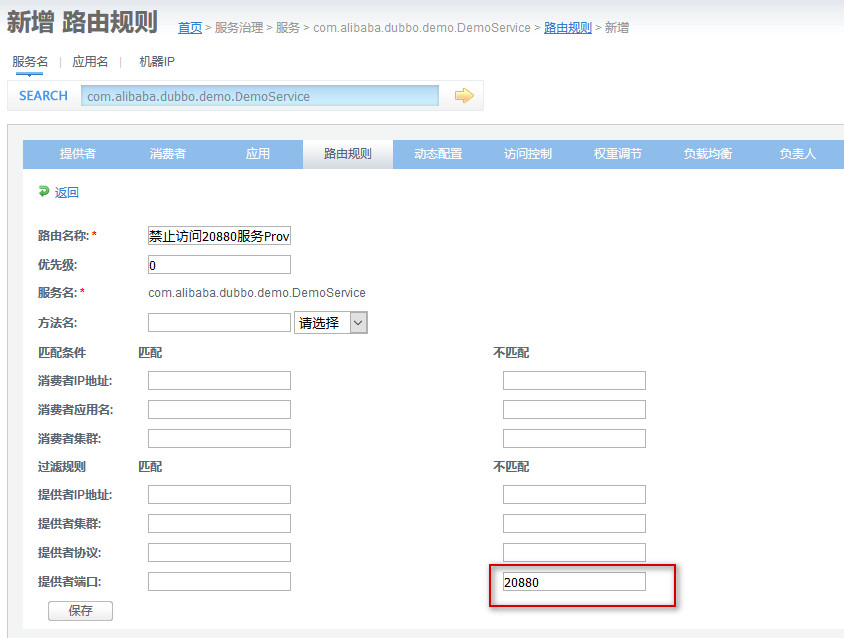
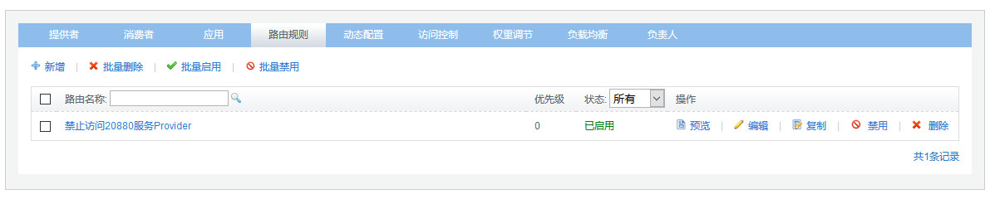

### 前言

Dubbo是一个分布式服务框架，致力于提供高性能和透明化的RPC远程服务调用方案，以及SOA服务治理方案。 本文主要讲解其基本的架构、源码编译、简单的使用。环境：

- oracle  jdk8
- maven-3.2.5
- tomcat-8.5.12
- zookeeper-3.4.8

### Dubbo核心架构



<!-- more -->

#### 组件说明

| 节点        | 角色说明                               |
| ----------- | -------------------------------------- |
| `Provider`  | 暴露服务的服务提供方                   |
| `Consumer`  | 调用远程服务的服务消费方               |
| `Registry`  | 服务注册与发现的注册中心               |
| `Monitor`   | 统计服务的调用次数和调用时间的监控中心 |
| `Container` | 服务运行容器                           |

#### 组件之间调用关系

1. 服务容器负责启动，加载，运行服务提供者。
2. 服务提供者在启动时，向注册中心注册自己提供的服务。
3. 服务消费者在启动时，向注册中心订阅自己所需的服务。
4. 注册中心返回服务提供者地址列表给消费者，如果有变更，注册中心将基于长连接推送变更数据给消费者。
5. 服务消费者，从提供者地址列表中，基于软负载均衡算法，选一台提供者进行调用，如果调用失败，再选另一台调用。
6. 服务消费者和提供者，在内存中累计调用次数和调用时间，定时每分钟发送一次统计数据到监控中心。。

### Dubbo源码构建

#### incubator-dubbo

此工程为dubbo的主工程，构建方式如下：

```shell
# 下载源码
git clone https://github.com/apache/incubator-dubbo.git 
# 进入源码目录，使用maven构建
mvn install -Dmaven.test.skip
mvn clean source:jar install -Dmaven.test.skip
```

#### incubator-dubbo-ops

此工程为运维人员使用的工程，包含了三个子工程：

>dubbo-admin—dubbo的管理控制台，方便对服务提供者、消费者进行管理，包括路由、负载等
>
>dubbo-monitor-simple —对dubbo的监控工程
>
>dubbo-registry-simple —dubbo实现的简单的服务注册中心

构建方式如下：

```shell
# 下载源码
git clone https://github.com/apache/incubator-dubbo-ops
# 进入源码目录，使用maven构建
mvn install -Dmaven.test.skip
```

### 案例

上面已经构建了源码，下面我们来搭建一个简单的例子，使用下dubbo：

#### 服务注册中心-zookeeper

dubbo支持的服务注册中心有多种：zookeeper、redis，还有上面说的简单的Simple 注册中心。这里我们使用zookeeper，安装过程如下：

```shell
# 下载介质
wget https://archive.apache.org/dist/zookeeper/zookeeper-3.4.8/zookeeper-3.4.8.tar.gz
# 解压并配置
tar zxvf zookeeper-3.4.8.tar.gz
cd zookeeper-3.4.8
cp conf/zoo_sample.cfg conf/zoo.cfg
# 修改zoo.cfg配置
tickTime=2000
initLimit=10
syncLimit=5
dataDir=./data
clientPort=2181
# 这里我们没有使用集群，所以可以直接启动了
cd bin
./zkServer.sh  start
```

#### Dubbo管理控制台 

将dubbo-admin—dubbo工程下编译出的war包拷贝到tomcat的webapps目录下，war中dubbo.properties配置的默认注册中心就是zookeeper。然后启动tomcat，使用root或者guest账号访问控制台如下图：



#### 服务提供者Provider 

参考incubator-dubbo/dubbo-demo/dubbo-demo-provider工程：

**maven依赖**：

```xml
<dependency>
    <groupId>com.alibaba</groupId>
    <artifactId>dubbo</artifactId>
    <version>${dubbo.version}</version>
</dependency>
```

**服务接口类**：

```java
package com.alibaba.dubbo.demo;
public interface DemoService {
    String sayHello(String name);
}
```

**服务提供者实现类**：

```java
package com.alibaba.dubbo.demo.provider;

import com.alibaba.dubbo.demo.DemoService;
import com.alibaba.dubbo.rpc.RpcContext;
import java.text.SimpleDateFormat;
import java.util.Date;

public class DemoServiceImpl implements DemoService {

    @Override
    public String sayHello(String name) {
        System.out.println("[" + new SimpleDateFormat("HH:mm:ss").format(new Date()) + "] Hello " + name + ", request from consumer: " + RpcContext.getContext().getRemoteAddress());
        return "Hello " + name + ", response from provider: " + RpcContext.getContext().getLocalAddress();
    }

}
```

**Provider启动类**：

```java
package com.alibaba.dubbo.demo.provider;

import org.springframework.context.support.ClassPathXmlApplicationContext;

public class Provider {

    public static void main(String[] args) throws Exception {
        //Prevent to get IPV6 address,this way only work in debug mode
        //But you can pass use -Djava.net.preferIPv4Stack=true,then it work well whether in debug mode or not
        System.setProperty("java.net.preferIPv4Stack", "true");
        ClassPathXmlApplicationContext context = new ClassPathXmlApplicationContext(new String[]{"META-INF/spring/dubbo-demo-provider.xml"});
        context.start();

        System.in.read(); // press any key to exit
    }

}

```

**Provider配置—dubbo-demo-provider.xml**：

```xml
<beans xmlns:xsi="http://www.w3.org/2001/XMLSchema-instance"
       xmlns:dubbo="http://dubbo.apache.org/schema/dubbo"
       xmlns="http://www.springframework.org/schema/beans"
       xsi:schemaLocation="http://www.springframework.org/schema/beans http://www.springframework.org/schema/beans/spring-beans-4.3.xsd
       http://dubbo.apache.org/schema/dubbo http://dubbo.apache.org/schema/dubbo/dubbo.xsd">
    <!-- provider's application name, used for tracing dependency relationship -->
    <dubbo:application name="demo-provider"/>
    <!-- use zookeeper registry center to export service -->
    <dubbo:registry address="zookeeper://127.0.0.1:2181"/>
    <!-- use dubbo protocol to export service on port 20880 -->
    <dubbo:protocol name="dubbo" port="20880"/>
    <!-- service implementation, as same as regular local bean -->
    <bean id="demoService" class="com.alibaba.dubbo.demo.provider.DemoServiceImpl"/>
    <!-- declare the service interface to be exported -->
    <dubbo:service interface="com.alibaba.dubbo.demo.DemoService" ref="demoService"/>
</beans>
```

因为这里我们要启动两个provider，因此上面的配置另一个provider需要修改：

```xml
<dubbo:protocol name="dubbo" port="20990"/>
```

打包成jar并下载依赖后用如下方式启动：

```shell
# 启动第一个服务提供者-20880
java -cp dubbo-demo-provider-2.6.2.jar;dependency/* com.alibaba.dubbo.demo.provider.Provider
# 启动第一个服务提供者-20990
java -cp dubbo-demo-provider-2.6.2-2.jar;dependency/* com.alibaba.dubbo.demo.provider.Provider
```

启动完成之后，查看dubbo控制台，可以看到目前有两个provider：



#### 服务消费者Consumer

参考incubator-dubbo/dubbo-demo/dubbo-demo-consumer工程：

**服务消费者启动类**：

```java
package com.alibaba.dubbo.demo.consumer;

import com.alibaba.dubbo.demo.DemoService;
import org.springframework.context.support.ClassPathXmlApplicationContext;

public class Consumer {

    public static void main(String[] args) {
        //Prevent to get IPV6 address,this way only work in debug mode
        //But you can pass use -Djava.net.preferIPv4Stack=true,then it work well whether in debug mode or not
        System.setProperty("java.net.preferIPv4Stack", "true");
        ClassPathXmlApplicationContext context = new ClassPathXmlApplicationContext(new String[]{"META-INF/spring/dubbo-demo-consumer.xml"});
        context.start();
        DemoService demoService = (DemoService) context.getBean("demoService"); // get remote service proxy

        while (true) {
            try {
                Thread.sleep(1000);
                String hello = demoService.sayHello("world"); // call remote method
                System.out.println(hello); // get result

            } catch (Throwable throwable) {
                throwable.printStackTrace();
            }
        }
    }
}

```

**Consumer配置—dubbo-demo-consumer.xml**：

```xml
<?xml version="1.0" encoding="UTF-8"?>
<beans xmlns:xsi="http://www.w3.org/2001/XMLSchema-instance"
       xmlns:dubbo="http://dubbo.apache.org/schema/dubbo"
       xmlns="http://www.springframework.org/schema/beans"
       xsi:schemaLocation="http://www.springframework.org/schema/beans http://www.springframework.org/schema/beans/spring-beans-4.3.xsd
       http://dubbo.apache.org/schema/dubbo http://dubbo.apache.org/schema/dubbo/dubbo.xsd">

    <!-- consumer's application name, used for tracing dependency relationship (not a matching criterion),
    don't set it same as provider -->
    <dubbo:application name="demo-consumer"/>
    <!-- use zookeeper registry center to discover service -->
    <dubbo:registry address="zookeeper://127.0.0.1:2181"/>
    <!-- generate proxy for the remote service, then demoService can be used in the same way as the local regular interface -->
    <dubbo:reference id="demoService" check="false" interface="com.alibaba.dubbo.demo.DemoService"/>

</beans>
```

打包成jar并下载依赖后用如下方式启动：

```shell
# 启动服务提供者
java -cp dubbo-demo-consumer-2.6.2.jar;dependency/* com.alibaba.dubbo.demo.consumer.Consumer
```

启动完成之后，查看dubbo控制台，可以看到目前有1个consumer：



并且consumer这边会出现调用provider的情况，并且会调用2个服务provider：

```shell
Hello world, response from provider: 192.168.3.1:20880
Hello world, response from provider: 192.168.3.1:20990
Hello world, response from provider: 192.168.3.1:20990
Hello world, response from provider: 192.168.3.1:20880
Hello world, response from provider: 192.168.3.1:20880
Hello world, response from provider: 192.168.3.1:20990
Hello world, response from provider: 192.168.3.1:20880
Hello world, response from provider: 192.168.3.1:20880
Hello world, response from provider: 192.168.3.1:20990
Hello world, response from provider: 192.168.3.1:20990
```

provider那边可以看到来自consumer的请求：

```shell
[11:36:11] Hello world, request from consumer: /192.168.3.1:63796
[11:36:14] Hello world, request from consumer: /192.168.3.1:63796
[11:36:15] Hello world, request from consumer: /192.168.3.1:63796
[11:36:16] Hello world, request from consumer: /192.168.3.1:63796
[11:36:17] Hello world, request from consumer: /192.168.3.1:63796
[11:36:21] Hello world, request from consumer: /192.168.3.1:63796
[11:36:22] Hello world, request from consumer: /192.168.3.1:63796
```

#### 灰度发布

灰度发布是指在黑与白之间，能够平滑过渡的一种发布方式。对于我们这个案例，现在我想升级Provider1，那么就必须让consumer的请求切换到Provider2，这样才能对Consumer没有任何影响。等Provider1升级完之后，再将consumer的请求分别负载给provider1和2，保证整体系统的稳定。dubbo为我们提供了一种路由机制来实现这个功能，首先再dubbo控制台新建路由规则：禁止访问端口为20880的服务



然后启动这条路由规则：



对应zookeeper中的数据：

```shell
转码前
[zk: localhost:2181(CONNECTED) 5] ls /dubbo/com.alibaba.dubbo.demo.DemoService/routers
[route%3A%2F%2F0.0.0.0%2Fcom.alibaba.dubbo.demo.DemoService%3Fcategory%3Drouters%26dynamic%3Dfalse%26enabled%3Dtrue%26force%3Dfalse%26name%3D%E7%A6%81%E6%AD%A2%E8%AE%BF%E9%97%AE20880%E6%9C%8D%E5%8A%A1Provider%26priority%3D0%26router%3Dcondition%26rule%3D%2B%253D%253E%2Bprovider.port%2B%2521%253D%2B20880%26runtime%3Dfalse]
转码后：
route://0.0.0.0/com.alibaba.dubbo.demo.DemoService?category=routers&dynamic=false&enabled=true&force=false&name=禁止访问20880服务Provider&priority=0&router=condition&rule=+%3D%3E+provider.port+%21%3D+20880&runtime=false
```


启用之后，consumer就不会再调用端口为20880的服务了，日志如下：

```shell
Hello world, response from provider: 192.168.3.1:20990
Hello world, response from provider: 192.168.3.1:20990
Hello world, response from provider: 192.168.3.1:20990
Hello world, response from provider: 192.168.3.1:20990
Hello world, response from provider: 192.168.3.1:20990
Hello world, response from provider: 192.168.3.1:20990
```

这是我们就可以做20880的升级工作，等到升级完成，禁用那条路由规则即可恢复对20880服务的访问。

### Route机制

1. 控制台设置路由规则，存储到zookeeper
2. 启用或者禁用这条规则时，zookeeper将会通知Consumer更新RegistryDirectory中的的routers信息
3. Consumer收到通知后，根据具体Router规则的具体实现，确定本地是否删除或者增加Invoker，Invoker里包含了服务提供者的全部信息
4. Consumer通过Loadbance选择可用的Invoker调用远程服务