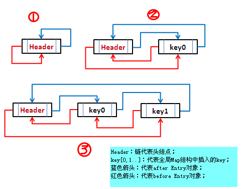

## JAVA基础
#### 1. JAVA中的几种基本数据类型是什么，各自占用多少字节?
数据类型：
```
基本数据类型：
    数值型：
        整数类型：byte、short、int、long
        浮点类型：float、double
    字符型：char
    布尔型：boolean
引用数据类型：类、接口、数组
```
基本数据类型各占多少个字节：
数据类型 | 字节 | 默认值
---|---|---
byte|	1	|0
short|	2　|	0
int|	4|	0
long|	8|	0
float|	4|	0.0f
double|	8|	0.0d
char|	2|	'\u0000'
boolean|	4|	false
关于boolean占几个字节，众说纷纭，虽然boolean表现出非0即1的“位”特性，但是存储空间的基本计量单位是字节，不是位。所以boolean至少占1个字节。 
JVM规范中，boolean变量当作int处理，也就是4字节；而boolean数组当做byte数组处理，即boolean类型的数组里面的每一个元素占1个字节。

#### 2. String类能被继承吗，为什么?
Java对String类的定义：
```
public final class String implements java.io.Serializable, Comparable<String>, CharSequence {
    // 省略...　
}
```
因此不能被继承，因为String类有final修饰符，而final修饰的类是不能被继承的。

final修饰符的用法：
1. 修饰类

当用final修饰一个类时，表明这个类不能被继承。final类中的成员变量可以根据需要设为final，但是要注意final中的所有成员方法都会被隐式地指定为final方法。
2. 修饰方法

使用final修饰方法的原因有两个。第一个原因是把方法锁定，以防任何继承类修改它的含义；第二个原因是效率。在早期的Java实现版本中，会将final方法转为内嵌调用。但是如果方法过于庞大，可能看不到内嵌调用带来的任何性能提升。在最近的Java版本中，不需要使用final方法进行这些优化了。因此，只有在想明确禁止该方法在子类中被覆盖的情况下才将方法设置为final。

注：一个类中的private方法会隐式地被指定为final方法。
3. 修饰变量

对于被final修饰的变量，如果是基本数据类型的变量，则其数值一旦在初始化之后便不能更改；如果是引用类型的变量，则在对其初始化之后便不能再让其指向另一个对象。虽然不能再指向其他对象，但是它指向的对象的内容是可变的。
#### 3. String，Stringbuffer，StringBuilder的区别。
1. 首先说运行速度，或者说是执行速度，在这方面运行速度快慢为：StringBuilder > StringBuffer > String

String最慢的原因：

String为字符串常量，而StringBuilder和StringBuffer均为字符串变量，即String对象一旦创建之后该对象是不可更改的，但后两者的对象是变量，是可以更改的。
以下面一段代码为例：
```
String str="abc";
System.out.println(str);
str=str+"de";
System.out.println(str);
```
如果运行这段代码会发现先输出“abc”，然后又输出“abcde”，好像是str这个对象被更改了，其实，这只是一种假象罢了，JVM对于这几行代码是这样处理的，首先创建一个String对象str，并把“abc”赋值给str，然后在第三行中，其实JVM又创建了一个新的对象也名为str，然后再把原来的str的值和“de”加起来再赋值给新的str，而原来的str就会被JVM的垃圾回收机制（GC）给回收掉了，所以，str实际上并没有被更改，也就是前面说的String对象一旦创建之后就不可更改了。所以，Java中对String对象进行的操作实际上是一个不断创建新的对象并且将旧的对象回收的一个过程，所以执行速度很慢。
而StringBuilder和StringBuffer的对象是变量，对变量进行操作就是直接对该对象进行更改，而不进行创建和回收的操作，所以速度要比String快很多。另外，有时候我们会这样对字符串进行赋值:
```
String str="abc"+"de";
StringBuilder stringBuilder=new StringBuilder().append("abc").append("de");
System.out.println(str);
System.out.println(stringBuilder.toString());
```
这样输出结果也是“abcde”和“abcde”，但是String的速度却比StringBuilder的反应速度要快很多，这是因为第1行中的操作和String str="abcde"是完全一样的，所以会很快，而如果写成下面这种形式:
```
String str1="abc";
String str2="de";
String str=str1+str2;
```
那么JVM就会像上面说的那样，不断的创建、回收对象来进行这个操作了。速度就会很慢。
2. 再来说线程安全

在线程安全上，StringBuilder是线程不安全的，而StringBuffer是线程安全的。

如果一个StringBuffer对象在字符串缓冲区被多个线程使用时，StringBuffer中很多方法可以带有synchronized关键字，所以可以保证线程是安全的，但StringBuilder的方法则没有该关键字，所以不能保证线程安全，有可能会出现一些错误的操作。所以如果要进行的操作是多线程的，那么就要使用StringBuffer，但是在单线程的情况下，还是建议使用速度比较快的StringBuilder。

3. 总结一下

String：适用于少量的字符串操作的情况

StringBuilder：适用于单线程下在字符缓冲区进行大量操作的情况

StringBuffer：适用多线程下在字符缓冲区进行大量操作的情况

#### 4. ArrayList和LinkedList有什么区别。
1. ArrayList是实现了基于动态数组的数据结构，而LinkedList是基于链表的数据结构；
2. 对于随机访问get和set，ArrayList要优于LinkedList，因为LinkedList要移动指针；
3. 对于添加和删除操作add和remove，一般大家都会说LinkedList要比ArrayList快，因为ArrayList要移动数据。但是实际情况并非这样，对于添加或删除，LinkedList和ArrayList并不能明确说明谁快谁慢。
``` java
import java.util.ArrayList;
import java.util.LinkedList;
import java.util.List;

public class ListTest {
	private static List<Integer> arrayList = new ArrayList<Integer>();
	private static List<Integer> linkedList = new LinkedList<Integer>();

	public static void main(String[] args) {
		// 获得两者插入数据的时间
		System.out.println("从位置0开始插入10000条数据：");
		System.out.println("array insert time:" + insertTime(arrayList, 0, 10000));
		System.out.println("linked insert time:" + insertTime(linkedList, 0, 10000));
		System.out.println("从位置1000开始插入10000条数据：");
		System.out.println("array insert time:" + insertTime(arrayList, 1000, 10000));
		System.out.println("linked insert time:" + insertTime(linkedList, 1000, 10000));
		System.out.println("从位置5000开始插入10000条数据：");
		System.out.println("array insert time:" + insertTime(arrayList, 5000, 10000));
		System.out.println("linked insert time:" + insertTime(linkedList, 5000, 10000));
        //获得两者随机访问的时间  
		System.out.println("从位置0开始get10000条数据：");
        System.out.println("array time:"+getTime(arrayList, 0, 10000));   
        System.out.println("linked time:"+getTime(linkedList, 0, 10000));  
        System.out.println("从位置1000开始get 10000条数据：");
        System.out.println("array time:"+getTime(arrayList, 1000, 10000));   
        System.out.println("linked time:"+getTime(linkedList, 1000, 10000));
        System.out.println("从位置5000开始get 10000条数据：");
        System.out.println("array time:"+getTime(arrayList, 5000, 10000));   
        System.out.println("linked time:"+getTime(linkedList, 5000, 10000));    
	}

	/**
	 * 
	 * @param list
	 * @param startIndex 开始get的位置
	 * @param count 最后的数
	 * @return
	 */
	public static long getTime(List<Integer> list, int startIndex, int count) {
		long time = System.currentTimeMillis();
		for (int i = startIndex; i < startIndex + count; i++) {
			list.get(i);
		}
		return System.currentTimeMillis() - time;
	}

	/**
	 * 
	 * @param list
	 * @param startIndex 开始插入的位置
	 * @param count 最后的数
	 * @return
	 */
	public static long insertTime(List<Integer> list, int startIndex, int count) {
		long time = System.currentTimeMillis();
		for (int i = 1; i < count; i++) {
			list.add(startIndex++, i);
		}
		return System.currentTimeMillis() - time;

	}
}
```
测试结果：
```
从位置0开始插入10000条数据：
array insert time:5
linked insert time:4
从位置1000开始插入10000条数据：
array insert time:18
linked insert time:97
从位置5000开始插入10000条数据：
array insert time:18
linked insert time:160
从位置0开始get10000条数据：
array time:0
linked time:80
从位置1000开始get 10000条数据：
array time:0
linked time:95
从位置5000开始get 10000条数据：
array time:0
linked time:159

```
分析：
对于读取操作，明显ArraList要比LinkedList效率高
对于插入操作，从位置0开始，插入10000条数据，ArraList和LinkedList测试结果不稳定，谁高的可能性都有，但是对于从位置1000、5000位置插入的结果来说，明显ArraList要比LinkedList效率高。查看各自的源码：
ArrayList中的随机访问、添加部分源码如下：
``` java
//获取index位置的元素值  
public E get(int index) {  
    rangeCheck(index); //首先判断index的范围是否合法  
  
    return elementData(index);  
}  

//将element添加到ArrayList的指定位置  
public void add(int index, E element) {  
    rangeCheckForAdd(index);  
  
    ensureCapacityInternal(size + 1);  // Increments modCount!!  
    //将index以及index之后的数据复制到index+1的位置往后，即从index开始向后挪了一位  
    System.arraycopy(elementData, index, elementData, index + 1,  
                     size - index);   
    elementData[index] = element; //然后在index处插入element  
    size++;  
}  

```
LinkedList中的随机访问、添加部分源码如下：
```
//获得第index个节点的值  
public E get(int index) {  
    checkElementIndex(index);  
    return node(index).item;  
}  
  
//在index个节点之前添加新的节点  
public void add(int index, E element) {  
    checkPositionIndex(index);  
  
    if (index == size)  
        linkLast(element);  
    else  
        linkBefore(element, node(index));  
}  
  
//定位index处的节点  
Node<E> node(int index) {  
    // assert isElementIndex(index);  
    //index<size/2时，从头开始找  
    if (index < (size >> 1)) {  
        Node<E> x = first;  
        for (int i = 0; i < index; i++)  
            x = x.next;  
        return x;  
    } else { //index>=size/2时，从尾开始找  
        Node<E> x = last;  
        for (int i = size - 1; i > index; i--)  
            x = x.prev;  
        return x;  
    }  
}
```
从源码可以看出，ArrayList想要get(int index)元素时，直接返回index位置上的元素，而LinkedList需要通过for循环进行查找，虽然LinkedList已经在查找方法上做了优化，比如index < size /2，则从左边开始查找，反之从右边开始查找，但是还是比ArrayList要慢。这点是毋庸置疑的。 ArrayList想要在指定位置插入或删除元素时，主要耗时的是System.arraycopy动作，会移动index后面所有的元素；LinkedList主耗时的是要先通过for循环找到index，然后直接插入或删除，这就导致了两者并非一定谁快谁慢。
#### 5. 讲讲类的实例化顺序，比如父类静态数据，构造函数，字段，子类静态数据，构造函数，字段，当new的时候，他们的执行顺序。
此题考察的是类加载器实例化时进行的操作步骤（加载–>连接->初始化）。 
Java程序对类的使用方式可以分为两种：
        主动使用：会执行加载、连接、初始化
        被动使用：只执行加载、连接，不执行类的初始化。
所有的Java虚拟机实现必须在类或接口被Java程序“首次主动使用”时才初始化它们（JVM规范）。
6种主动使用：
1. 创建类的实例
2. 访问某个类或接口的静态变量，或对该静态变量赋值（即在字节码中，执行getstatic或putstatic指令时）
3. 调用类的静态方法（即在字节码中执行invokestatic指令时）
4. 反射
5. 初始化一个类的子类
6. 当虚拟机启动某个被表明为启动类的类 

执行顺序：**先静态再父子**
父类静态变量
父类静态代码块
子类静态变量 
子类静态代码块
父类非静态变量（父类实例成员变量）
父类构造函数
子类非静态变量（子类实例成员变量）
子类构造函数

#### 6. 用过哪些Map类，都有什么区别，HashMap是线程安全的吗,并发下使用的Map是什么，他们内部原理分别是什么，比如存储方式，hashcode，扩容，默认容量等。

[https://zhuanlan.zhihu.com/p/21673805](https://zhuanlan.zhihu.com/p/21673805)

#### 7. JAVA8的ConcurrentHashMap为什么放弃了分段锁，有什么问题吗，如果你来设计，你如何设计

[https://yq.aliyun.com/articles/36781](https://yq.aliyun.com/articles/36781)

#### 8. 有没有有顺序的Map实现类，如果有，他们是怎么保证有序的。
顺序的 Map 实现类:LinkedHashMap,TreeMap
LinkedHashMap 是基于元素进入集合的顺序或者被访问的先后顺序排序，TreeMap 则是基于元素的固有顺序 (由 Comparator 或者 Comparable 确定)。

[http://uule.iteye.com/blog/1522291](http://uule.iteye.com/blog/1522291)



**HashMap**:

        put -> addEntry(新建一个Entry)

        get

        getEntry

**LinkedHashMap**:

       put -> addEntry(重写)

                新建一个Entry,然后将其加入header前

                e.addBefore(header)

       get -> 调用HashMap的getEntry - recordAccess(重写)

1. LinkedHashMap概述：

LinkedHashMap是HashMap的一个子类，它**保留插入的顺序**，如果需要输出的顺序和输入时的相同，那么就选用LinkedHashMap。

   LinkedHashMap是Map接口的哈希表和链接列表实现，具有可预知的迭代顺序。此实现提供所有可选的映射操作，并**允许使用null值和null键**。此类不保证映射的顺序，特别是它**不保证该顺序恒久不变**。
   LinkedHashMap实现与HashMap的不同之处在于，后者维护着一个运行于所有条目的双重链接列表。此链接列表定义了迭代顺序，该迭代顺序可以是插入顺序或者是访问顺序。
   注意，此实现不是同步的。如果多个线程同时访问链接的哈希映射，而其中至少一个线程从结构上修改了该映射，则它必须保持外部同步。

根据链表中元素的顺序可以分为：**按插入顺序的链表，和按访问顺序(调用get方法)的链表。**  

默认是按插入顺序排序，如果指定按访问顺序排序，那么调用get方法后，会将这次访问的元素移至链表尾部，不断访问可以形成按访问顺序排序的链表。  可以重写removeEldestEntry方法返回true值指定插入元素时移除最老的元素。 

2. LinkedHashMap的实现：

   对于LinkedHashMap而言，它继承与HashMap、底层使用哈希表与双向链表来保存所有元素。其基本操作与父类HashMap相似，它通过重写父类相关的方法，来实现自己的链接列表特性。

1) 成员变量：

   LinkedHashMap采用的hash算法和HashMap相同，但是它重新定义了数组中保存的元素Entry，该Entry除了保存当前对象的引用外，还保存了其上一个元素before和下一个元素after的引用，从而在哈希表的基础上又构成了双向链接列表。

2) 初始化：

   通过源代码可以看出，在LinkedHashMap的构造方法中，实际调用了父类HashMap的相关构造方法来构造一个底层存放的table数组。

 我们已经知道LinkedHashMap的Entry元素继承HashMap的Entry，提供了双向链表的功能。在上述HashMap的构造器中，最后会调用init()方法，进行相关的初始化，这个方法在HashMap的实现中并无意义，只是提供给子类实现相关的初始化调用。    LinkedHashMap重写了init()方法，在调用父类的构造方法完成构造后，进一步实现了对其元素Entry的初始化操作。

3) 存储：

   LinkedHashMap并未重写父类HashMap的put方法，而是重写了父类HashMap的put方法调用的子方法void recordAccess(HashMap m)  ，void addEntry(int hash, K key, V value, int bucketIndex) 和void createEntry(int hash, K key, V value, int bucketIndex)，提供了自己特有的双向链接列表的实现。

4) 读取：

   LinkedHashMap重写了父类HashMap的get方法，实际在调用父类getEntry()方法取得查找的元素后，再判断当排序模式accessOrder为true时，记录访问顺序，将最新访问的元素添加到双向链表的表头，并从原来的位置删除。由于的链表的增加、删除操作是常量级的，故并不会带来性能的损失。

 5) 排序模式：

   LinkedHashMap定义了排序模式accessOrder，该属性为boolean型变量，对于访问顺序，为true；对于插入顺序，则为false。 一般情况下，不必指定排序模式，其迭代顺序即为默认为插入顺序。

 这些构造方法都会默认指定排序模式为插入顺序。如果你想构造一个LinkedHashMap，并打算按从近期访问最少到近期访问最多的顺序（即访问顺序）来保存元素，那么请使用下面的构造方法构造LinkedHashMap：

```java
public LinkedHashMap(int initialCapacity, float loadFactor,  boolean accessOrder) {  
    super(initialCapacity, loadFactor);  
    this.accessOrder = accessOrder;  
}  
```

该哈希映射的迭代顺序就是最后访问其条目的顺序，这种映射很适合构建LRU缓存。LinkedHashMap提供了removeEldestEntry(Map.Entry<K,V> eldest)方法。该方法可以提供在每次添加新条目时移除最旧条目的实现程序，默认返回false，这样，此映射的行为将类似于正常映射，即永远不能移除最旧的元素.

当有新元素加入Map的时候会调用Entry的addEntry方法，会调用removeEldestEntry方法，这里就是实现LRU元素过期机制的地方，默认的情况下removeEldestEntry方法只返回false表示元素永远不过期。

此方法通常不以任何方式修改映射，相反允许映射在其返回值的指引下进行自我修改。如果用此映射构建LRU缓存，则非常方便，它允许映射通过删除旧条目来减少内存损耗。

   例如：重写此方法，维持此映射只保存100个条目的稳定状态，在每次添加新条目时删除最旧的条目。

其实LinkedHashMap几乎和HashMap一样，不同的是它定义了一个Entry<K,V> header，这个header不是放在Table里，它是额外独立出来的。LinkedHashMap通过继承hashMap中的Entry<K,V>,并添加两个属性Entry<K,V>  before,after,和header结合起来组成一个双向链表，来实现按插入顺序或访问顺序排序。

#### 9. 抽象类和接口的区别，类可以继承多个类么，接口可以继承多个接口么,类可以实现多个接口么?

1. 抽象类可以有自己的实现方法，接口在jdk8以后也可以有自己的实现方法（default）

2. 抽象类的抽象方法是由非抽象类的子类实现，接口的抽象方法有接口的实现类实现

3. 接口不能有私有的方法跟对象，抽象类可以有自己的私有的方法跟对象

4. 类不可以继承多个类，接口可以继承多个接口，类可以实现多个接口

5. 抽象类和接口都不能直接实例化，如果要实例化，抽象类变量必须指向实现所有抽象方法的子类对象，接口变量必须指向实现所有接口方法的类对象。  
6. 抽象类要被子类继承，接口要被类实现。  
7. 接口只能做方法申明，抽象类中可以做方法申明，也可以做方法实现  
8. 接口里定义的变量只能是公共的静态的常量，抽象类中的变量是普通变量
9. 抽象类里的抽象方法必须全部被子类所实现，如果子类不能全部实现父类抽象方法，那么该子类只能是抽象类。同样，一个实现接口的时候，如不能全部实现接口方法，那么该类也只能为抽象类。  
10. 抽象方法只能申明，不能实现。abstract void abc();不能写成abstract void abc(){}。  
11. 抽象类里可以没有抽象方法  
12. 如果一个类里有抽象方法，那么这个类只能是抽象类  
13. 抽象方法要被实现，所以不能是静态的，也不能是私有的
14. 接口可继承接口，并可多继承接口，但类只能单根继承

#### 10. 继承和聚合的区别在哪?

继承：指的是一个类（称为子类、子接口）继承另外的一个类（称为父类、父接口）的功能，并可以增加它自己的新功能的能力，继承是类与类或者接口与接口之间最常见的关系；在Java中此类关系通过关键字extends明确标识，在设计时一般没有争议性；

聚合：聚合是关联关系的一种特例，他体现的是整体与部分、拥有的关系，即has-a的关系，此时整体与部分之间是可分离的，他们可以具有各自的生命周期，部分可以属于多个整体对象，也可以为多个整体对象共享；比如计算机与CPU、公司与员工的关系等；表现在代码层面，和关联关系是一致的，只能从语义级别来区分；

[http://www.cnblogs.com/jiqing9006/p/5915023.html](http://www.cnblogs.com/jiqing9006/p/5915023.html)

#### 11. IO模型有哪些，讲讲你理解的nio，他和bio，aio的区别是啥，谈谈reactor模型。

[https://zhuanlan.zhihu.com/p/31321140](https://zhuanlan.zhihu.com/p/31321140)

#### 12. 反射的原理，反射创建类实例的三种方式是什么?

参照：<http://www.jianshu.com/p/3ea4a6b57f87?amp>

<http://blog.csdn.net/yongjian1092/article/details/7364451>

反射创建类实例的三种方式：

1.Class.forName("com.A");

2.new A().getClass();

3.A.class;

#### 13. 反射中，Class.forName和ClassLoader区别。

[https://my.oschina.net/gpzhang/blog/486743](https://my.oschina.net/gpzhang/blog/486743)

ClassLoader.loadClass()与Class.forName()大家都知道是反射用来构造类的方法，但是他们的用法还是有一定区别的。在讲区别之前，我觉得很有不要把类的加载过程在此整理一下。
在Java中，类装载器把一个类装入Java虚拟机中，要经过三个步骤来完成：装载、链接和初始化，其中链接又可以分成校验、准备和解析三步，除了解析外，其它步骤是严格按照顺序完成的，各个步骤的主要工作如下：

 　 装载：查找和导入类或接口的二进制数据； 

　　链接：执行下面的校验、准备和解析步骤，其中解析步骤是可以选择的； 

　　    校验：检查导入类或接口的二进制数据的正确性； 

　　    准备：给类的静态变量分配并初始化存储空间； 

　　    解析：将符号引用转成直接引用； 

　　初始化：激活类的静态变量的初始化Java代码和静态Java代码块。

 于是乎我们可以开始看2者的区别了。
 Class.forName(className)方法，其实调用的方法是Class.forName(className,true,classloader);注意看第2个boolean参数，它表示的意思，在loadClass后必须初始化。比较下我们前面准备jvm加载类的知识，我们可以清晰的看到在执行过此法后，目标对象的 static块代码已经被执行，static参数也已经被初始化。

 再看ClassLoader.loadClass(className)方法，其实他调用的方法是ClassLoader.loadClass(className,false);还是注意看第2个boolean参数，该参数表示目标对象被装载后不进行链接，这就意味这不会去执行该类静态块中间的内容。因此2者的区别就显而易见了。最后还有必要在此提一下new方法和newInstance方法的区别

newInstance: 弱类型。低效率。只能调用无参构造。

new: 强类型。相对高效。能调用任何public构造。
例如，在JDBC编程中，常看到这样的用法，Class.forName("com.mysql.jdbc.Driver")，如果换成了 getClass().getClassLoader().loadClass("com.mysql.jdbc.Driver")，就不行。
为什么呢？打开com.mysql.jdbc.Driver的源代码看看，
//
// Register ourselves with the DriverManager
//
static {
    try {
        java.sql.DriverManager.registerDriver(new Driver());
    } catch (SQLException E) {
        throw new RuntimeException("Can't register driver!");
    }
}
Driver在static块中会注册自己到java.sql.DriverManager。而static块就是在Class的初始化中被执行。所以这个地方就只能用Class.forName(className)。 

#### 14. 描述动态代理的几种实现方式，分别说出相应的优缺点。

Jdk cglib jdk底层是利用反射机制，需要基于接口方式，这是由于  Proxy.newProxyInstance(target.getClass().getClassLoader(),  target.getClass().getInterfaces(), this);  Cglib则是基于asm框架，实现了无反射机制进行代理，利用空间来换取了时间，代理效率高于jdk 

[http://lrd.ele.me/2017/01/09/dynamic_proxy/](http://lrd.ele.me/2017/01/09/dynamic_proxy/)

#### 15. 动态代理与cglib实现的区别。

同上（基于invocationHandler和methodInterceptor）

#### 16. 为什么CGlib方式可以对接口实现代理。

同上， cglib动态代理是继承并重写目标类，所以目标类和方法不能被声明成final。而接口是可以被继承的。

#### 17. final的用途。

[http://www.importnew.com/7553.html](http://www.importnew.com/7553.html)

1. final关键字可以用于成员变量、本地变量、方法以及类。
2. final成员变量必须在声明的时候初始化或者在构造器中初始化，否则就会报编译错误。
3. 你不能够对final变量再次赋值。
4. 本地变量必须在声明时赋值。
5. 在匿名类中所有变量都必须是final变量。
6. final方法不能被重写。
7. final类不能被继承。
8. final关键字不同于finally关键字，后者用于异常处理。
9. final关键字容易与finalize()方法搞混，后者是在Object类中定义的方法，是在垃圾回收之前被JVM调用的方法。
10. 接口中声明的所有变量本身是final的。
11. final和abstract这两个关键字是反相关的，final类就不可能是abstract的。
12. final方法在编译阶段绑定，称为静态绑定(static binding)。
13. 没有在声明时初始化final变量的称为空白final变量(blank final variable)，它们必须在构造器中初始化，或者调用this()初始化。不这么做的话，编译器会报错“final变量(变量名)需要进行初始化”。
14. 将类、方法、变量声明为final能够提高性能，这样JVM就有机会进行估计，然后优化。

#### 18. 写出三种单例模式实现。

[https://my.oschina.net/dyyweb/blog/609021](https://my.oschina.net/dyyweb/blog/609021)

#### 19. 如何在父类中为子类自动完成所有的hashcode和equals实现？这么做有何优劣。
#### 20. 请结合OO设计理念，谈谈访问修饰符public、private、protected、default在应用设计中的作用。
#### 21. 深拷贝和浅拷贝区别。
#### 22. 数组和链表数据结构描述，各自的时间复杂度。
#### 23. error和exception的区别，CheckedException，RuntimeException的区别。
#### 24. 请列出5个运行时异常。
#### 25. 在自己的代码中，如果创建一个java.lang.String类，这个类是否可以被类加载器加载？为什么。
#### 26. 说一说你对java.lang.Object对象中hashCode和equals方法的理解。在什么场景下需要重新实现这两个方法。
#### 27. 在jdk1.5中，引入了泛型，泛型的存在是用来解决什么问题。
#### 28. 这样的a.hashcode() 有什么用，与a.equals(b)有什么关系。
#### 29. 有没有可能2个不相等的对象有相同的hashcode。
#### 30. Java中的HashSet内部是如何工作的。
#### 31. 什么是序列化，怎么序列化，为什么序列化，反序列化会遇到什么问题，如何解决。
#### 32. java8的新特性。

## JVM知识
#### 1. 什么情况下会发生栈内存溢出。
#### 2. JVM的内存结构，Eden和Survivor比例。
#### 3. JVM内存为什么要分成新生代，老年代，持久代。新生代中为什么要分为Eden和Survivor。
#### 4. JVM中一次完整的GC流程是怎样的，对象如何晋升到老年代，说说你知道的几种主要的JVM参数。
#### 5. 你知道哪几种垃圾收集器，各自的优缺点，重点讲下cms和G1，包括原理，流程，优缺点。
#### 6. 垃圾回收算法的实现原理。
#### 7. 当出现了内存溢出，你怎么排错。
#### 8. JVM内存模型的相关知识了解多少，比如重排序，内存屏障，happen-before，主内存，工作内存等。
#### 9. 简单说说你了解的类加载器，可以打破双亲委派么，怎么打破。
#### 10. 讲讲JAVA的反射机制。
#### 11. 你们线上应用的JVM参数有哪些。
#### 12. g1和cms区别,吞吐量优先和响应优先的垃圾收集器选择。
#### 13. 怎么打出线程栈信息。
#### 14. 请解释如下jvm参数的含义：
-server -Xms512m -Xmx512m -Xss1024K
-XX:PermSize=256m -XX:MaxPermSize=512m -
XX:MaxTenuringThreshold=20XX:CMSInitiatingOccupancyFraction=80 -
XX:+UseCMSInitiatingOccupancyOnly。

## 开源框架知识
#### 1. 简单讲讲tomcat结构，以及其类加载器流程，线程模型等。
#### 2. tomcat如何调优，涉及哪些参数。
#### 3. 讲讲Spring加载流程。
#### 4. Spring AOP的实现原理。
#### 5. 讲讲Spring事务的传播属性。
#### 6. Spring如何管理事务的。
#### 7. Spring怎么配置事务（具体说出一些关键的xml 元素）。
#### 8. 说说你对Spring的理解，非单例注入的原理？它的生命周期？循环注入的原理，aop的实现原理，说说aop中的几个术语，它们是怎么相互工作的。
#### 9. Springmvc 中DispatcherServlet初始化过程。
#### 10. netty的线程模型，netty如何基于reactor模型上实现的。
#### 11. 为什么选择netty。
#### 12. 什么是TCP粘包，拆包。解决方式是什么。
#### 13. netty的fashwheeltimer的用法，实现原理，是否出现过调用不够准时，怎么解决。
#### 14. netty的心跳处理在弱网下怎么办。
#### 15. netty的通讯协议是什么样的。
#### 16. springmvc用到的注解，作用是什么，原理。
#### 17. springboot启动机制。

## 操作系统
#### 1. Linux系统下你关注过哪些内核参数，说说你知道的。
#### 2. Linux下IO模型有几种，各自的含义是什么。
#### 3. epoll和poll有什么区别。
#### 4. 平时用到哪些Linux命令。
#### 5. 用一行命令查看文件的最后五行。
#### 6. 用一行命令输出正在运行的java进程。
#### 7. 介绍下你理解的操作系统中线程切换过程。
#### 8. 进程和线程的区别。
#### 9. top 命令之后有哪些内容，有什么作用。
#### 10. 线上CPU爆高，请问你如何找到问题所在。

## 多线程
#### 1. 多线程的几种实现方式，什么是线程安全。
#### 2. volatile的原理，作用，能代替锁么。
#### 3. 画一个线程的生命周期状态图。
#### 4. sleep和wait的区别。
#### 5. sleep和sleep(0)的区别。
#### 6. Lock与Synchronized的区别。
#### 7. synchronized的原理是什么，一般用在什么地方(比如加在静态方法和非静态方法的区别，静态方法和非静态方法同时执行的时候会有影响吗)，解释以下名词：重排序，自旋锁，偏向锁，轻量级锁，可重入锁，公平锁，非公平锁，乐观锁，悲观锁。
#### 8. 用过哪些原子类，他们的原理是什么。
#### 9. JUC下研究过哪些并发工具，讲讲原理。
#### 10. 用过线程池吗，如果用过，请说明原理，并说说newCache和newFixed有什么区别，构造函数的各个参数的含义是什么，比如coreSize，maxsize等。
#### 11. 线程池的关闭方式有几种，各自的区别是什么。
#### 12. 假如有一个第三方接口，有很多个线程去调用获取数据，现在规定每秒钟最多有10个线程同时调用它，如何做到。
#### 13. spring的controller是单例还是多例，怎么保证并发的安全。
#### 14. 用三个线程按顺序循环打印abc三个字母，比如abcabcabc。
#### 15. ThreadLocal用过么，用途是什么，原理是什么，用的时候要注意什么。
#### 16. 如果让你实现一个并发安全的链表，你会怎么做。
#### 17. 有哪些无锁数据结构，他们实现的原理是什么。
#### 18. 讲讲java同步机制的wait和notify。
#### 19. CAS机制是什么，如何解决ABA问题。
#### 20. 多线程如果线程挂住了怎么办。
#### 21. countdowlatch和cyclicbarrier的内部原理和用法，以及相互之间的差别(比如countdownlatch的await方法和是怎么实现的)。
#### 22. 对AbstractQueuedSynchronizer了解多少，讲讲加锁和解锁的流程，独占锁和公平所加锁有什么不同。
#### 23. 使用synchronized修饰静态方法和非静态方法有什么区别。
#### 24. 简述ConcurrentLinkedQueue和LinkedBlockingQueue的用处和不同之处。
#### 25. 导致线程死锁的原因？怎么解除线程死锁。
#### 26. 非常多个线程（可能是不同机器），相互之间需要等待协调，才能完成某种工作，问怎么设计这种协调方案。
#### 27. 用过读写锁吗，原理是什么，一般在什么场景下用。
#### 28. 开启多个线程，如果保证顺序执行，有哪几种实现方式，或者如何保证多个线程都执行完再拿到结果。
#### 29. 延迟队列的实现方式，delayQueue和时间轮算法的异同。

## TCP与HTTP
#### 1. http1.0和http1.1有什么区别。
#### 2. TCP三次握手和四次挥手的流程，为什么断开连接要4次,如果握手只有两次，会出现什么。
#### 3. TIME_WAIT和CLOSE_WAIT的区别。
#### 4. 说说你知道的几种HTTP响应码，比如200, 302, 404。
#### 5. 当你用浏览器打开一个链接的时候，计算机做了哪些工作步骤。
#### 6. TCP/IP如何保证可靠性，说说TCP头的结构。
#### 7. 如何避免浏览器缓存。
#### 8. 如何理解HTTP协议的无状态性。
#### 9. 简述Http请求get和post的区别以及数据包格式。
#### 10. HTTP有哪些method
#### 11. 简述HTTP请求的报文格式。
#### 12. HTTP的长连接是什么意思。
#### 13. HTTPS的加密方式是什么，讲讲整个加密解密流程。
#### 14. Http和https的三次握手有什么区别。
#### 15. 什么是分块传送。
#### 16. Session和cookie的区别。

## 架构设计与分布式
#### 1. 用java自己实现一个LRU。
#### 2. 分布式集群下如何做到唯一序列号。
#### 3. 设计一个秒杀系统，30分钟没付款就自动关闭交易。
#### 4. 如何使用redis和zookeeper实现分布式锁？有什么区别优缺点，会有什么问题，分别适用什么场景。（延伸：如果知道redlock，讲讲他的算法实现，争议在哪里）
#### 5. 如果有人恶意创建非法连接，怎么解决。
#### 6. 分布式事务的原理，优缺点，如何使用分布式事务，2pc 3pc 的区别，解决了哪些问题，还有哪些问题没解决，如何解决，你自己项目里涉及到分布式事务是怎么处理的。
#### 7. 什么是一致性hash。
#### 8. 什么是restful，讲讲你理解的restful。
#### 9. 如何设计一个良好的API。
#### 10. 如何设计建立和保持100w的长连接。
#### 11. 解释什么是MESI协议(缓存一致性)。
#### 12. 说说你知道的几种HASH算法，简单的也可以。
#### 13. 什么是paxos算法，什么是zab协议。
#### 14. 一个在线文档系统，文档可以被编辑，如何防止多人同时对同一份文档进行编辑更新。
#### 15. 线上系统突然变得异常缓慢，你如何查找问题。
#### 16. 说说你平时用到的设计模式。
#### 17. Dubbo的原理，有看过源码么，数据怎么流转的，怎么实现集群，负载均衡，服务注册和发现，重试转发，快速失败的策略是怎样的。
#### 18. 一次RPC请求的流程是什么。
#### 19. 自己实现过rpc么，原理可以简单讲讲。Rpc要解决什么问题。
#### 20. 异步模式的用途和意义。
#### 21. 编程中自己都怎么考虑一些设计原则的，比如开闭原则，以及在工作中的应用。
#### 22. 设计一个社交网站中的“私信”功能，要求高并发、可扩展等等。 画一下架构图。
#### 23. MVC模式，即常见的MVC框架。
#### 24. 聊下曾经参与设计的服务器架构并画图，谈谈遇到的问题，怎么解决的。
#### 25. 应用服务器怎么监控性能，各种方式的区别。
#### 26. 如何设计一套高并发支付方案，架构如何设计。
#### 27. 如何实现负载均衡，有哪些算法可以实现。
#### . Zookeeper的用途，选举的原理是什么。
#### 29. Zookeeper watch机制原理。
#### 30. Mybatis的底层实现原理。
#### 31. 请思考一个方案，实现分布式环境下的countDownLatch。
#### 32. 后台系统怎么防止请求重复提交。
#### 33. 描述一个服务从发布到被消费的详细过程。
#### 34. 讲讲你理解的服务治理。
#### 35. 如何做到接口的幂等性。
#### 36. 如何做限流策略，令牌桶和漏斗算法的使用场景。
#### 37. 什么叫数据一致性，你怎么理解数据一致性。
#### 38. 分布式服务调用方，不依赖服务提供方的话，怎么处理服务方挂掉后，大量无效资源请求的浪费，如果只是服务提供方吞吐不高的时候该怎么做，如果服务挂了，那么一会重启，该怎么做到最小的资源浪费，流量半开的实现机制是什么。
#### 39. dubbo的泛化调用怎么实现的，如果是你，你会怎么做。
#### 40. 远程调用会有超时现象，如果做到优雅的控制，JDK自带的超时机制有哪些，怎么实现的。

## 算法
#### 1. 10亿个数字里里面找最小的10个。
#### 2. 有1亿个数字，其中有2个是重复的，快速找到它，时间和空间要最优。
#### 3. 2亿个随机生成的无序整数,找出中间大小的值。
#### 4. 给一个不知道长度的（可能很大）输入字符串，设计一种方案，将重复的字符排重。
#### 5. 遍历二叉树。
#### 6. 有3n+1个数字，其中3n个中是重复的，只有1个是不重复的，怎么找出来。
#### 7. 写一个字符串反转函数。
#### 8. 常用的排序算法，快排，归并、冒泡。 快排的最优时间复杂度，最差复杂度。冒泡排序的优化方案。
#### 9. 二分查找的时间复杂度，优势。
#### 10. 一个已经构建好的TreeSet，怎么完成倒排序。
#### 11. 什么是B+树，B-树，列出实际的使用场景。
#### 12. 一个单向链表，删除倒数第N个数据。
#### 13. 200个有序的数组，每个数组里面100个元素，找出top20的元素。
#### 14. 单向链表，查找中间的那个元素。

## 数据库知识
#### 1. 数据库隔离级别有哪些，各自的含义是什么，MYSQL默认的隔离级别是是什么。
#### 2. 什么是幻读。
#### 3. MYSQL有哪些存储引擎，各自优缺点。
#### 4. 高并发下，如何做到安全的修改同一行数据。
#### 5. 乐观锁和悲观锁是什么，INNODB的标准行级锁有哪2种，解释其含义。
#### 6. SQL优化的一般步骤是什么，怎么看执行计划，如何理解其中各个字段的含义。
#### 7. 数据库会死锁吗，举一个死锁的例子，mysql怎么解决死锁。
#### 8. MYsql的索引原理，索引的类型有哪些，如何创建合理的索引，索引如何优化。
#### 9. 聚集索引和非聚集索引的区别。
#### 10. select for update 是什么含义，会锁表还是锁行或是其他。
#### 11. 为什么要用Btree实现，它是怎么分裂的，什么时候分裂，为什么是平衡的。
#### 12. 数据库的ACID是什么。
#### 13. 某个表有近千万数据，CRUD比较慢，如何优化。
#### 14. Mysql怎么优化table scan的。
#### 15. 如何写sql能够有效的使用到复合索引。
#### 16. mysql中in 和exists 区别。
#### 17. 数据库自增主键可能的问题。
#### 18. MVCC的含义，如何实现的。
#### 19. 你做过的项目里遇到分库分表了吗，怎么做的，有用到中间件么，比如sharding jdbc等,他们的原理知道么。
#### 20. MYSQL的主从延迟怎么解决。

## 消息队列
#### 1. 消息队列的使用场景。
#### 2. 消息的重发，补充策略。
#### 3. 如何保证消息的有序性。
#### 4. 用过哪些MQ，和其他mq比较有什么优缺点，MQ的连接是线程安全的吗，你们公司的MQ服务架构怎样的。
#### 5. MQ系统的数据如何保证不丢失。
#### 6. rabbitmq如何实现集群高可用。
#### 7. kafka吞吐量高的原因。
#### 8. kafka 和其他消息队列的区别，kafka 主从同步怎么实现。
#### 9. 利用mq怎么实现最终一致性。
#### 10. 使用kafka有没有遇到什么问题，怎么解决的。
#### 11. MQ有可能发生重复消费，如何避免，如何做到幂等。
#### 12. MQ的消息延迟了怎么处理，消息可以设置过期时间么，过期了你们一般怎么处理。

## 缓存
#### 1. 常见的缓存策略有哪些，如何做到缓存(比如redis)与DB里的数据一致性，你们项目中用到了什么缓存系统，如何设计的。
#### 2. 如何防止缓存击穿和雪崩。
#### 3. 缓存数据过期后的更新如何设计。
#### 4. redis的list结构相关的操作。
#### 5. Redis的数据结构都有哪些。
#### 6. Redis的使用要注意什么，讲讲持久化方式，内存设置，集群的应用和优劣势，淘汰策略等。
#### 7. redis2和redis3的区别，redis3内部通讯机制。
#### 8. 当前redis集群有哪些玩法，各自优缺点，场景。
#### 9. Memcache的原理，哪些数据适合放在缓存中。
#### 10. redis和memcached 的内存管理的区别。
#### 11. Redis的并发竞争问题如何解决，了解Redis事务的CAS操作吗。
#### 12. Redis的选举算法和流程是怎样的。
#### 13. redis的持久化的机制，aof和rdb的区别。
#### 14. redis的集群怎么同步的数据的。
#### 15. 知道哪些redis的优化操作。
#### 16. Reids的主从复制机制原理。
#### 17. Redis的线程模型是什么。
#### 18. 请思考一个方案，设计一个可以控制缓存总体大小的自动适应的本地缓存。
#### 19. 如何看待缓存的使用（本地缓存，集中式缓存），简述本地缓存和集中式缓存和优缺点。本地缓存在并发使用时的注意事项。

## 搜索
#### 1. elasticsearch了解多少，说说你们公司es的集群架构，索引数据大小，分片有多少，以及一些调优手段。elasticsearch的倒排索引是什么。
#### 2. elasticsearch索引数据多了怎么办，如何调优，部署。
#### 3. elasticsearch是如何实现master选举的。
#### 4. 详细描述一下Elasticsearch索引文档的过程。
#### 5. 详细描述一下Elasticsearch搜索的过程。
#### 6. Elasticsearch在部署时，对Linux的设置有哪些优化方法？
#### 7. lucence内部结构是什么。
