### 前言
SpringBoot深入分析—web容器部分已经简单分析了spring-boot的classloader机制，本文主要是验证是否真的是LaunchedURLClassLoader加载应用的？会不会存在其他情况？
要验证这个问题，我们有很多方式，最直接的就是去调试classloader的代码，这里我们使用另一种java诊断工具：greys-anatomy，类似btrace和housemd，但是更强大

### greys-anatomy安装和使用
关于工具的安装和使用，github上已经说的非常清楚了，我就不班门弄斧了，直接上地址：[greys-anatomy](https://github.com/oldmanpushcart/greys-anatomy/wiki/greys-pdf)
安装好工具之后，我们来分析应用。
<!--more-->
### Jar类型的应用
1. 启动spring-boot应用
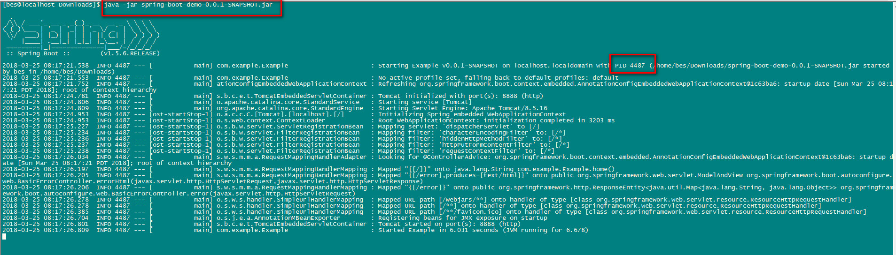
2. 启动greys
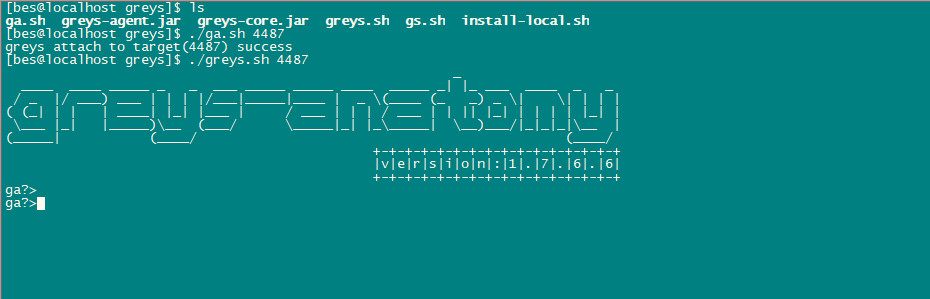
3. 访问应用
```
curl 'http://localhost:8888'
```
4. 通过greys查看Example类的类加载器
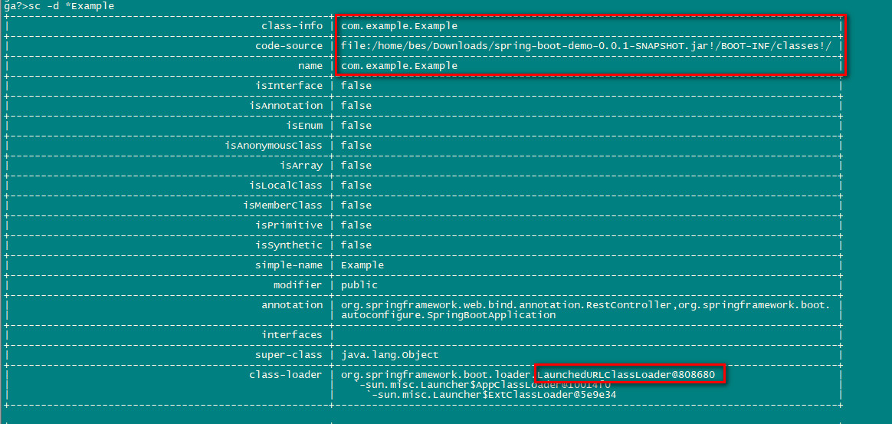
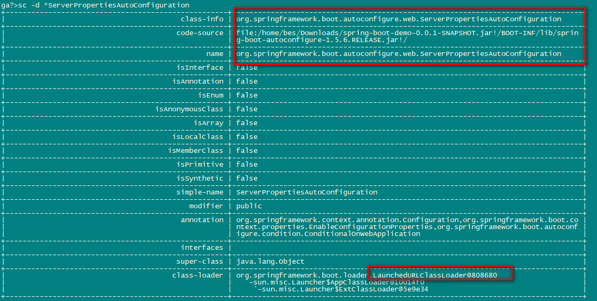

### War类型的应用（包含jsp文件）
1. 启动spring-boot应用
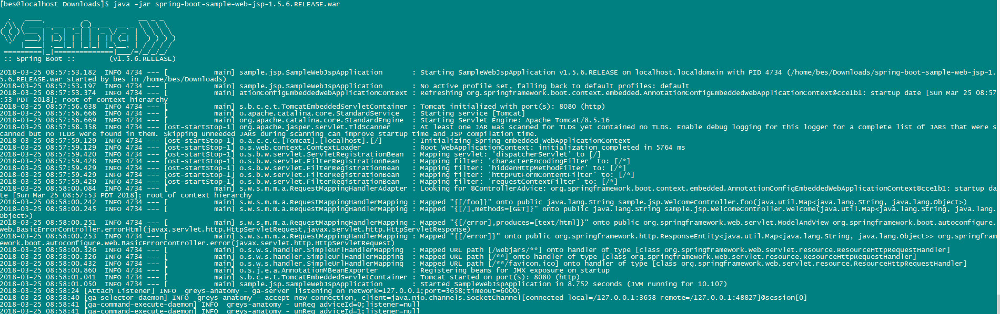
2. 启动greys
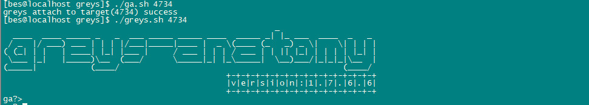
3. 访问应用
```
curl 'http://localhost:8080'
```
4. 通过greys查看jsp的类加载器
对于jsp文件，是由JasperLoader加载编译之后的jsp文件
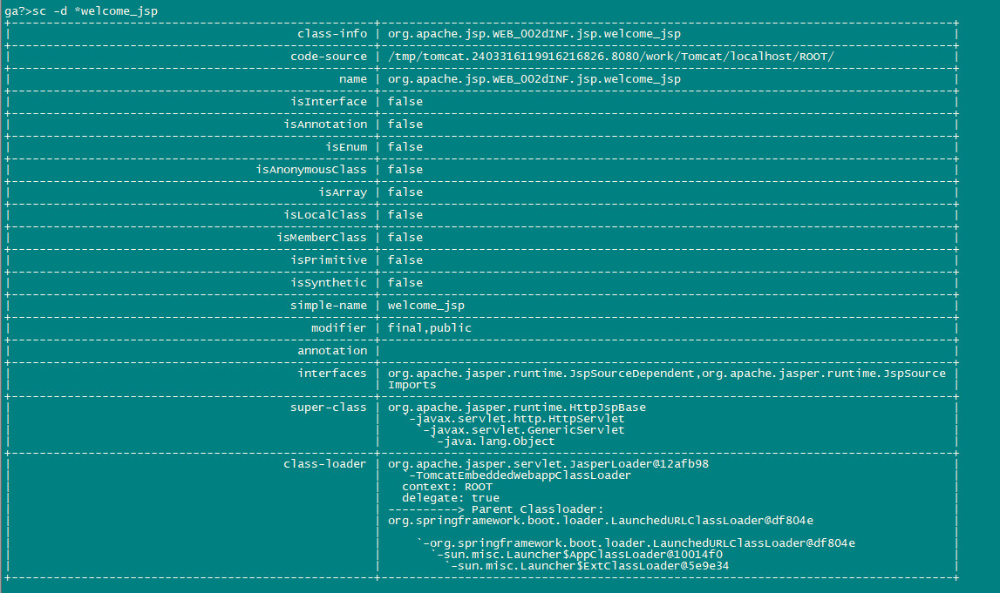
对于tomcat本身的加载：
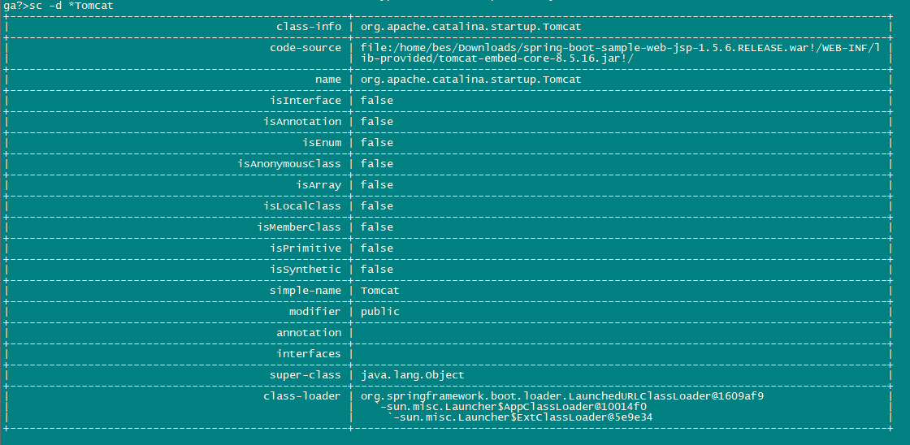
对于应用controller的加载：
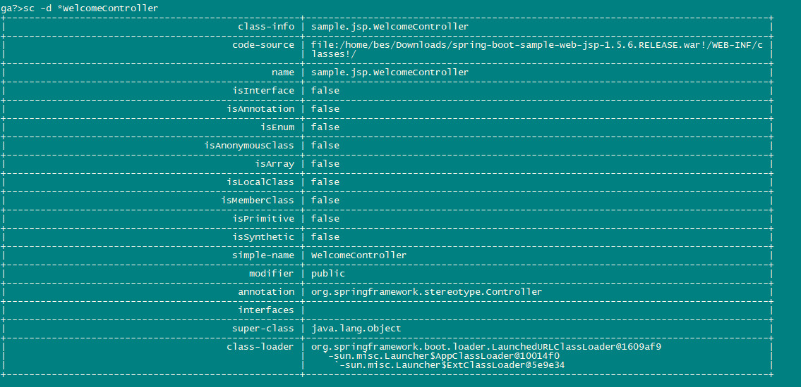
### 类加载层次分析
从上面可以看到，不管是classes下的class文件，还是lib下的jar里面的类，都是由LaunchedURLClassLoader加载的。而对于jsp文件，单独由JasperLoader加载
回顾下传统的tomcat类加载层次：
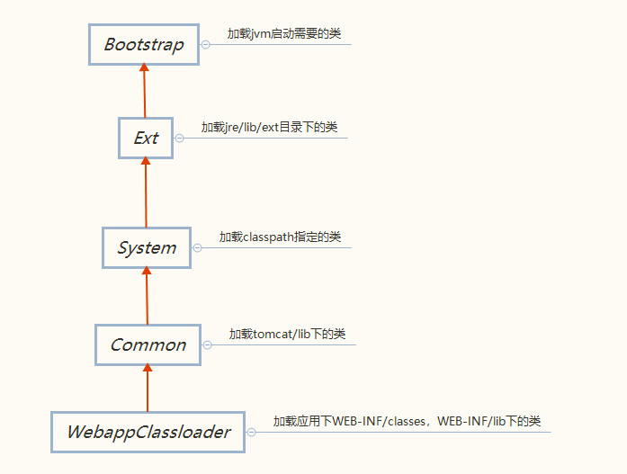
根据TomcatEmbeddedServletContainerFactory代码我们可以画出spring-boot的classloader层次：
```
protected void prepareContext(Host host, ServletContextInitializer[] initializers) {
	File docBase = getValidDocumentRoot();
	docBase = (docBase != null ? docBase : createTempDir("tomcat-docbase"));
	final TomcatEmbeddedContext context = new TomcatEmbeddedContext();
	context.setName(getContextPath());
	context.setDisplayName(getDisplayName());
	context.setPath(getContextPath());
	context.setDocBase(docBase.getAbsolutePath());
	context.addLifecycleListener(new FixContextListener());
	context.setParentClassLoader(
			this.resourceLoader != null ? this.resourceLoader.getClassLoader()
					: ClassUtils.getDefaultClassLoader());
	resetDefaultLocaleMapping(context);
	addLocaleMappings(context);
	try {
		context.setUseRelativeRedirects(false);
	}
	catch (NoSuchMethodError ex) {
		// Tomcat is < 8.0.30. Continue
	}
	SkipPatternJarScanner.apply(context, this.tldSkipPatterns);
	WebappLoader loader = new WebappLoader(context.getParentClassLoader());
	loader.setLoaderClass(TomcatEmbeddedWebappClassLoader.class.getName());
	loader.setDelegate(true);
	context.setLoader(loader);
	if (isRegisterDefaultServlet()) {
		addDefaultServlet(context);
	}
	if (shouldRegisterJspServlet()) {
		addJspServlet(context);
		addJasperInitializer(context);
		context.addLifecycleListener(new StoreMergedWebXmlListener());
	}
	context.addLifecycleListener(new LifecycleListener() {

		@Override
		public void lifecycleEvent(LifecycleEvent event) {
			if (event.getType().equals(Lifecycle.CONFIGURE_START_EVENT)) {
				TomcatResources.get(context)
						.addResourceJars(getUrlsOfJarsWithMetaInfResources());
			}
		}

	});
	ServletContextInitializer[] initializersToUse = mergeInitializers(initializers);
	configureContext(context, initializersToUse);
	host.addChild(context);
	postProcessContext(context);
}
```
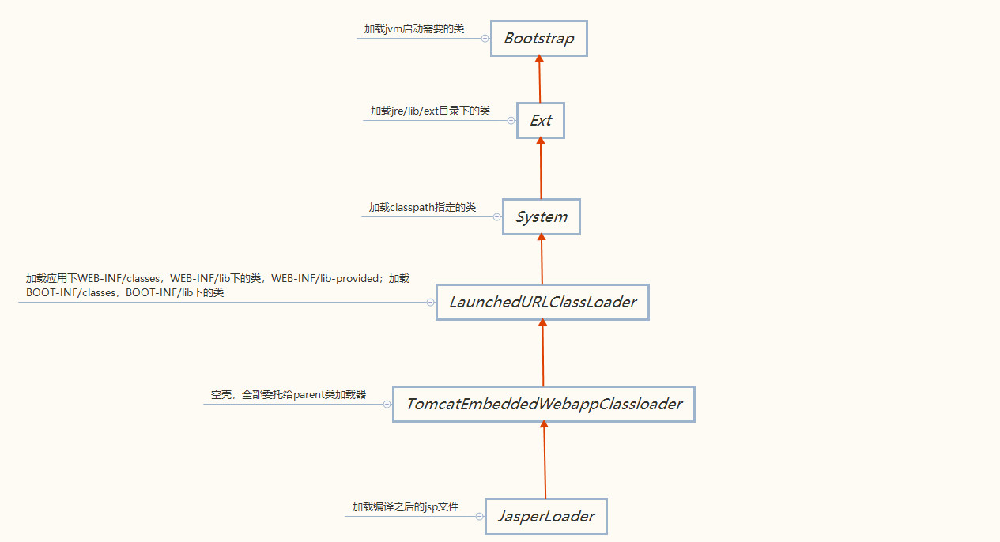