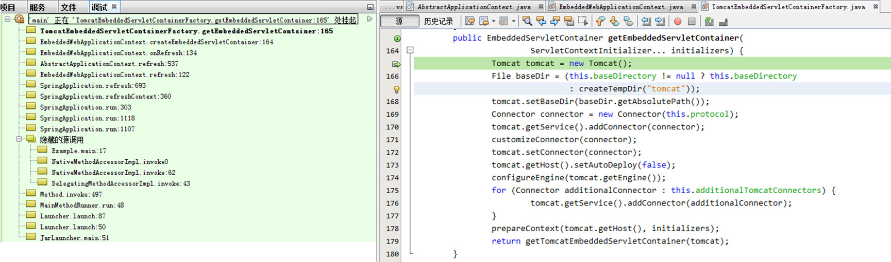
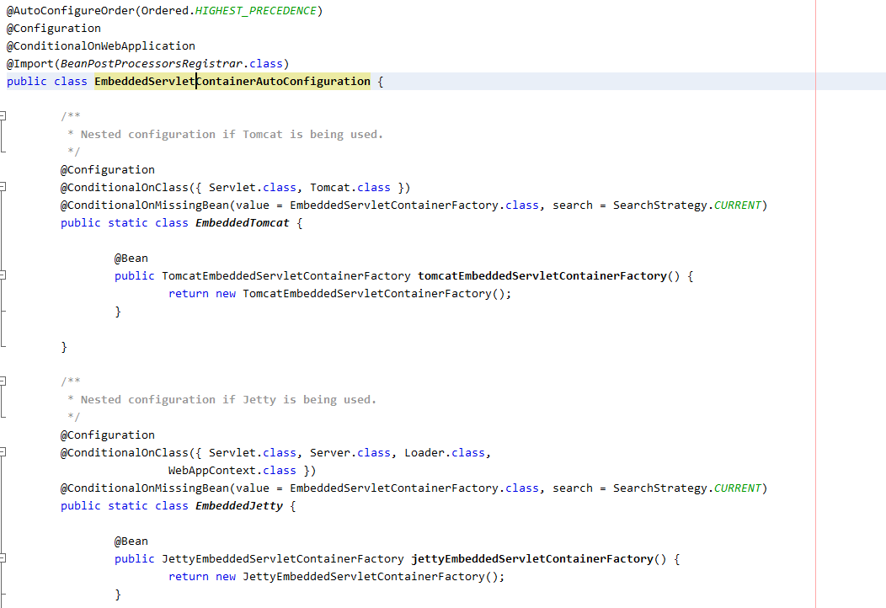
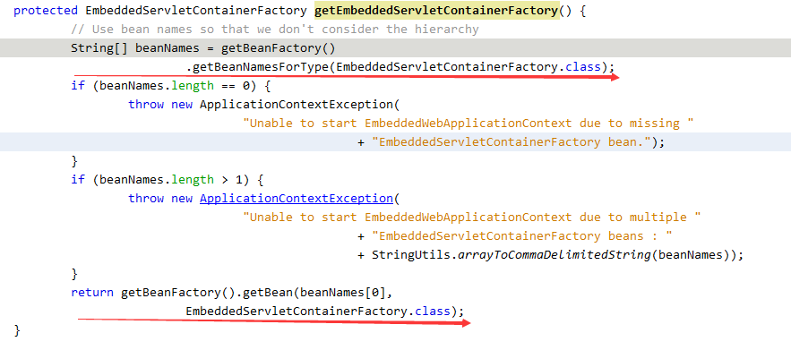

### 前言
- 这几天接到老大一个任务，需要应用服务器支持springboot，so......，经过调查，springboot底层的web容器支持tomcat、jetty、undertow，那么来看看springboot和tomcat是怎么玩的？

具体环境如下：

- springboot-1.5.6.RELEASE（依赖tomcat-8.5.16，spring-4.3.10）
- oracle jdk7
- CentOS6 64位
- git
- svn

<!--more-->

### 源码下载
spring-boot下载
```
git clone -b v1.5.6.RELEASE https://github.com/spring-projects/spring-boot.git
或者
wget https://github.com/spring-projects/spring-boot/archive/v1.5.6.RELEASE.zip  会快一些
```

tomcat源码下载
```
svn checkout http://svn.apache.org/repos/asf/tomcat/tc8.5.x/tags/TOMCAT_8_5_16
```
至于如何导入开发工具调试，这里就不说了

### SpringBoot应用demo
创建个maven工程spring-boot-demo，pom.xml如下：
```
<?xml version="1.0" encoding="UTF-8"?>
<project xmlns="http://maven.apache.org/POM/4.0.0" 
xmlns:xsi="http://www.w3.org/2001/XMLSchema-instance"
    xsi:schemaLocation="http://maven.apache.org/POM/4.0.0 http://maven.apache.org/xsd/maven-4.0.0.xsd">
    <modelVersion>4.0.0</modelVersion>
    <parent>
        <groupId>org.springframework.boot</groupId>
        <artifactId>spring-boot-starter-parent</artifactId>
        <version>1.5.6.RELEASE</version>
    </parent>
    <groupId>com.example</groupId>
    <artifactId>spring-boot-demo</artifactId>
    <version>0.0.1-SNAPSHOT</version>
    <dependencies>
	<dependency>
		<groupId>org.springframework.boot</groupId>
		<artifactId>spring-boot-starter-web</artifactId>
	</dependency>
    </dependencies>
    <build>
	<plugins>
                <!—springboot打包插件 -->
		<plugin>
			<groupId>org.springframework.boot</groupId>
			<artifactId>spring-boot-maven-plugin</artifactId>
		</plugin>
	</plugins>
    </build>
</project>
```
入口类Example.java
```
package com.example;
import org.springframework.boot.*;
import org.springframework.boot.autoconfigure.*;
import org.springframework.stereotype.*;
import org.springframework.web.bind.annotation.*;

@RestController
@SpringBootApplication
public class Example {
    @RequestMapping("/")
    String home() {
        return "Hello World!";
    }
    public static void main(String[] args) throws Exception {
        SpringApplication.run(Example.class, args);
    }
}
```
编译和运行
```
mvn clean install -DskipTests
mvn spring-boot:run或者java -jar spring-boot-demo.jar来运行
```
浏览器访问：http://localhost:8080， 返回Hello World!

### SpringBoot 启动分析
根据上面我们知道java -jar spring-boot-demo.jar来启动运行，内部机制如何？
#### jar文件结构
```
spring-boot-demo.jar  
├─BOOT-INF
│  ├─classes
│  │  └─com
│  │      └─example
│  │              Example.class
│  │              SpringBootStartApplication.class
│  │              
│  └─lib
│       |……..依赖jar
├─META-INF
│  │__MANIFEST.MF
│                  
└─org
    └─springframework
        └─boot
            └─loader
                │  ……spring boot loader相关class
```

#### MANIFEST.MF文件
```
Manifest-Version: 1.0
Implementation-Title: spring-boot-demo
Implementation-Version: 0.0.1-SNAPSHOT
Archiver-Version: Plexus Archiver
Built-By: bes6
Implementation-Vendor-Id: com.example
Spring-Boot-Version: 1.5.6.RELEASE
Implementation-Vendor: Pivotal Software, Inc.
Main-Class: org.springframework.boot.loader.JarLauncher
Start-Class: com.example.Example
Spring-Boot-Classes: BOOT-INF/classes/
Spring-Boot-Lib: BOOT-INF/lib/
Created-By: Apache Maven 3.2.5
Build-Jdk: 1.8.0_60
Implementation-URL: http://projects.spring.io/spring-boot/spring-boot-demo/
```
通过上面的配置可以看到有Main-Class是org.springframework.boot.loader.JarLauncher ，这个是jar启动的Main函数，还有一个Start-Class是com.example.Example，里面是我们应用自己的Main函数。

#### Archive的概念
archive即归档文件，通常就是一个tar/zip格式的压缩包，jar是zip格式，在spring boot里，抽象出了Archive的概念。一个archive可以是一个jar（JarFileArchive），也可以是一个文件目录（ExplodedArchive）。可以理解为Spring boot抽象出来的统一访问资源的层。上面的spring-boot-demo.jar 是一个Archive，然后spring-boot-demo.jar里的/lib目录下面的每一个Jar包，也是一个Archive。
```
public interface Archive extends Iterable<Archive.Entry> {

	/**
	 * Returns a URL that can be used to load the archive.
	 * @return the archive URL
	 * @throws MalformedURLException if the URL is malformed
	 */
	URL getUrl() throws MalformedURLException;

	/**
	 * Returns the manifest of the archive.
	 * @return the manifest
	 * @throws IOException if the manifest cannot be read
	 */
	Manifest getManifest() throws IOException;

	/**
	 * Returns nested {@link Archive}s for entries that match the specified filter.
	 * @param filter the filter used to limit entries
	 * @return nested archives
	 * @throws IOException if nested archives cannot be read
	 */
	List<Archive> getNestedArchives(EntryFilter filter) throws IOException;
...
...
}
```
可以看到Archive有一个自己的URL，比如：jar:file:/spring-boot-demo/target/spring-boot-demo.jar!/
注意这个getNestedArchives函数，这个实际返回的是spring-boot-demo.jar/lib下面的jar的Archive列表。它们的URL是：
file:/E:/project/spring-boot-demo/target/spring-boot-demo-0.0.1-SNAPSHOT.jar!/BOOT-INF/lib/spring-boot-starter-web-1.5.6.RELEASE.jar!/
file:/E:/project/spring-boot-demo/target/spring-boot-demo-0.0.1-SNAPSHOT.jar!/BOOT-INF/lib/spring-beans-4.3.10.RELEASE.jar!/

#### 自定义LaunchedURLClassLoader类加载器
JarLauncher先找到自己所在的jar，即spring-boot-demo.jar的路径，然后创建了一个Archive，然后通过getNestedArchives函数来获取到spring-boot-demo.jar/lib下面的所有jar文件，并创建为List<URL>。获取到这些Archive的URL之后，也就获得了一个URL[]数组，用这个来构造一个自定义的ClassLoader：LaunchedURLClassLoader。创建好ClassLoader之后，再从MANIFEST.MF里读取到Start-Class，即com.example.Example，并通过反射启动应用的Main函数。
web容器启动：
SpringApplication中完成很多初始化的工作，
deduceWebEnvironment()->判断当前是否为web环境
deduceMainApplicationClass() ->获取应用启动main函数的class
createApplicationContext()-> 根据是否为web环境创建上下文，
AnnotationConfigEmbeddedWebApplicationContext或者AnnotationConfigApplicationContext
onRefresh()->创建web容器，默认为tomcat，同时创建应用的Context和WebappLoader，此部分不详细分析。
调用栈如下:


#### web容器创建
从上面的调用栈可以看出，确实创建了Tomcat，但是为什么就是创建了Tomcat，没有创建Jetty或者其他？
我们可以从TomcatEmbeddedServletContainerFactory来寻找线索，既然tomcat由TomcatEmbeddedServletContainerFactory来创建，相同可以得出对于jetty，存在JettyEmbeddedServletContainerFactory来创建jetty的web容器，还有undertow的UndertowEmbeddedServletContainerFactory。那么具体又是使用哪一个factory?
根据调用栈我们找到这个类：EmbeddedServletContainerAutoConfiguration

EmbeddedServletContainerAutoConfiguration配置类在spring解析时会解析子类EmbededTomcat和其方法。@ConditionalOnClass意思当类路径下有Servlet.class，Tomcat.class时，就注册的servletContainerFactory的是TomcatEmbeddedServletContainerFactory，jetty类似。这个注册信息实在上述调用栈中EmbeddedWebApplicationContext. getEmbeddedServletContainerFactory()来获取，以拿到当前环境下的servletContainerFactory。
代码如下：

因此我们可以得出一个替换web容器为jetty的方案，修改pom.xml文件：
```
<?xml version="1.0" encoding="UTF-8"?>
<project xmlns="http://maven.apache.org/POM/4.0.0" 
xmlns:xsi="http://www.w3.org/2001/XMLSchema-instance"
    xsi:schemaLocation="http://maven.apache.org/POM/4.0.0 http://maven.apache.org/xsd/maven-4.0.0.xsd">
    <modelVersion>4.0.0</modelVersion>
    <parent>
        <groupId>org.springframework.boot</groupId>
        <artifactId>spring-boot-starter-parent</artifactId>
        <version>1.5.6.RELEASE</version>
    </parent>
    <groupId>com.example</groupId>
    <artifactId>spring-boot-demo</artifactId>
    <version>0.0.1-SNAPSHOT</version>
    <dependencies>
	<dependency>
		<groupId>org.springframework.boot</groupId>
		<artifactId>spring-boot-starter-web</artifactId>
		<exclusions>  
			<exclusion>  
				<groupId>org.springframework.boot</groupId>  
				<artifactId>spring-boot-starter-tomcat</artifactId>  
			</exclusion>  
		</exclusions> 	
	</dependency>
	<dependency>  
		<groupId>org.springframework.boot</groupId>  
		<artifactId>spring-boot-starter-jetty</artifactId>  
	</dependency> 
    </dependencies>
    <build>
	<plugins>
                <!—springboot打包插件 -->
		<plugin>
			<groupId>org.springframework.boot</groupId>
			<artifactId>spring-boot-maven-plugin</artifactId>
		</plugin>
	</plugins>
    </build>
</project>
```
未完待续