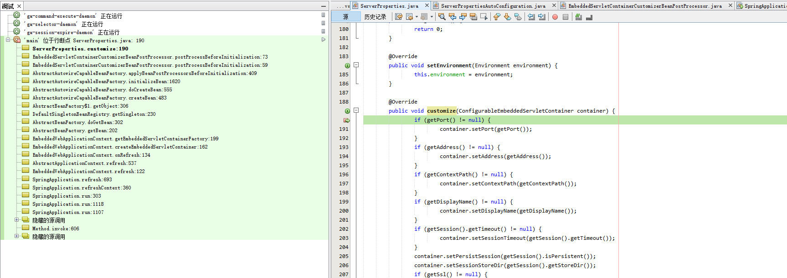

### 前言
- 上一篇讲了springboot和web容器相关的东西，这篇继续分析如何配置web容器参数以及如何接入另一种web容器。

### application.properties配置

@ConfigurationProperties(location,prefix)注解主要用来把properties配置文件转化为bean来使用的
@EnableConfigurationProperties(clazz) 注解的作用是@ConfigurationProperties注解生效。如果只配置@ConfigurationProperties注解，在IOC容器中是获取不到properties配置文件转化的bean的。
例如application.properties中配置tomcat：
server.tomcat.maxThreads=100
server.port=8080
<!--more-->
对应的类：
```
@ConfigurationProperties(prefix = "server", ignoreUnknownFields = true)
public class ServerProperties
		implements EmbeddedServletContainerCustomizer, EnvironmentAware, Ordered {
	private Integer port;
	private InetAddress address;
	private String contextPath;
	private String servletPath = "/";
        private final Tomcat tomcat = new Tomcat();
	private final Jetty jetty = new Jetty();
	private final Undertow undertow = new Undertow();
        @Override
	public void customize(ConfigurableEmbeddedServletContainer container) {
		if (getPort() != null) {
			container.setPort(getPort());
		}
		if (getAddress() != null) {
			container.setAddress(getAddress());
		}
                ...
                if (container instanceof TomcatEmbeddedServletContainerFactory) {
			getTomcat().customizeTomcat(this,
					(TomcatEmbeddedServletContainerFactory) container);
		}
		if (container instanceof JettyEmbeddedServletContainerFactory) {
			getJetty().customizeJetty(this,
					(JettyEmbeddedServletContainerFactory) container);
		}

		if (container instanceof UndertowEmbeddedServletContainerFactory) {
			getUndertow().customizeUndertow(this,
					(UndertowEmbeddedServletContainerFactory) container);
		}
		container.addInitializers(new SessionConfiguringInitializer(this.session));
		container.addInitializers(new InitParameterConfiguringServletContextInitializer(
				getContextParameters()));
        }
```

使得ServerProperties生效：
```
@Configuration
@EnableConfigurationProperties
@ConditionalOnWebApplication
public class ServerPropertiesAutoConfiguration {

	@Bean
	@ConditionalOnMissingBean(search = SearchStrategy.CURRENT)
	public ServerProperties serverProperties() {
		return new ServerProperties();
	}

	@Bean
	public DuplicateServerPropertiesDetector duplicateServerPropertiesDetector() {
		return new DuplicateServerPropertiesDetector();
	}

	/**
	 * {@link EmbeddedServletContainerCustomizer} that ensures there is exactly one
	 * {@link ServerProperties} bean in the application context.
	 */
	private static class DuplicateServerPropertiesDetector implements
			EmbeddedServletContainerCustomizer, Ordered, ApplicationContextAware {

		private ApplicationContext applicationContext;

		@Override
		public int getOrder() {
			return 0;
		}

		@Override
		public void setApplicationContext(ApplicationContext applicationContext)
				throws BeansException {
			this.applicationContext = applicationContext;
		}

		@Override
		public void customize(ConfigurableEmbeddedServletContainer container) {
			// ServerProperties handles customization, this just checks we only have
			// a single bean
			String[] serverPropertiesBeans = this.applicationContext
					.getBeanNamesForType(ServerProperties.class);
			Assert.state(serverPropertiesBeans.length == 1,
					"Multiple ServerProperties beans registered " + StringUtils
							.arrayToCommaDelimitedString(serverPropertiesBeans));
		}

	}

}
```

ServerProperties如何设置给Tomcat的？
EmbeddedServletContainerCustomizerBeanPostProcessor实现了BeanPostProcessor接口，当TomcatEmbeddedServletContainerFactory实例化时，会调用postProcessBeforeInitialization方法
```
public class EmbeddedServletContainerCustomizerBeanPostProcessor
		implements BeanPostProcessor, BeanFactoryAware {

	private ListableBeanFactory beanFactory;

	private List<EmbeddedServletContainerCustomizer> customizers;

	@Override
	public void setBeanFactory(BeanFactory beanFactory) {
		Assert.isInstanceOf(ListableBeanFactory.class, beanFactory,
				"EmbeddedServletContainerCustomizerBeanPostProcessor can only be used "
						+ "with a ListableBeanFactory");
		this.beanFactory = (ListableBeanFactory) beanFactory;
	}

	@Override
	public Object postProcessBeforeInitialization(Object bean, String beanName)
			throws BeansException {
		if (bean instanceof ConfigurableEmbeddedServletContainer) {
			postProcessBeforeInitialization((ConfigurableEmbeddedServletContainer) bean);
		}
		return bean;
	}

	@Override
	public Object postProcessAfterInitialization(Object bean, String beanName)
			throws BeansException {
		return bean;
	}

	private void postProcessBeforeInitialization(
			ConfigurableEmbeddedServletContainer bean) {
		for (EmbeddedServletContainerCustomizer customizer : getCustomizers()) {
			customizer.customize(bean);
		}
	}
...
...
}
```
调用栈如下：


### 接入另一种web容器
我们来思考下给springboot接入另一种web容器需要做那些事？例如weblogic
创建独立的工程spring-boot-starter-weblogic
1.创建web容器的工厂以及factory初始化器
WeblogicEmbeddedServletContainerFactory
EmbeddedWeblogicServletContainerAutoConfiguration
2、配置
新增加WeblogicPrroperties、WeblogicServerPropertiesAutoConfiguration（将配置设置给factory）
spring.factories中需要增加如下配置：
```
# Auto Configure
org.springframework.boot.autoconfigure.EnableAutoConfiguration=\
xxxx.xxxx.xxxx.EmbeddedWeblogicServletContainerAutoConfiguration,\
xxxx.xxxx.xxxx.WeblogicServerPropertiesAutoConfiguration
```