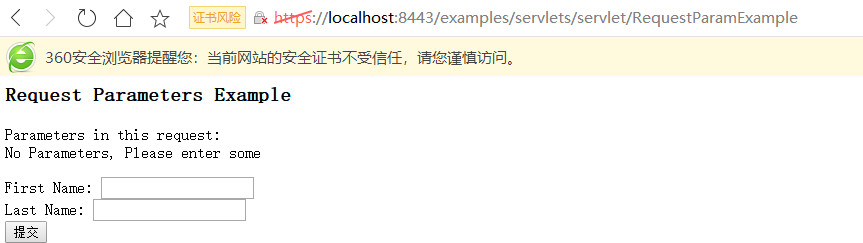
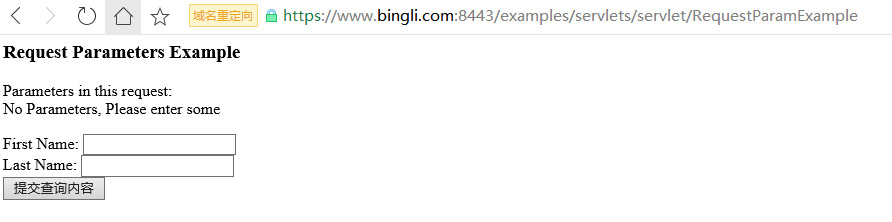
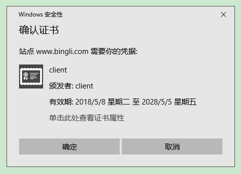

### 前言

之前已经通过startup.bat脚本启动tomcat，浏览器中输入 http://localhost:8080 来访问tomcat的管理页面。通过wireshark或者其他的协议分析工具，可以轻松的分析出整个访问的过程和报文，那么，Tomcat就不能加密传输数据吗？答案就是HTTPS

### 基本概念

#### 协议

1、HTTP 协议（HyperText Transfer Protocol，超文本传输协议）：是客户端浏览器或其他程序与Web服务器之间的应用层通信协议 。

2、HTTPS 协议（HyperText Transfer Protocol over Secure Socket Layer）：可以理解为HTTP+SSL/TLS， 即 HTTP 下加入 SSL 层，HTTPS 的安全基础是 SSL，用于安全的 HTTP 数据传输。由于安全问题，SSL目前已经很少被使用，大部分网站都是用TLS，两者的关系大致如下：TLS1.0建立在SSL3.0基础上，可以理解为SSL3.1，常用的 TLS 协议版本还有如下几个：TLS1.2, TLS1.1 

如下所示 HTTPS 相比 HTTP 多了一层 SSL/TLS

```xml
http    https
  |       |
 tcp   ssl/tls
  |       |
  ip     tcp
          |
          ip
```

<!--more-->

#### 加密算法

##### 对称加密

有流式、分组两种，加密和解密都是使用的同一个密钥。

例如：DES、AES-GCM、ChaCha20-Poly1305等

##### 非对称加密

非对称加密使用一对“私钥-公钥”，用私钥加密的内容只有对应公钥才能解开，反之亦然。非对称加密有以下特性：

- 对于一个公钥，有且只有一个对应的私钥。
- 公钥是公开的，并且不能通过公钥反推出私钥。
- 通过私钥加密的密文只能通过公钥能解密，通过公钥加密的密文也只能通过私钥能解密
- 公钥和算法都是公开的，私钥是保密的。
- 非对称加密算法性能较低，但是安全性超强，由于其加密特性，非对称加密算法能加密的数据长度也是有限的。

例如：RSA、DSA、ECDSA、 DH、ECDHE

#### 摘要算法（哈希算法）

将任意长度的信息转换为较短的固定长度的值，通常其长度要比信息小得多，且算法不可逆。摘要算法有以下特性：

- 只要源文本不同，计算得到的结果，必然不同（或者说机会很少）。

- 无法从结果反推出源数据。

基于以上特性，我们一般使用摘要算法来校验原始内容是否被篡改。例如：MD5、SHA-1、SHA-2、SHA-256 等

#### 数字签名

用**摘要算法**提取出源文件的摘要并用私钥进行加密后的内容，再和源文件信息一起发送，以保证这个hash值不被修改。

### 例子

1、A有一对私钥和公钥，并将公钥发给了B。

2、B要给A写信，用A的公钥加密确保信件不能被其他人读取。A收到信后，用私钥解密，就看到了信件内容。注意：只要A的私钥不泄露，这封信就是安全的，即使落在别人手里，也无法解密。

3、 A给B回信，A写完信件后先用Hash函数，生成信件的摘要（digest） ，然后使用私钥，对这个摘要加密，生成"数字签名"（signature）。将这个签名，附在信件下面，一起发给B。B收信后，取下数字签名，用A的公钥解密，得到信件的摘要。由此证明，这封信确实是A发出的 ，同时B对信件本身使用Hash函数，将得到的结果，与上一步得到的摘要进行对比。如果两者一致，就证明这封信未被修改过。 

4、一个问题出现了，C想欺骗B，他偷偷使用了B的电脑，用自己的公钥换走了A的公钥。此时，B实际拥有的是C的公钥，但是还以为这是A的公钥。因此，C就可以冒充A，用自己的私钥做成"数字签名"，写信给B，让B用假的A公钥进行解密。 B一直以为是和A在写信。过了一段时间，B感觉不对劲，发现自己无法确定公钥是否真的属于A。她想到了一个办法，要求A去找"证书中心"（certificate authority，简称CA），为公钥做认证。证书中心用自己的私钥，对A的公钥和一些相关信息一起加密，生成"数字证书"（Digital Certificate） ，A拿到数字证书以后，就可以放心了。以后再给B写信，只要在签名的同时，再附上数字证书就行了 ，B收信后，用CA的公钥解开数字证书，得到对应的证书摘要，并根据证书签名使用的hash算法，计算出当前证书的摘要，相比较2个摘要，判断证书是否被修改过。同时也可以拿到A真实的公钥了，只要CA证书安全，A的公钥就是安全的。 

数字签名和数字证书是两个不同的概念:

> 数字签名是内容提供方用自己的私钥对内容摘要（MD5、SHA）非对称加密
>
> 数字证书是 CA 用自己的私钥对证书内容的摘要非对称加密从而确保证书内的用户合法拥有证书里列出的公钥。

了解了概念，今天所说的https与RSA和数字签名密切相关。那么如何让tomcat支持https呢？下面我们来实践一下

### 自签名证书制作

keytool是jdk自带的一款ssl管理工具，jdk6和jdk7的keytool命令有些不同，jdk7的兼容jdk6的，这里用的是jdk7下的keytool 。制作一个简单的自签名证书：

```bat
帮助信息：
E:\project\TOMCAT_7_0_83\output\build\bin>keytool
密钥和证书管理工具
命令:

 -certreq            生成证书请求
 -changealias        更改条目的别名
 -delete             删除条目
 -exportcert         导出证书
 -genkeypair         生成密钥对
 -genseckey          生成密钥
 -gencert            根据证书请求生成证书
 -importcert         导入证书或证书链
 -importkeystore     从其他密钥库导入一个或所有条目
 -keypasswd          更改条目的密钥口令
 -list               列出密钥库中的条目
 -printcert          打印证书内容
 -printcertreq       打印证书请求的内容
 -printcrl           打印 CRL 文件的内容
 -storepasswd        更改密钥库的存储口令

使用 "keytool -command_name -help" 获取 command_name 的用法
E:\project\TOMCAT_7_0_83\output\build\bin>keytool -genkeypair -help
keytool -genkeypair [OPTION]...
生成密钥对
选项:

 -alias <alias>                  要处理的条目的别名
 -keyalg <keyalg>                密钥算法名称
 -keysize <keysize>              密钥位大小
 -sigalg <sigalg>                签名算法名称
 -destalias <destalias>          目标别名
 -dname <dname>                  唯一判别名
 -startdate <startdate>          证书有效期开始日期/时间
 -ext <value>                    X.509 扩展
 -validity <valDays>             有效天数
 -keypass <arg>                  密钥口令
 -keystore <keystore>            密钥库名称
 -storepass <arg>                密钥库口令
 -storetype <storetype>          密钥库类型
 -providername <providername>    提供方名称
 -providerclass <providerclass>  提供方类名
 -providerarg <arg>              提供方参数
 -providerpath <pathlist>        提供方类路径
 -v                              详细输出
 -protected                      通过受保护的机制的口令
 
制作：
keytool -genkeypair -v -alias tomcat -keyalg RSA -validity 3650 -keystore server.keystore -dname "CN=www.bingli.com,OU=cn,O=cn,L=cn,ST=cn,c=cn" -storepass changeit -keypass changeit

查看：
E:\project\TOMCAT_7_0_83\output\build\conf>keytool -list -v -keystore server.keystore
输入密钥库口令:

密钥库类型: JKS
密钥库提供方: SUN

您的密钥库包含 1 个条目

别名: tomcat
创建日期: 2018-5-7
条目类型: PrivateKeyEntry
证书链长度: 1
证书[1]:
所有者: CN=www.bingli.com, OU=cn, O=cn, L=cn, ST=cn, C=cn
发布者: CN=www.bingli.com, OU=cn, O=cn, L=cn, ST=cn, C=cn
序列号: 357e6e93
有效期开始日期: Mon May 07 22:08:53 CST 2018, 截止日期: Thu May 04 22:08:53 CST 2028
证书指纹:
         MD5: 84:E7:50:5D:64:6A:A7:00:92:66:07:FD:A5:01:9E:16
         SHA1: D1:42:F8:D5:27:30:AD:E5:61:A3:B6:BA:4D:05:F6:1D:CF:7C:7F:98
         SHA256: 9D:1F:83:34:C2:2D:35:B9:A6:EE:19:CC:52:08:E9:6B:8E:D2:32:9A:4F:3E:7B:E1:86:C7:9C:0B:65:26:90:4C
         签名算法名称: SHA256withRSA
         版本: 3

扩展:

#1: ObjectId: 2.5.29.14 Criticality=false
SubjectKeyIdentifier [
KeyIdentifier [
0000: 2D F3 F3 00 49 E0 F8 81   D5 B2 33 22 9B B3 7E FD  -...I.....3"....
0010: 6D 8C AC 02                                        m...
]
]
一个自签名的证书就制作完成了。
```

### Tomcat配置https单向认证

tomcat的server.xml中配置：

```xml
<Connector port="8443" protocol="org.apache.coyote.http11.Http11Protocol"
               maxThreads="150" SSLEnabled="true" scheme="https" secure="true" 
               keystoreFile="conf/server.keystore" keystorePass="changeit"
               clientAuth="false" sslProtocol="TLS" />
```

然后浏览器访问：http://localhost:8443/examples/servlets/servlet/RequestParamExample 发现访问失败，肯定那，因为8443端口现在已经启用了https，所以改成如下 https://localhost:8443/examples/servlets/servlet/RequestParamExample 即可访问，但是可能会遇到问题，浏览器提示localhost:8443 使用了无效的安全证书。 

1、该证书因为其自签名而不被信任

因为是自签名证书，没有经过CA认证中心签发，因此浏览器会提示不被信任。

2、 该证书对名称 localhost 无效

因为访问的地址是localhost，但是证书中CN=www.bingli.com，因此浏览器也会提示localhost无效

可以通过添加例外就能忽略掉上面的异常信息，才能正常访问。下面我们来解决上面的两个问题。

#### 自签名证书不被信任

这就涉及到CA根证书的问题，由于去CA认证中心做认证太贵了，我们可以自己做一个CA根证书，然后签发一个二级证书配置到tomcat中，最后在浏览器中导入CA根证书即可

```bat
1.制作根证书，保存在密钥库mykeystore中
E:\project\TOMCAT_7_0_83\output\build\conf>keytool -genkeypair -v -alias rootca -keyalg RSA   -validity 3650  -dname "CN=CA,OU=CA,O=CA,L=CA,ST=CA"  -storepass changeit  -keypass changeit -keystore mykeystore
正在为以下对象生成 2,048 位RSA密钥对和自签名证书 (SHA256withRSA) (有效期为 3,650 天):
         CN=CA, OU=CA, O=CA, L=CA, ST=CA
[正在存储mykeystore]

2.制作二级证书，保存在密钥库mykeystore中
E:\project\TOMCAT_7_0_83\output\build\conf>keytool -genkeypair -v -alias bingli -keyalg RSA   -validity 3650 -dname "CN=www.bingli.com,OU=bingli,O=bingli,L=bingli,ST=bingli" -storepass changeit  -keypass changeit -keystore mykeystore
正在为以下对象生成 2,048 位RSA密钥对和自签名证书 (SHA256withRSA) (有效期为 3,650 天):
         CN=www.bingli.com, OU=bingli, O=bingli, L=bingli, ST=bingli
[正在存储mykeystore]

现在密钥库mykeystore中存在两个条目，可以通过list查看
E:\project\TOMCAT_7_0_83\output\build\conf>keytool -list -v -keystore mykeystore -storepass changeit

密钥库类型: JKS
密钥库提供方: SUN

您的密钥库包含 2 个条目

别名: rootca
创建日期: 2018-5-8
条目类型: PrivateKeyEntry
证书链长度: 1
证书[1]:
所有者: CN=CA, OU=CA, O=CA, L=CA, ST=CA
发布者: CN=CA, OU=CA, O=CA, L=CA, ST=CA
序列号: 700d296d
有效期开始日期: Tue May 08 17:18:36 CST 2018, 截止日期: Fri May 05 17:18:36 CST 2028
证书指纹:
         MD5: 4B:85:2D:A5:97:C2:DA:85:6C:69:E7:6D:5A:89:84:E1
         SHA1: D4:41:64:F3:B6:AE:70:DC:DF:84:B5:40:51:5D:59:D6:D2:2A:11:C1
         SHA256: CE:5C:79:FD:90:F6:E7:FC:9C:F8:06:08:2A:9B:C3:B0:26:08:83:52:FA:63:EF:03:3B:9E:A0:26:3D:61:6E:F6
         签名算法名称: SHA256withRSA
         版本: 3

扩展:

#1: ObjectId: 2.5.29.14 Criticality=false
SubjectKeyIdentifier [
KeyIdentifier [
0000: 03 C7 37 E8 C2 2D 9F 68   1B 3D AD E6 DF C3 FC E5  ..7..-.h.=......
0010: 7C 90 64 CB                                        ..d.
]
]


*******************************************
*******************************************


别名: bingli
创建日期: 2018-5-8
条目类型: PrivateKeyEntry
证书链长度: 1
证书[1]:
所有者: CN=www.bingli.com, OU=bingli, O=bingli, L=bingli, ST=bingli
发布者: CN=www.bingli.com, OU=bingli, O=bingli, L=bingli, ST=bingli
序列号: b55f388
有效期开始日期: Tue May 08 17:22:34 CST 2018, 截止日期: Fri May 05 17:22:34 CST 2028
证书指纹:
         MD5: 29:13:C3:A8:73:E6:B1:22:99:B6:73:15:62:29:95:C9
         SHA1: 3C:93:A6:DF:3A:DB:60:B4:ED:70:7B:42:CC:51:69:3E:44:A9:49:2B
         SHA256: 2B:AC:01:AC:BF:E6:9E:9A:FA:EE:62:CE:62:7C:8C:E4:51:D1:A0:27:55:CF:4E:BB:8B:83:DB:C1:09:CA:EF:24
         签名算法名称: SHA256withRSA
         版本: 3

扩展:

#1: ObjectId: 2.5.29.14 Criticality=false
SubjectKeyIdentifier [
KeyIdentifier [
0000: 67 68 F6 7E E9 2E EB 2B   5E BA D8 A7 E0 BA 0E 3D  gh.....+^......=
0010: 21 F0 8D 69                                        !..i
]
]

3.对二级证书生成证书请求
E:\project\TOMCAT_7_0_83\output\build\conf>keytool -certreq -alias bingli -file bingli.csr  -storepass changeit  -keypass changeit -keystore mykeystore

4.通过CA根证书来给刚才生成的证书请求做认证，生成认证之后的证书
E:\project\TOMCAT_7_0_83\output\build\conf>keytool -gencert -alias rootca -infile bingli.csr -outfile bingli.cer  -storepass changeit  -keypass changeit -keystore mykeystore

5.将认证之后的证书导入密钥库
E:\project\TOMCAT_7_0_83\output\build\conf>keytool -importcert  -alias bingli  -file bingli.cer   -storepass changeit  -keypass changeit -keystore mykeystore
证书回复已安装在密钥库中

再通过list查看别名为bingli的证书条目，会发现证书链长度为2，一个就是刚才认证之后的证书，所有者是bingli，发布者是CA，另一个就是CA的证书。
E:\project\TOMCAT_7_0_83\output\build\conf>keytool -list -v -alias bingli -keystore mykeystore -storepass changeit
别名: bingli
创建日期: 2018-5-8
条目类型: PrivateKeyEntry
证书链长度: 2
证书[1]:
所有者: CN=www.bingli.com, OU=bingli, O=bingli, L=bingli, ST=bingli
发布者: CN=CA, OU=CA, O=CA, L=CA, ST=CA
序列号: 262f42ba
有效期开始日期: Tue May 08 17:32:01 CST 2018, 截止日期: Mon Aug 06 17:32:01 CST 2018
证书指纹:
         MD5: 17:E5:F0:82:C1:8E:D2:7F:85:6A:9F:A3:5E:CB:90:1B
         SHA1: EE:03:89:68:D9:0E:83:27:A8:5B:41:F2:80:75:9D:4A:69:B6:0C:96
         SHA256: FA:08:67:AB:52:FF:17:D8:04:FB:C6:BF:C0:2D:A6:CF:3B:9E:78:82:E6:9A:94:B4:AE:7F:03:0E:E3:92:62:00
         签名算法名称: SHA256withRSA
         版本: 3

扩展:

#1: ObjectId: 2.5.29.35 Criticality=false
AuthorityKeyIdentifier [
KeyIdentifier [
0000: 03 C7 37 E8 C2 2D 9F 68   1B 3D AD E6 DF C3 FC E5  ..7..-.h.=......
0010: 7C 90 64 CB                                        ..d.
]
]

#2: ObjectId: 2.5.29.14 Criticality=false
SubjectKeyIdentifier [
KeyIdentifier [
0000: 67 68 F6 7E E9 2E EB 2B   5E BA D8 A7 E0 BA 0E 3D  gh.....+^......=
0010: 21 F0 8D 69                                        !..i
]
]

证书[2]:
所有者: CN=CA, OU=CA, O=CA, L=CA, ST=CA
发布者: CN=CA, OU=CA, O=CA, L=CA, ST=CA
序列号: 700d296d
有效期开始日期: Tue May 08 17:18:36 CST 2018, 截止日期: Fri May 05 17:18:36 CST 2028
证书指纹:
         MD5: 4B:85:2D:A5:97:C2:DA:85:6C:69:E7:6D:5A:89:84:E1
         SHA1: D4:41:64:F3:B6:AE:70:DC:DF:84:B5:40:51:5D:59:D6:D2:2A:11:C1
         SHA256: CE:5C:79:FD:90:F6:E7:FC:9C:F8:06:08:2A:9B:C3:B0:26:08:83:52:FA:63:EF:03:3B:9E:A0:26:3D:61:6E:F6
         签名算法名称: SHA256withRSA
         版本: 3

扩展:

#1: ObjectId: 2.5.29.14 Criticality=false
SubjectKeyIdentifier [
KeyIdentifier [
0000: 03 C7 37 E8 C2 2D 9F 68   1B 3D AD E6 DF C3 FC E5  ..7..-.h.=......
0010: 7C 90 64 CB                                        ..d.
]
]

6.导出CA根证书，方便浏览器安装
E:\project\TOMCAT_7_0_83\output\build\conf>keytool -exportcert -alias rootca -file rootca.cer   -storepass changeit  -keypass changeit -keystore mykeystore
存储在文件 <rootca.cer> 中的证书
现在将server.xml中的证书改为mykeystore，
<Connector port="8443" protocol="org.apache.coyote.http11.Http11Protocol"
    maxThreads="150" SSLEnabled="true" scheme="https" secure="true" 
    keystoreFile="conf/mykeystore" keystorePass="changeit" keyAlias="bingli"
    clientAuth="false" sslProtocol="TLS" />
启动tomcat，再用浏览器访问：
https://localhost:8443/examples/servlets/servlet/RequestParamExample
发现上面2个问题依然存在，很简单，浏览器还没有导入CA根证书，双击rootca.cer安装证书，导入到受信任颁发机构一栏，然后再次访问，服务器证书不受信任问题解决！
```

#### 证书对应网址无效

这个问题的原因前面已经说了，就是访问的地址和证书中的网址不相符，浏览器发出警告，解决方法是：

```bat
在C:\Windows\System32\drivers\etc\hosts下配置映射
192.168.1.110 www.bingli.com
```

然后通过 https://www.bingli.com:8443/examples/servlets/servlet/RequestParamExample 访问，会发现地址栏左边不再显示红色的访问链接，而是绿色的标志，说明此网站已经被信任。最新版的google浏览器安全性增加了，可能仍然会有安全提示，但是使用360浏览器没有问题。效果图对比如下：

未导入根证书前或者使用localhost访问：



导入CA证书并使用证书中的网址访问：



### Tomcat配置https双向认证

在单项认证中，是客户端去认证服务端证书的有效性，那么对于双向认证，就是在单项认证的基础上，服务端去校验客户端证书的有效性。如何在tomcat中开启双向认证？

#### 客户端证书制作

首先需要制作一个客户端证书，由于目前客户端就是浏览器，因此证书类型必须是PKCS12，方便安装：

```bat
E:\project\TOMCAT_7_0_83\output\build\conf>keytool -genkeypair -v -alias client -keyalg RSA   -validity 3650 -storetype PKCS12 -keystore client.p12 -dname "CN=client,OU=cn,O=cn,L=cn,ST=cn" -storepass changeit -keypass changeit
正在为以下对象生成 2,048 位RSA密钥对和自签名证书 (SHA256withRSA) (有效期为 3,650 天):
         CN=client, OU=cn, O=cn, L=cn, ST=cn
[正在存储client.p12]
密钥库client.p12中就包含一个别名为client的证书
```

#### 导出客户端证书并导入信任库

双向认证握手时，服务端要信任客户端证书，必须将客户端的证书加入服务端的信任库中：

根据类的完成类名创建，eg：

```bat
导出客户端证书
E:\project\TOMCAT_7_0_83\output\build\conf>keytool -exportcert -keystore client.p12 -storepass changeit -alias client -rfc -file client.cer  -storetype PKCS12
存储在文件 <client.cer> 中的证书

导入信任库
E:\project\TOMCAT_7_0_83\output\build\conf>keytool --import -noprompt -v -alias client -storepass changeit -file client.cer -keystore cacerts.jks
证书已添加到密钥库中
[正在存储cacerts.jks]
```

#### 配置server.xml

修改server.xml如下：

根据element的属性的值创建对象，当找不到属性，这使用默认的类名，eg:

```xml
<Connector port="8443" protocol="org.apache.coyote.http11.Http11Protocol"
           maxThreads="150" SSLEnabled="true" scheme="https" secure="true" 
           keystoreFile="conf/mykeystore" keystorePass="changeit" keyAlias="bingli"
           truststoreFile="conf/cacerts.jks" truststorePass="changeit" 
           clientAuth="true" sslProtocol="TLS" />
```

启动tomcat，然后继续访问https://www.bingli.com:8443/examples/servlets/servlet/RequestParamExample

发现会提示没有提供登陆证书，访问失败。将刚才制作的client.p12证书安装好，然后继续访问，此时会弹出一个选择客户端证书的窗口，点击确定，会访问成功。因此如果客户端没有安装证书，也无法访问tomcat提供的服务，安全性大大增加。证书选择示例：



除了通过jdk的keytool制作证书外，通过openssl也可以制作证书，可自行网上查阅，也可以参考这篇文章[httpd设置HTTPS双向认证 ](https://blog.csdn.net/zhulianhai0927/article/details/52233355)，流程和keytool先差不多。

### HTTP/2.0

之前已经tomcat如何配置https，下面介绍下tomcat如何支持http2，因为http2是在https基础之上实现的。由于目前jdk8及以下版本JSSE还没有支持ALPN协议，因此配置环境在jdk10下进行，如果实在想用jdk8或者以下版本，则可以选择openssl的方式配置https，此处不再描述。这里使用上面创建的自签名证书server.keystore

#### 配置

tomcat的server.xml中配置：

```xml
<Connector port="8443" protocol="org.apache.coyote.http11.Http11NioProtocol" 		scheme="https" secure="true" keystoreFile="conf/security/keystore.jks" keystorePass="changeit"  maxThreads="150" SSLEnabled="true" >
     <UpgradeProtocol className="org.apache.coyote.http2.Http2Protocol" />
</Connector>
```

启动tomcat后，通过https://localhost:8443/访问，查看访问日志如下即可：

```xml
0:0:0:0:0:0:0:1 - - [28/Aug/2018:08:12:37 +0800] "GET / HTTP/2.0" 200 11230
0:0:0:0:0:0:0:1 - - [28/Aug/2018:08:12:37 +0800] "GET /tomcat.png HTTP/2.0" 200 5103
0:0:0:0:0:0:0:1 - - [28/Aug/2018:08:12:37 +0800] "GET /tomcat.css HTTP/2.0" 200 5581
0:0:0:0:0:0:0:1 - - [28/Aug/2018:08:12:37 +0800] "GET /bg-middle.png HTTP/2.0" 200 1918
0:0:0:0:0:0:0:1 - - [28/Aug/2018:08:12:37 +0800] "GET /bg-nav.png HTTP/2.0" 200 1401
0:0:0:0:0:0:0:1 - - [28/Aug/2018:08:12:37 +0800] "GET /bg-upper.png HTTP/2.0" 200 3103
0:0:0:0:0:0:0:1 - - [28/Aug/2018:08:12:37 +0800] "GET /bg-button.png HTTP/2.0" 200 713
0:0:0:0:0:0:0:1 - - [28/Aug/2018:08:12:37 +0800] "GET /asf-logo-wide.svg HTTP/2.0" 200 27235
0:0:0:0:0:0:0:1 - - [28/Aug/2018:08:12:38 +0800] "GET /favicon.ico HTTP/2.0" 200 21630
```

关于https的其他配置可以参考tomcat的文档，下一篇会继续讲https，通过wireshark工具分析https的握手过程以及异常情况。

