本人从事J2EE应用服务器的研发工作，从本文开始分析下开源的web容器项目tomcat，首先讲下环境搭建，方便调试源码和分析tomcat原理。

### tomcat源码下载
[Tomcat源码位置](http://svn.apache.org/repos/asf/tomcat/tc8.5.x/tags/TOMCAT_8_5_23)，这里我们选择8.5.23版本，通过svn工具检出之后的目录如下：
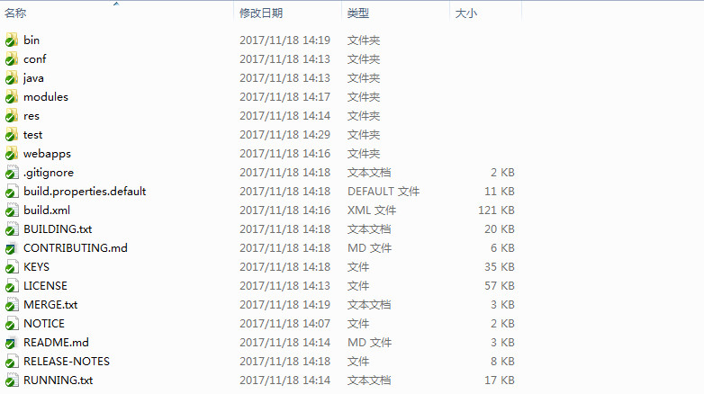

### 编译
我们可以看到build.xml，官方编译tomcat使用ant编译，这里我使用ant-1.9.7来编译，直接在源码目录输入ant命令。
```
F:\project\TOMCAT_8_5_23>ant
```
编译过程中会下载编译需要的依赖到本地，具体位置可以查看build.properties.default中base.path属性，base.path=${user.home}/tomcat-build-libs，完成之后目录如下：
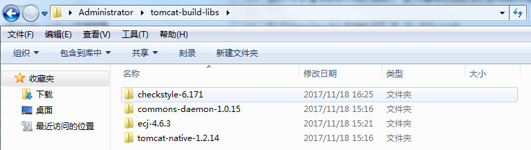

<!--more-->
注意：在下载checkstyle时遇到一个问题：
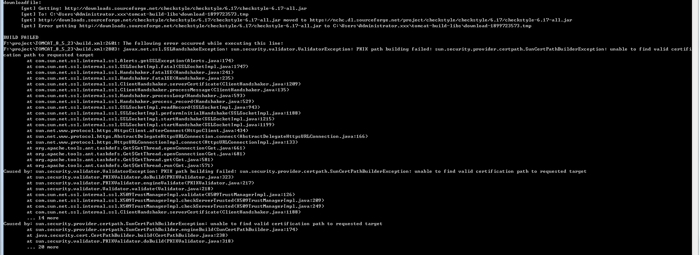
有人已经遇到过这个问题，https://www.cnblogs.com/liaojie970/p/4919485.html
但是要注意直接替换jdk下的cacerts文件，但是还是有如下问题：
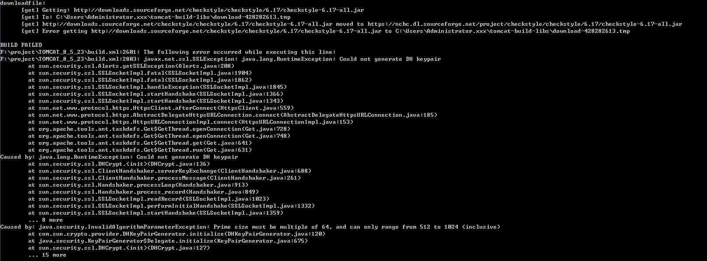

查看我的jdk版本为jdk1.7._80，换为jdk1.8之后问题解决。下载完成后，不用再次下载，可换回jdk7或者jdk6继续编译。
编译好之后再查看源码目录下output/build，即为编译好的tomcat
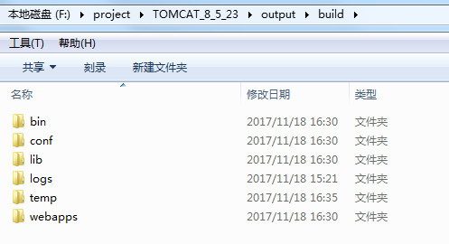

各个目录作用如下：

```
bin——存放各种不同平台开启与关闭Tomcat的脚本文件

lib——存tomcat与web应用的Jar包

conf——存放tomcat的配置文件：
server.xml-tomcat主要配置文件，即存放server、service、connector、engine、host等结构以及属性的文件
web.xml-默认的web应用配置文件，部署应用时将会和应用自身的web.xml合并
context.xml-默认给应用配置一些非标准信息的配置文件，起到私有描述符的作用，类似于glassfish的glass fish-web.xml
tomcat-users.xml-文件安全域（UserDatabaseRealm）配置用户和密码的文件
logging.properties-tomcat日志配置文件，日志级别和handler
catalina.properties-tomcat默认的一些系统属性配置，common.loader、shared.loader、server.loader
catalina.policy-Java Security Manager 实现的安全策略声明，只有当Tomcat用-security命令行参数启动时这个文件才会被使用

webapps——web应用的发布目录，tomcat启动时，加载webapps文件夹下的项目

work——tomcat把由各种jsp生成的servlet文件存放的地方

logs——tomcat存放日志文件的地方

temp——tomcat存放临时文件的地方
```


### 导入eclipse
现在将tomcat源码导入eclipse，有种方案：
1、在源码目录上执行转换工程的命令

```
# 转为eclipse工程
ant ide-eclipse

# 转为netbeans工程
ant ide-netbeans
```


2、新建一个java工程，将源码中的所有那文件拷贝过去，同时将下载的依赖添加到buildpath中，此方案具体步骤可百度解决，此处不再详细描述。
3、新添加一个pom文件改为maven工程，即可导入eclipse。
pom.xml文件内容

```
<?xml version="1.0" encoding="UTF-8"?>
<project xmlns="http://maven.apache.org/POM/4.0.0" xmlns:xsi="http://www.w3.org/2001/XMLSchema-instance"
         xsi:schemaLocation="http://maven.apache.org/POM/4.0.0 http://maven.apache.org/maven-v4_0_0.xsd">

  <modelVersion>4.0.0</modelVersion>
  <artifactId>tomcat</artifactId>
  <groupId>org.apache.tomcat</groupId>
  <version>8.5.23</version>
  <packaging>jar</packaging>
  <name>Tomcat</name>
  <properties>
    <project.build.sourceEncoding>UTF-8</project.build.sourceEncoding>
    <tomcat.groupId>org.apache.tomcat</tomcat.groupId>
    <tomcat.zip.name>tomcat</tomcat.zip.name>
  </properties>
  
  <build>
  	<sourceDirectory>java</sourceDirectory>
  	<testSourceDirectory>test</testSourceDirectory>
  </build>
  <dependencies>
      <dependency>
          <groupId>tomcat-native</groupId>
          <artifactId>tomcat-native</artifactId>
          <version>1.2.14</version>
          <type>tar.gz</type>
      </dependency>
      <dependency>
          <groupId>commons-daemon</groupId>
          <artifactId>commons-daemon</artifactId>
          <version>1.0.15</version>
          <type>jar</type>
      </dependency>
      <dependency>
          <groupId>commons-daemon</groupId>
          <artifactId>commons-daemon</artifactId>
          <version>1.0.15</version>
          <type>tar.gz</type>
          <classifier>native-src</classifier>
      </dependency>
      <dependency>
          <groupId>ecj</groupId>
          <artifactId>ecj</artifactId>
          <version>4.6.3</version>
          <type>jar</type>
      </dependency>
  </dependencies>
  
</project>

```
用第3种方式导入eclipse成功后如下：
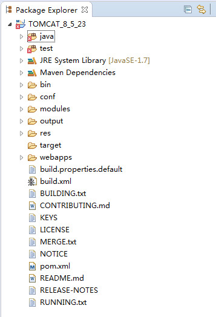

### debug模式启动tomcat
调试tomcat可以本地调试，也可以远程调试。
#### 本地调试
本地调试可在eclipse中打开Bootstrap.java类，打上断点之后，右键debug as->Java Application
#### 远程调试
远程调试只需要在启动tomcat时开启jpda服务即可。
什么是JPDA呢？
JPDA(Java Platform Debugger Architecture) 是 Java 平台调试体系结构的缩写，通过 JPDA 提供的 API，开发人员可以方便灵活的搭建 Java 调试应用程序。JPDA 主要由三个部分组成：Java 虚拟机工具接口（JVMTI），Java 调试线协议（JDWP），以及 Java 调试接口（JDI）。而像Eclipse和IDEA这种开发工具提供的图形界面的调试工具，其实就是实现了JDI。关于JPDA的详细信息，可以google一些文章查看。
tomcat使用如下方式进行启动jpda：
```
F:\project\TOMCAT_8_5_23\output\build\bin> catalina.bat jpda start 
```
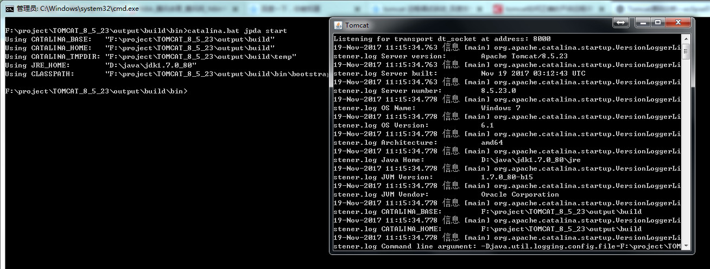
默认远程调试的默认端口为8000，可以通过JPDA_ADDRESS进行配置，指定自定义的端口，另外，还有两个可以配置的参数
	JPDA_TRANSPORT：即调试器和虚拟机之间数据的传输方式，默认值是dt_socket
	JPDA_SUSPEND：即JVM启动后是否立即挂起，默认是n
可以在catalina.bat中进行配置： 
```
    JPDA_TRANSPORT=dt_socket  
    JPDA_ADDRESS=5005  
    JPAD_SUSPEND=n  
```
增加远程调试参数的方式有很多，这里就不一一描述了。
### 使用eclipse远程调试tomcat
以debug模式启动tomcat后，在eclipse中Debug Configuration->新建Remote Java Application，注意调试Host和Port分别为localhost和8000：
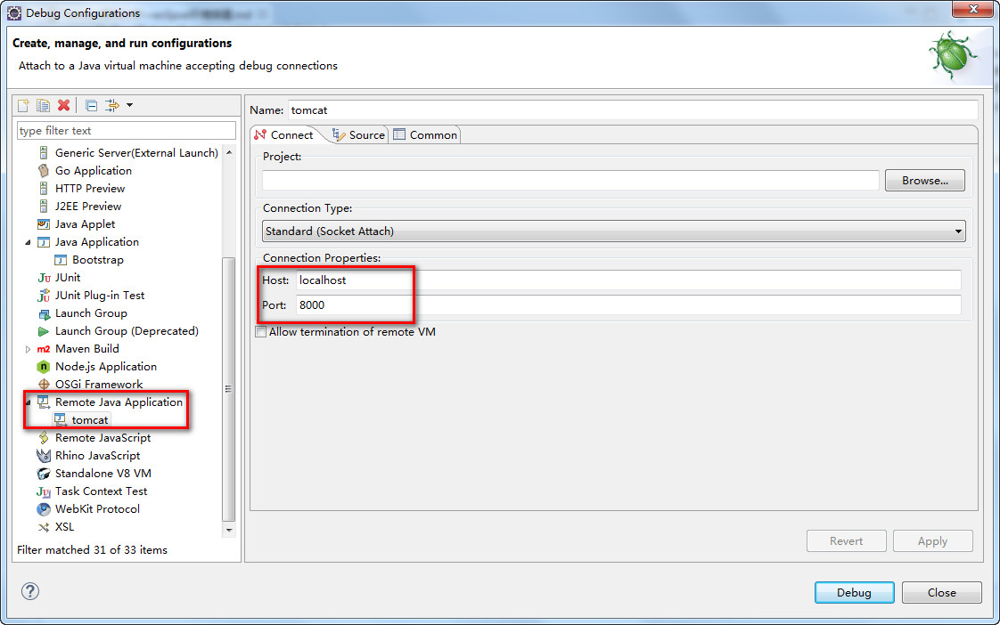
然后在source栏中将Tomcat项目添加进来：
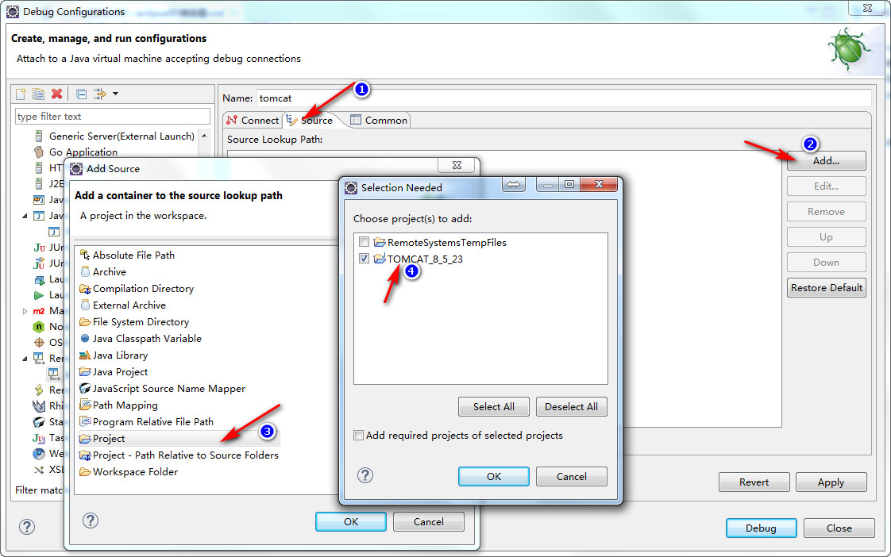
最后点击debug按钮即可远程调试：
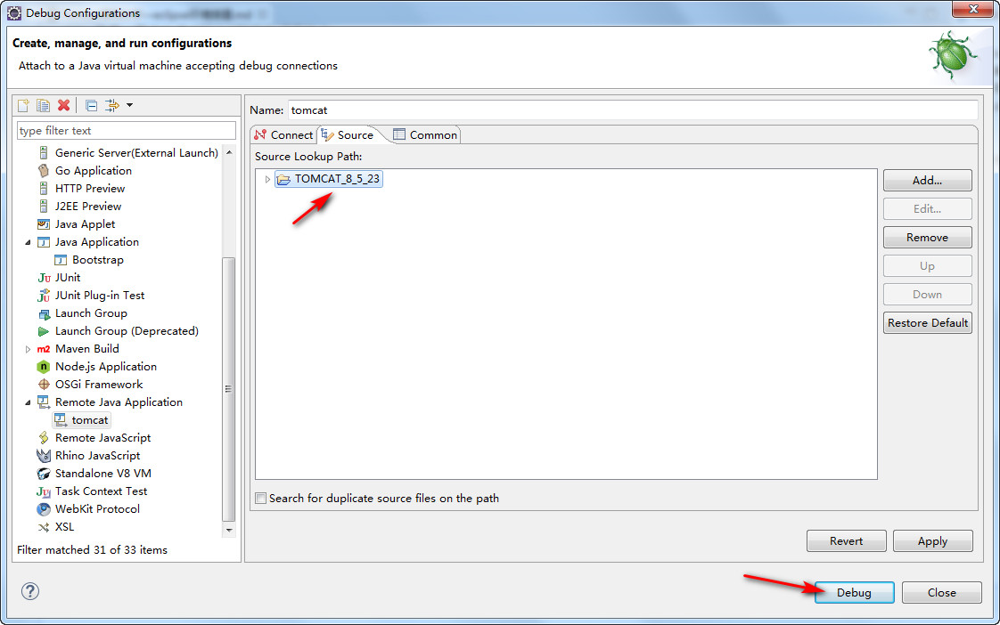
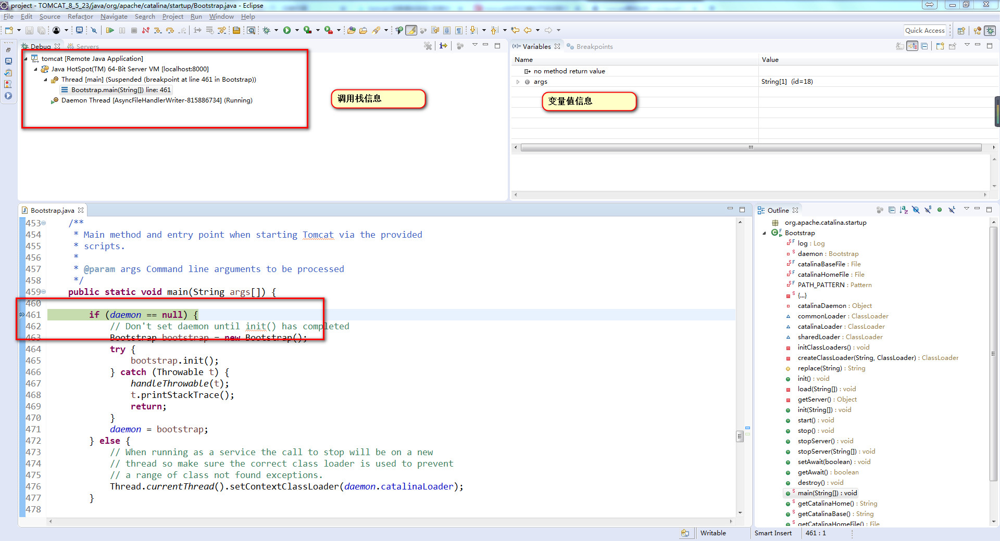

### 补充
由于目前使用的8.5.23版本的tomcat去掉了BIO，而7.0.83版是带有BIO的连接器的，因此以后分析采用7.0.83版本，环境搭建过程和上面的类似。

