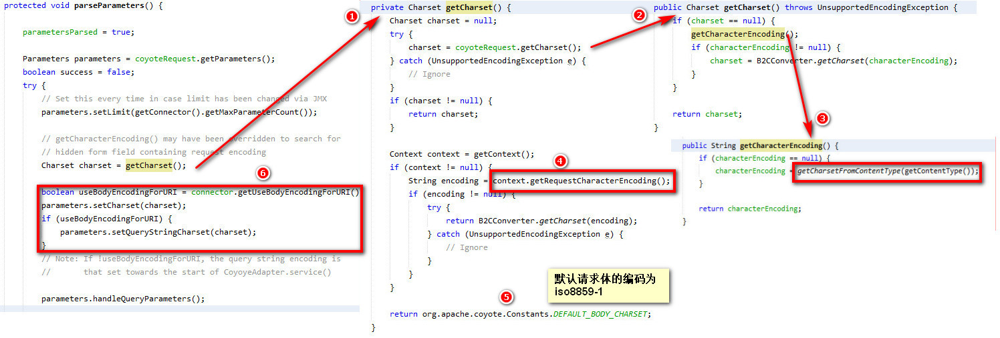

### 前言

本篇主要将tomcat涉及到的一些编码的部分，方便查阅。先看tomcat文档上的两个编码参数：

| `URIEncoding`       | This specifies the character encoding used to decode the URI bytes,       after %xx decoding the URL. If not specified, UTF-8 will be used unless       the `org.apache.catalina.STRICT_SERVLET_COMPLIANCE`       [system property](https://tomcat.apache.org/tomcat-8.5-doc/config/systemprops.html) is set to `true`       in which case ISO-8859-1 will be used. |
| ----------------------- | ------------------------------------------------------------ |
| `useBodyEncodingForURI` | This specifies if the encoding specified in contentType should be used       for URI query parameters, instead of using the URIEncoding. This       setting is present for compatibility with Tomcat 4.1.x, where the       encoding specified in the contentType, or explicitly set using       Request.setCharacterEncoding method was also used for the parameters from       the URL. The default value is `false`.              **Notes:** 1) This setting is applied only to the       query string of a request. Unlike `URIEncoding` it does not       affect the path portion of a request URI. 2) If request character       encoding is not known (is not provided by a browser and is not set by       `SetCharacterEncodingFilter` or a similar filter using       Request.setCharacterEncoding method), the default encoding is always       "ISO-8859-1". The `URIEncoding` setting has no effect on       this default. |

<!--more-->

### URIEncoding

此参数默认为utf-8，表示对请求的URI部分的编码（注意不包含？后面的参数部分），如果过路径url中包含中文，此编码会正确的解码，例如：

```http
|--------------URL---------------------|
http://localhost:8080/test/汉字/test.jsp
                     |--------URI------|
```

CoyoteAdapter代码中使用到这个参数的地方：

```java
protected void convertURI(MessageBytes uri, Request request) throws IOException {
        ByteChunk bc = uri.getByteChunk();
        int length = bc.getLength();
        CharChunk cc = uri.getCharChunk();
        cc.allocate(length, -1);
		// 默认为utf-8
        Charset charset = connector.getURICharset();

        B2CConverter conv = request.getURIConverter();
        if (conv == null) {
            conv = new B2CConverter(charset, true);
            request.setURIConverter(conv);
        } else {
            conv.recycle();
        }

        try {
            conv.convert(bc, cc, true);
            uri.setChars(cc.getBuffer(), cc.getStart(), cc.getLength());
        } catch (IOException ioe) {
            // Should never happen as B2CConverter should replace
            // problematic characters
            request.getResponse().sendError(HttpServletResponse.SC_BAD_REQUEST);
        }
}
```

### useBodyEncodingForURI

useBodyEncodingForURI是对URI后面的参数QueryString的编码，例如：

```http
|--------------URL---------------------|
http://localhost:8080/test/汉字/test.jsp？name=汉字中文
                     |--------URI------|-Query String-|
```

Request代码中使用到这个参数的部分：



1、org.apache.catalina.connector.Request中首先要获取到请求的编码

2、转到org.apache.coyote.Request获取编码

3、转到获取CharacterEncoding的设置，如果过没有设置，在直接获取请求头中Content-Type设置的编码，如果过还没有，进入下一步

4、如果上面3都没有获取到，则从应用Context的RequestCharacterEncoding获取请求体的编码

5、如果4也没有获取到，则直接使用默认的编码iso-8859-1

6、首先拿到useBodyEncodingForURI的值，默认false，然后设置charset给parameters用于解析请求体中的参数的编码。useBodyEncodingForURI为true，则设置给parameters用于解析请求路径中QueryString的参数，当然也可以在业务中手动给参数转码

body编码优先级：

request.setCharSet|request.setCharacterEncoding > Content-Type > context.setRequestCharacterEncoding > default(iso8859-1)

### QueryStringCharset

我继续看看如果上面useBodyEncodingForURI=false，Parameters中请求路径中QueryString的参数的默认编码时时什么，看代码：

```java
public void setQueryStringCharset(Charset queryStringCharset) {
        if (queryStringCharset == null) {
            queryStringCharset = DEFAULT_URI_CHARSET;
        }
        this.queryStringCharset = queryStringCharset;

        if(log.isDebugEnabled()) {
            log.debug("Set query string encoding to " + queryStringCharset.name());
        }
}
private static final Charset DEFAULT_URI_CHARSET = StandardCharsets.UTF_8;
private Charset queryStringCharset = StandardCharsets.UTF_8;
```

可以看到，queryStringCharset默认就是utf-8，因此如果过js给这个参数通过enscape编码（unicode），这个queryStringCharset是无法解码的，可以手动在业务中通过URLDecoder解码，也可以改tomcat的代码，将unicode转utf-8（移位运算）

### 其他

1、jsp中pageEncoding表示是JSP文件的编码（这个编码一定要和文件本身的编码一致，否则一定会乱码，因为生成的java文件就会有乱码），contentType是服务端将字符发向客户端的字符集编码。这个字符集会写在响应报文头的Content-Type字段中的，浏览器根据这个编码来显示，如果不存在，则根据**<meta http-equiv=Content-Type content="text/html;charset=gbk"> ** 指定的编码来显示页面。 

2、MessageByte数据结构中也可以设置编码，实际设置给了ByteChunk，默认为iso8859-1，这个用在响应头信息的编码中，比如，Location头中有中文，Content-Type为utf-8，那么肯定会乱码，一般不常用。

