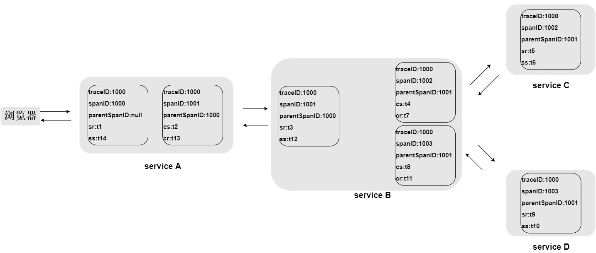

### 前言

这几天工作需要，调查了为服务中分布式链路调用监控系统Zipkin组件spring-cloud-sleuth和Zipkin，下面简单记录下调查过程

### Zipkin简介

`zipkin`为分布式链路调用监控系统，聚合各业务系统调用延迟数据，达到链路调用监控跟踪，主要涉及四个组件 ：

>collector：一旦跟踪数据到达Zipkin collector守护进程，它将被验证，存储和索引，以供Zipkin收集器查找；  
>
>storage：Zipkin最初数据存储在Cassandra上，因为Cassandra是可扩展的，具有灵活的模式，并在Twitter中大量使用；但是这个组件可插入，除了Cassandra之外，还支持ElasticSearch和MySQL；  
>
>search：一旦数据被存储和索引，我们需要一种方法来提取它。查询守护进程提供了一个简单的JSON API来查找和检索跟踪，主要给Web UI使用；  
>
>web UI：创建了一个GUI，为查看痕迹提供了一个很好的界面；Web UI提供了一种基于服务，时间和注释查看跟踪的方法。 

<!-- more -->

大的互联网公司都有自己的分布式跟踪系统，比如Google的Dapper，Twitter的zipkin，淘宝的鹰眼，新浪的Watchman，京东的Hydra等，他们的核心思想都是一样。

### Zipkin设计

#### Span

每个服务的处理跟踪是一个Span，可以理解为一个基本的工作单元，包含了一些描述信息：traceID，id，parentId，name，timestamp，duration，annotations等，例如 ：

```json
{
      "traceId": "bd7a977555f6b982",
      "name": "get-traces",
      "id": "ebf33e1a81dc6f71",
      "parentId": "bd7a977555f6b982",
      "timestamp": 1458702548478000,
      "duration": 354374,
      "annotations": [
        {
          "endpoint": {
            "serviceName": "zipkin-query",
            "ipv4": "192.168.1.2",
            "port": 9411
          },
          "timestamp": 1458702548786000,
          "value": "cs"
        }
      ],
      "binaryAnnotations": [
        {
          "key": "lc",
          "value": "JDBCSpanStore",
          "endpoint": {
            "serviceName": "zipkin-query",
            "ipv4": "192.168.1.2",
            "port": 9411
          }
        }
      ]
}

```

**traceId**：标记一次请求的跟踪，相关的Spans都有相同的traceId
**id**：每个Span的id
**name**：Span的名称，一般是接口方法的名称
**parentId**：可选的id，当前Span的父Span id，通过parentId来保证Span之间的依赖关系，如果没有parentId，表示当前Span为根Span
**timestamp**：Span创建时的时间戳，使用的单位是微秒（而不是毫秒），所有时间戳都有错误，包括主机之间的时钟偏差以及时间服务重新设置时钟的可能性，出于这个原因，Span应尽可能记录其duration
**duration**：持续时间使用的单位是微秒（而不是毫秒）
**annotations**：注释用于及时记录事件；有一组核心注释用于定义RPC请求的开始和结束；

> cs :Client -Sent -客户端发起一个请求，这个annotion描述了这个span的开始
>
> sr :Server-Received -服务端获得请求并准备开始处理它，如果将其sr减去cs时间戳便可得到网络延迟
>
> ss:Server-Sent -注解表明请求处理的完成(当请求返回客户端)，如果ss减去sr时间戳便可得到服务端需要的处理请求时间
>
> cr :Client-Received -表明span的结束，客户端成功接收到服务端的回复，如果cr减去cs时间戳便可得到客户端从服务端获取回复的所有所需时间 

**binaryAnnotations**：二进制注释，旨在提供有关RPC的额外信息

一次请求过程中，多个span组成了一个有向无环图，如下：



#### 举例

根据上图，三个服务调用关系如下：A-》B-》C，我们直接浏览器访问A

一般一个span是要包含cs-》sr-》ss-》cr完整追踪信息的，cs和cr是客户端信息，通常会是一个span，位于客户都按发起请求调用服务端时生成的，sr和ss会是一个span，服务端执行时生成的span。但是两个span的id是一样的，最终到zipkin合并的时候会将两个span合并为一个，这样就包含了cs-》sr-》ss-》cr完整信息。那么我们可以分析到

A服务上：

- 关于A服务的Span（sr、ss）
- 关于B服务的Span（cs、cr）

B服务上：

- 关于B服务的Span（sr、ss）
- 关于C服务的Span（cs、cr）

C服务上：

- 关于C服务的Span（sr、ss）

所以，发送给zipkin的请求至少为3次

### Sleuth分析

上面说了zipkin的基本原来和模型，那么sleuth是如何将业务中的信息（Span）追踪到并发送给zipkin服务器的呢？

其实就是通过TraceFilter、TraceHandlerInterceptor 、TraceRestTemplateInterceptor 三个类完成。

#### TraceFilter

1. 获取Reques中是否包含Span的信息（traceID、spanID、parentSpanID），如果包含，则直接用这个信息创建Span，否则生成新的Span，然后调用业务方法

2. 业务方法完成之后，回到filter，将上面的Span信息发送给消息队列，Report线程从队列中获取Span信息发送给zipkin 

#### TraceHandlerInterceptor 

在上面TraceFilter的1调用业务方法之前，会被这个拦截器拦截，获取方法名、类名等信息加入到创建的Span当中

#### TraceRestTemplateInterceptor 

在上面TraceFilter的1调用业务方法的过程中，又通过restTemplate调用了另外一个服务，那么在调用之前，会被TraceRestTemplateInterceptor拦截，生成新的Span，它的parentSpan就是TraceFilter的1生成的Span，调用结束后，同样将Span信息发送给消息队列，Report线程从队列中获取Span信息发送给zipkin 。再来看这个图，好理解一些：

