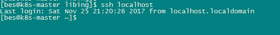

本教程在CentOS Linux release 7.1.1503 (Core) 64位，Hadoop 2.7.1 下验证通过。最新的 Hadoop 2 稳定版可以通过 [http://mirror.bit.edu.cn/apache/hadoop/common/stable2/](http://mirror.bit.edu.cn/apache/hadoop/common/stable2/)或者 [http://mirrors.cnnic.cn/apache/hadoop/common/stable/](http://mirrors.cnnic.cn/apache/hadoop/common/stable/) 下载。

### Hadoop 伪分布式配置
这里我直接在bes用户下安装，不再单独创建用户了。
#### 安装SSH后，配置无密码登录:
```
cd ~
mkdir .ssh                        # 可能该文件已存在，不影响
cd ~/.ssh/
ssh-keygen -t rsa                 # 会有提示，都按回车就可以
cat id_rsa.pub >> authorized_keys
chmod 644 authorized_keys         #文件权限很重要
chmod 700 ~/.ssh                  #文件权限很重要
```
无密码登录本机：


#### java环境安装
要求jdk7及以上，可google，此处不详细讲解

### 安装hadoop2.7.1
解压缩安装包：
```
cd ~/libing/software
tar -zxvf ./hadoop-2.7.1.tar.gz -C ../ # 解压到/home/bes/libing中
cd /home/bes/libing
mv ./hadoop-2.7.1/ ./hadoop            # 将文件夹名改为hadoop
```
进行伪分布式配置：
修改配置文件 core-site.xml (/home/bes/libing/hadoop/etc/hadoop/core-site.xml)：
```
<configuration>
    <property>
        <name>hadoop.tmp.dir</name>
        <value>file:/home/bes/libing/hadoop/tmp</value>
        <description>Abase for other temporary directories.</description>
    </property>
    <property>
        <name>fs.defaultFS</name>
        <value>hdfs://localhost:9000</value>
    </property>
</configuration>
```
修改配置文件 hdfs-site.xml：
```
<configuration>
    <property>
        <name>dfs.replication</name>
        <value>1</value>
    </property>
    <property>
        <name>dfs.namenode.name.dir</name>
        <value>file:/home/bes/libing/hadoop/tmp/dfs/name</value>
    </property>
    <property>
        <name>dfs.datanode.data.dir</name>
        <value>file:/home/bes/libing/hadoop/tmp/dfs/data</value>
    </property>
</configuration>
```
启动 Hadoop:
```
cd /home/bes/libing/hadoop
bin/hdfs namenode -format       # namenode 格式化
sbin/start-dfs.sh               # 开启守护进程
jps                             # 判断是否启动成功
```
若成功启动则会列出如下进程: NameNode、DataNode和SecondaryNameNode。
执行WordCount实例:
```bash
bin/hdfs dfs -mkdir -p /user/hadoop       # 创建HDFS目录
bin/hdfs dfs -mkdir /input
bin/hdfs dfs -put etc/hadoop/*.xml /input  # 将配置文件作为输入
bin/hadoop jar share/hadoop/mapreduce/hadoop-mapreduce-examples-*.jar grep /input /output 'dfs[a-z.]+'
bin/hdfs dfs -cat /output/*                # 查看输出
```
最后结果：


### Hadoop 集群配置
有两台机器:
```
k8s-master  192.168.32.129
k8s-node   192.168.32.130
```

Hadoop 集群配置过程:

1.     选定一台机器作为 Master，在所有主机上配置网络映射
1.     在 Master 主机上配置ssh免密码登录、安装Java环境
1.     在 Master 主机上安装Hadoop，并完成配置
1.     在其他主机上配置ssh免密码登录、安装Java环境
1.     将 Master 主机上的Hadoop目录复制到其他主机上
1.     开启、使用 Hadoop

所有主机配置网络映射:
```
192.168.32.129 k8s-master
192.168.32.130 k8s-node
```
在 k8s-master 主机上执行：
```
cd ~/.ssh
ssh-keygen -t rsa                 # 一直按回车就可以
cat ~/id_rsa.pub >> ~/authorized_keys
chmod 644 authorized_keys         #文件权限很重要
chmod 700 ~/.ssh                  #文件权限很重要
scp ~/.ssh/id_rsa.pub bes@k8s-node:/home/bes/ # 传输公钥到Slave1
```
接着在 k8s-node 节点上执行:
```
cd ~
mkdir .ssh
cat ~/id_rsa.pub >> ~/.ssh/authorized_keys
chmod 644 authorized_keys         #文件权限很重要
chmod 700 ~/.ssh                  #文件权限很重要
```
验证：


在k8s-master节点上进行Hadoop集群配置(位于 /home/bes/libing/hadoop/etc/hadoop中):

文件 slave:

将原来 localhost 删除，把所有Slave的主机名写上，每行一个。
```
k8s-node
```

文件 core-site.xml:
```
<configuration>
    <property>
        <name>hadoop.tmp.dir</name>
        <value>file:/home/bes/libing/hadoop/tmp</value>
        <description>Abase for other temporary directories.</description>
    </property>
    <property>
        <name>fs.defaultFS</name>
        <value>hdfs://k8s-master:9000</value>
    </property>
</configuration>
```

文件 hdfs-site.xml:
```
<configuration>
	<property>
	    <name>dfs.namenode.secondary.http-address</name>
	    <value>k8s-master:50090</value>
	</property>
    <property>
        <name>dfs.replication</name>
        <value>1</value>
    </property>
    <property>
        <name>dfs.namenode.name.dir</name>
        <value>file:/home/bes/libing/hadoop/tmp/dfs/name</value>
    </property>
    <property>
        <name>dfs.datanode.data.dir</name>
        <value>file:/home/bes/libing/hadoop/tmp/dfs/data</value>
    </property>
</configuration>
```
文件 mapred-site.xml(首先需执行 cp mapred-site.xml.template mapred-site.xml):
```
<configuration>
	<property>
	    <name>mapreduce.framework.name</name>
	    <value>yarn</value>
	</property>
</configuration>
```
文件 yarn-site.xml：
```
<configuration>
	<property>
	    <name>yarn.resourcemanager.hostname</name>
	    <value>k8s-master</value>
	</property>
	<property>
	    <name>yarn.nodemanager.aux-services</name>
	    <value>mapreduce_shuffle</value>
	</property>
</configuration>
```

配置好后，在 k8s-master 主机上，将 Hadoop 文件复制到各个节点上:
```
cd /home/bes/libing/
rm -r ./hadoop/tmp                     # 删除 Hadoop 临时文件
tar -zcf ./hadoop.tar.gz ./hadoop
scp ./hadoop.tar.gz k8s-node:/home/bes/libing
```
在 k8s-node 上执行：
```
tar -zxf ~/libing/hadoop.tar.gz -C /home/bes/libing
```
最后在 k8s-master 主机上就可以启动hadoop了:
```
cd /home/bes/libing/hadoop/
bin/hdfs namenode -format
sbin/start-dfs.sh
sbin/start-yarn.sh
jps                        # 判断是否启动成功
```
若成功启动，则k8s-master节点启动了NameNode、SecondrryNameNode、ResourceManager进程，k8s-node节点启动了DataNode和NodeManager进程。
可参照上面伪分布式配置执行WordCount实例。