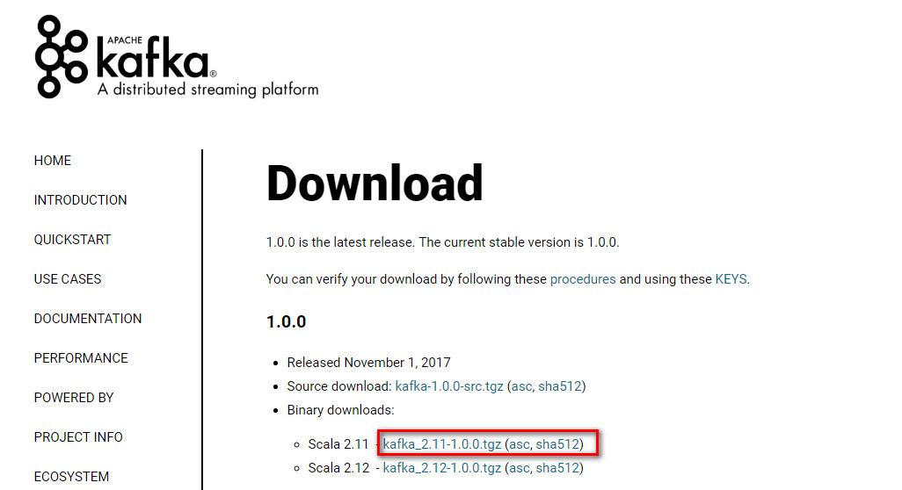

### 前言
Kafka是一种高吞吐量的分布式发布订阅消息系统，它可以处理消费者规模的网站中的所有动作流数据。Kafka的目的是通过Hadoop的并行加载机制来统一线上和离线的消息处理，也是为了通过集群机来提供实时的消费。下面介绍有关Kafka的简单安装和使用,想全面了解Kafka,请访问[Kafka的官网](http://kafka.apache.org/), 本教程环境：

- CentOS Linux release 7.1.1503 (Core) 64位
- Java JDK 1.7以上
- kafka_2.11-0.10.1.0

### 安装kafka
[Kafka官方下载页面](https://kafka.apache.org/downloads),下载稳定版本0.10.1.0的kafka。

此安装包内已经附带zookeeper,不需要额外安装zookeeper.按顺序执行如下步骤:
```
cd /home/bes/libing/software
tar -zxvf kafka_2.10-0.10.1.0.tgz -C ../
mv kafka_2.10-0.10.1.0/ kafka
```
<!--more-->
### kafka核心概念

下面介绍Kafka相关概念,以便运行下面实例的同时，更好地理解Kafka.
1. Broker
Kafka集群包含一个或多个服务器，这种服务器被称为broker
2. Topic
每条发布到Kafka集群的消息都有一个类别，这个类别被称为Topic。（物理上不同Topic的消息分开存储，逻辑上一个Topic的消息虽然保存于一个或多个broker上但用户只需指定消息的Topic即可生产或消费数据而不必关心数据存于何处）
3. Partition
Partition是物理上的概念，每个Topic包含一个或多个Partition.
4. Producer
负责发布消息到Kafka broker
5. Consumer
消息消费者，向Kafka broker读取消息的客户端。
6. Consumer Group
每个Consumer属于一个特定的Consumer Group（可为每个Consumer指定group name，若不指定group name则属于默认的group）
### 简单测试
按顺序执行如下命令：
```
cd /home/bes/libing/kafka
#启动zookeeper
bin/zookeeper-server-start.sh config/zookeeper.properties  
#另开窗口启动kafka
bin/kafka-server-start.sh config/server.properties
#另开窗口创建topic
bin/kafka-topics.sh --create --zookeeper localhost:2181 --replication-factor 1 --partitions 1 --topic test-topic
#列出所有topic
bin/kafka-topics.sh --list --zookeeper localhost:2181
#生产消息
bin/kafka-console-producer.sh --broker-list localhost:9092 --topic test-topic
执行后输入如下字符：
hello
world
#另开窗口消费消息
bin/kafka-console-consumer.sh --zookeeper localhost:2181 --topic test-topic --from-beginning
可以看到刚才产生的两条信息。说明kafka安装成功。 
```

### 参考文献
[http://dblab.xmu.edu.cn/blog/1096-2/](http://dblab.xmu.edu.cn/blog/1096-2/)