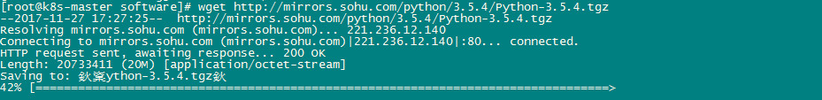
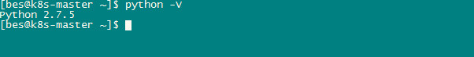
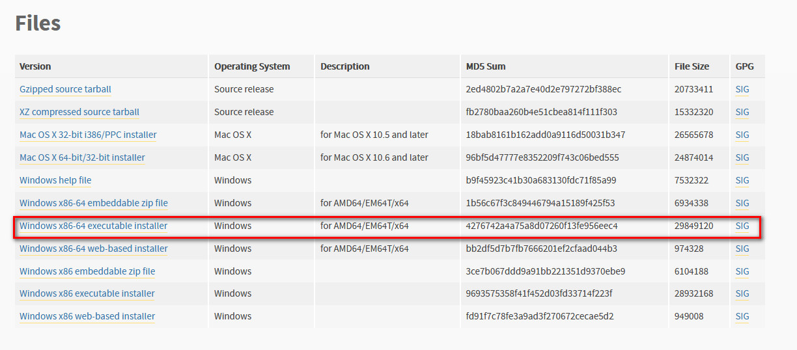

### 前言
由于当前学习的大数据内容需要用到Python，所以做下Python安装笔记。安装版本：**python-3.5.4**

### Linux下源码安装
在CentOS Linux release 7.1.1503 (Core) 64位环境上安装。
#### 安装Python依赖包
在root用户下执行如下脚本：
```
yum install zlib-devel bzip2-devel openssl-devel ncurses-devel sqlite-devel readline-devel tk-devel gcc make
```
#### 下载Python源码包
```
cd /home/bes/libing/software
wget http://mirrors.sohu.com/python/3.5.4/Python-3.5.4.tgz
```

<!--more-->
#### 编译、安装
```
cd /home/bes/libing/software
# 解压缩
tar -zxvf Python-3.5.4.tgz -C /usr/local/
cd /usr/local/Python-3.5.4/
#编译、安装
./configure
make
make install
# 查看python链接
ll /usr/bin |grep python
# 删除老链接
rm -rf /usr/bin/python
# 创建新链接
ln -s /usr/local/bin/python3.5 /usr/bin/python
# 查看版本
python -V
```


### windows下安装
在win7 64位环境上安装。可在[Python官网下载](https://www.python.org/downloads/release/python-354/)3.5.4版本安装包--python-3.5.4-amd64.exe， 如下图：

双击安装，傻瓜式一直下一步，不再详解。可参考[http://blog.csdn.net/zs808/article/details/51611790](http://blog.csdn.net/zs808/article/details/51611790)
