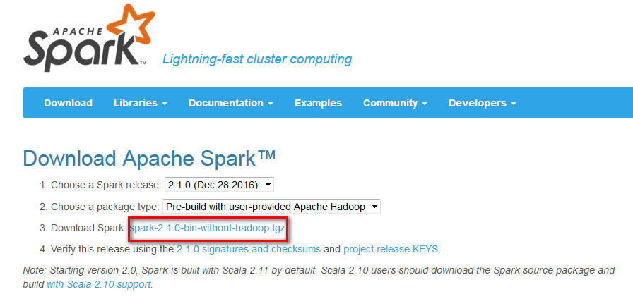
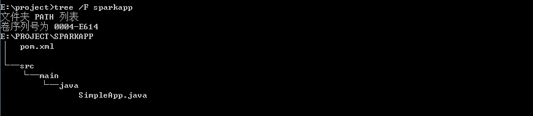
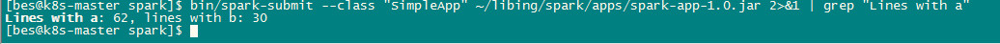

### 前言
- Spark可以独立安装使用，也可以和Hadoop一起安装使用
- 安装好Spark以后，里面就自带了scala环境，不需要额外安装scala

本教程中，我们采用和Hadoop一起安装使用，具体运行环境如下：

- CentOS Linux release 7.1.1503 (Core) 64位
- Hadoop 2.7.1
- Java JDK 1.7以上
- Spark 2.1.0

### 安装Hadoop
如果已经安装了Hadoop，本步骤可以略过。如果没有安装Hadoop，请访问[Hadoop安装教程](https://bingli-borland.github.io/blog/2017/11/25/大数据学习—hadoop安装配置/)就可以完成JDK和Hadoop这二者的安装。
### 安装 Spark
打开浏览器，访问[Spark官方下载地址](http://spark.apache.org/downloads.html)，按照如下图下载。

Spark部署模式主要有四种：Local模式（单机模式）、Standalone模式（使用Spark自带的简单集群管理器）、YARN模式（使用YARN作为集群管理器）和Mesos模式（使用Mesos作为集群管理器）。这里介绍Local模式（单机模式）的 Spark安装。我们选择Spark 2.1.0版本。
安装脚本如下：
```
cd /home/bes/libing/software
tar -zxvf spark-2.1.0-bin-without-hadoop.tgz  -C ../
mv spark-2.1.0-bin-without-hadoop/ spark
```
<!--more-->
安装后，需要修改Spark的配置文件spark-env.sh
```
cp ./conf/spark-env.sh.template ./conf/spark-env.sh
```
编辑spark-env.sh文件(vim ./conf/spark-env.sh)，添加以下配置信息:
```
export SPARK_DIST_CLASSPATH=$(/home/bes/libing/hadoop/bin/hadoop classpath)
```
有了上面的配置信息以后，Spark就可以把数据存储到Hadoop分布式文件系统HDFS中，也可以从HDFS中读取数据。如果没有配置上面信息，spark就只能读写本地数据，无法读写HDFS数据。配置完成后就可以直接使用，不需要像Hadoop运行启动命令。
通过运行Spark自带的示例，验证Spark是否安装成功。
```
bin/run-example SparkPi 2>&1 | grep "Pi is"
```
运行结果如下图示:

### Java独立应用编程
这个demo程序使用maven构建，所以提前搭建好maven环境。
这个程序目录结构：

pom.xml内容：
```
<project xmlns="http://maven.apache.org/POM/4.0.0" xmlns:xsi="http://www.w3.org/2001/XMLSchema-instance"
	xsi:schemaLocation="http://maven.apache.org/POM/4.0.0 http://maven.apache.org/xsd/maven-4.0.0.xsd">
	<modelVersion>4.0.0</modelVersion>
	<groupId>com.bes.bingli</groupId>
	<artifactId>spark-app</artifactId>
	<name>Spark App Project</name>
    <packaging>jar</packaging>
	<version>1.0</version>
	<properties>
		<project.build.sourceEncoding>UTF-8</project.build.sourceEncoding>
	</properties>
	<build>
		<sourceDirectory>src</sourceDirectory>
		<resources>
			<resource>
				<directory>src</directory>
				<excludes>
					<exclude>**/*.java</exclude>
				</excludes>
			</resource>
		</resources>
		<plugins>
			<plugin>
				<artifactId>maven-compiler-plugin</artifactId>
				<version>3.1</version>
				<configuration>
					<source>1.7</source>
					<target>1.7</target>
					<encoding>UTF-8</encoding>
				</configuration>
			</plugin>
		</plugins>
	</build>
	<dependencies>
            <dependency>
                <groupId>org.apache.spark</groupId>
                <artifactId>spark-core_2.11</artifactId>
                <version>2.1.0</version>
            </dependency>
	</dependencies>
</project>
```
SimpleApp.java内容：
```
import org.apache.spark.api.java.*;
import org.apache.spark.api.java.function.Function;

public class SimpleApp {
    public static void main(String[] args) {
        String logFile = "file:///home/bes/libing/spark/README.md"; 
        JavaSparkContext sc = new JavaSparkContext("local", "Simple App",
            "file:///home/bes/libing/spark/", new String[]{"apps/spark-app-1.0.jar"});
        JavaRDD<String> logData = sc.textFile(logFile).cache();

        long numAs = logData.filter(new Function<String, Boolean>() {
            public Boolean call(String s) { return s.contains("a"); }
        }).count();

        long numBs = logData.filter(new Function<String, Boolean>() {
            public Boolean call(String s) { return s.contains("b"); }
        }).count();

        System.out.println("Lines with a: " + numAs + ", lines with b: " + numBs);
    }
}
```
使用如下命令编译：
```
mvn clean install -DskipTests
```
得到打包程序 sparkapp/target/spark-app-1.0.jar

通过spark-submit 运行程序应用程序，该命令的格式如下：
```
./bin/spark-submit 
  --class <main-class>  //需要运行的程序的主类，应用程序的入口点
  --master <master-url>  //Master URL，下面会有具体解释
  --deploy-mode <deploy-mode>   //部署模式
  ... # other options  //其他参数
  <application-jar>  //应用程序JAR包
  [application-arguments] //传递给主类的主方法的参数
```
deploy-mode这个参数用来指定应用程序的部署模式，部署模式有两种：client和cluster，默认是client。当采用client部署模式时，就是直接在本地运行Driver Program，当采用cluster模式时，会在Worker节点上运行Driver Program。比较常用的部署策略是从网关机器提交你的应用程序，这个网关机器和你的Worker集群进行协作。在这种设置下，比较适合采用client模式，在client模式下，Driver直接在spark-submit进程中启动，这个进程直接作为集群的客户端，应用程序的输入和输出都和控制台相连接。因此，这种模式特别适合涉及REPL的应用程序。另一种选择是，如果你的应用程序从一个和Worker机器相距很远的机器上提交，那么采用cluster模式会更加合适，它可以减少Driver和Executor之间的网络迟延。

Spark的运行模式取决于传递给SparkContext的Master URL的值。Master URL可以是以下任一种形式：
* local 使用一个Worker线程本地化运行SPARK(完全不并行)
* local[*] 使用逻辑CPU个数数量的线程来本地化运行Spark
* local[K] 使用K个Worker线程本地化运行Spark（理想情况下，K应该根据运行机器的CPU核数设定）
* spark://HOST:PORT 连接到指定的Spark standalone master。默认端口是7077.
* yarn-client 以客户端模式连接YARN集群。集群的位置可以在HADOOP_CONF_DIR 环境变量中找到。
* yarn-cluster 以集群模式连接YARN集群。集群的位置可以在HADOOP_CONF_DIR 环境变量中找到。
* mesos://HOST:PORT 连接到指定的Mesos集群。默认接口是5050。

最后，针对上面编译打包得到的应用程序，可以通过将生成的jar包通过spark-submit提交到Spark中运行，如下命令：
```
/home/bes/libing/spark/bin/spark-submit --class "SimpleApp" ./libing/spark/apps/spark-app-1.0.jar
#上面命令执行后会输出太多信息，可以不使用上面命令，而使用下面命令查看想要的结果
/home/bes/libing/spark/bin/spark-submit --class "SimpleApp" ~/libing/spark/apps/spark-app-1.0.jar 2>&1 | grep "Lines with a"
```
最后得到的结果如下:


### 参考文献
[http://dblab.xmu.edu.cn/blog/1307-2/](http://dblab.xmu.edu.cn/blog/1307-2/)