### 概述

#### 协议分层

国际标准化组织（International Standard Organization,ISO）公布了开放系统互连参考模型（OSI/RM）。OSI/RM是一种分层的体系结构，参考模型共有7层。 

TCP/IP(Transmission Control Protocol/Internet Protocol)作为Internet的核心协议。它是个协议族，包含多种协议。 对比如下：

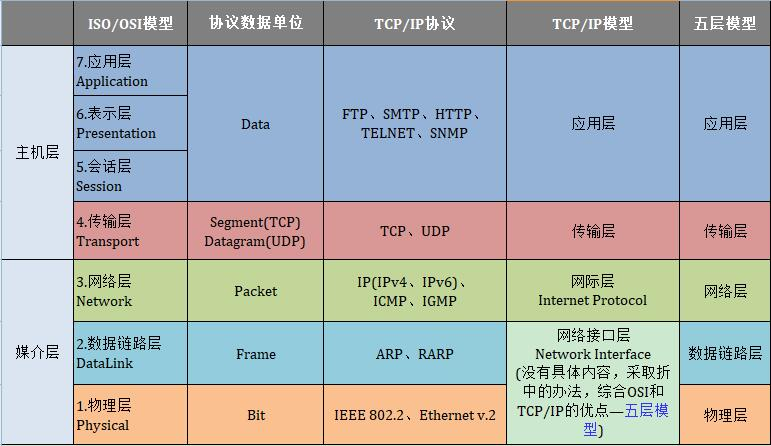

TCP/IP协议族中不同层次的协议如下 ：

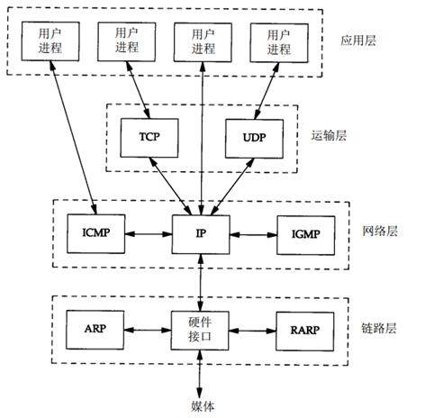

#### 互联网的地址 

互联网上的每个接口必须有一个唯一的Internet地址（也称作IP地址），IP地址长32bit。五类不同的互联网地址格式以及范围如下： 

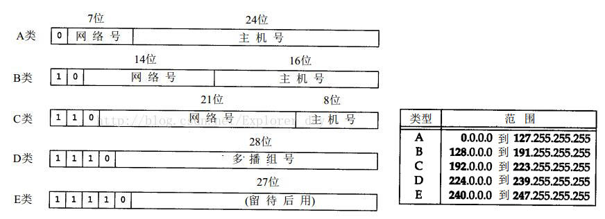

**如何确定两个ip地址属于同一个网络？**/

这就要引入网络地址和子网掩码的概念：网络地址 = IP地址  & 子网掩码，当两个ip地址算的网络地址一样是，确认为在同一个网络中

#### 数据进入协议栈的封装过程 

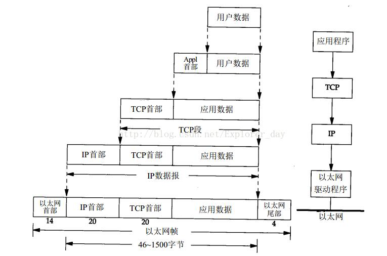

>1. 帧头和帧尾所标注的数字是典型以太网首部的长度
>2. 以太网数据帧的物理特性是其长度必须在46~1500字节之间(原因是因为数据链路层发送出去的包大小最少是64字节 ，减掉以太网首部和尾部的18字节，等于46字节。那为什么数据链路层发送出去的包大小最少是64字节呢？这个问题在数据链路层说明)
>3. 图中IP和网络接口层传送的数据单元应该是分组。分组既可以是一个IP数据报，也可以是IP数据报的一个片
>4. UDP数据和TCP数据基本一致。唯一不同的是UDP传送给IP的信息单元称作UDP数据报，而UDP首部的长度为8位
>5. 由于TCP、UDP、ICMP、IGMP都要向IP传送数据，因此IP必须在生成的IP首部加入某种标识，以表明数据属于那一层。IP在首部存入一个长度为8位的数值，称作协议域。1表示IGMP协议，2表示ICMP协议，6表示TCP协议，17表示UDP协议
>6. TCP、UDP、网络接口也要在首部加入标识符

### 数据链路层

#### 为什么数据链路层发送出去的包大小最少是64字节呢？

1. CSMA/CD

CSMA/CD 表示 Carrier Sense Multiple Access with Collision Detection。

“多点接入”表示许多计算机以多点接入的方式连接在一根总线上。

“载波监听”是指每一个站在发送数据之前先要检测一下总线上是否有其他计算机在发送数据，如果有，则暂时不要发送数据，以免发生碰撞。 

总线上并没有什么“载波”。因此， “载波监听”就是用电子技术检测总线上有没有其他计算机发送的数据信号。  

2. 碰撞检测

“碰撞检测”就是计算机边发送数据边检测信道上的信号电压大小。当几个站同时在总线上发送数据时，总线上的信号电压摆动值将会增大（互相叠加）。当一个站检测到的信号电压摆动值超过一定的门限值时，就认为总线上至少有两个站同时在发送数据，表明产生了碰撞。所谓“碰撞”就是发生了冲突。因此“碰撞检测”也称为“冲突检测”。

在发生碰撞时，总线上传输的信号产生了严重的失真，无法从中恢复出有用的信息来。每一个正在发送数据的站，一旦发现总线上出现了碰撞，就要立即停止发送，免得继续浪费网络资源，然后等待一段随机时间后再次发送。

举例：

A 向 B 发出的信息，要经过一定的时间后才能传送到 B。B 若在 A 发送的信息到达 B 之前发送自己的帧(因为这时 B 的载波监听检测不到 A 所发送的信息)，则必然要在某个时间和 A 发送的帧发生碰撞。碰撞的结果是两个帧都变得无用。  

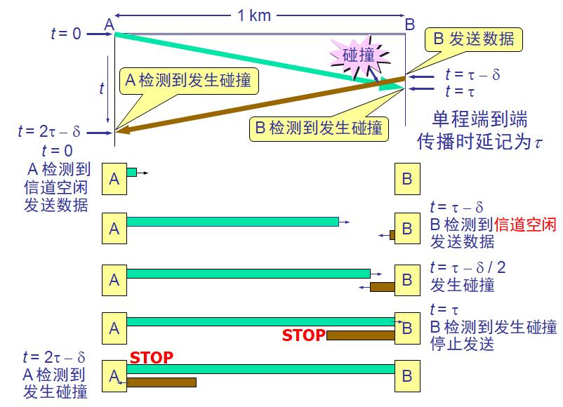

3. 争用期

最先发送数据帧的站，在发送数据帧后至多经过时间 2t （两倍的端到端往返时延）就可知道发送的数据帧是否遭受了碰撞。以太网的端到端往返时延 2t 称为争用期，或碰撞窗口。经过争用期这段时间还没有检测到碰撞，才能肯定这次发送不会发生碰撞。   

**以太网取 51.2 ms 为争用期的长度。对于 10 Mb/s 以太网，在争用期内可发送512 bit，即 64 字节。以太网在发送数据时，若前 64 字节没有发生冲突，则后续的数据就不会发生冲突。如果发生冲突，就一定是在发送的前 64 字节之内。 由于一检测到冲突就立即中止发送，这时已经发送出去的数据一定小于 64 字节。 以太网规定了最短有效帧长为 64 字节，凡长度小于 64 字节的帧都是由于冲突而异常中止的无效帧。 **

#### 链路层目的

在TCP/IP协议族中，链路层主要有三个目的：

1. 为IP模块发送和接收IP数据报；
2. 为ARP模块发送ARP请求和接收ARP应答；
3. 为RARP发送RARP请求和接收RARP应答。

TCP/IP支持多种不同的链路层协议，这取决于网络所使用的硬件，如以太网、令牌环网、FDDI（光纤分布式数据接口）及RS-232串行线路等。 

#### 以太网的 MAC 层 

在局域网中，硬件地址又称为物理地址，或 MAC 地址。  适配器从网络上每收到一个 MAC 帧就首先用硬件检查 MAC 帧中的 MAC 地址，如果是发往本站的帧则收下，然后再进行其他的处理。否则就将此帧丢弃，不再进行其他的处理。

“发往本站的帧”包括以下三种帧： 

​	单播(unicast)帧（一对一）

​	广播(broadcast)帧（一对全体）

​	多播(multicast)帧（一对多）

#### MAC 帧的格式  

常用的以太网MAC帧格式有两种标准 ：

​	DIX Ethernet V2 标准（RFC894）

​	IEEE 的 802.3 标准（RFC1024）

协议格式如下：

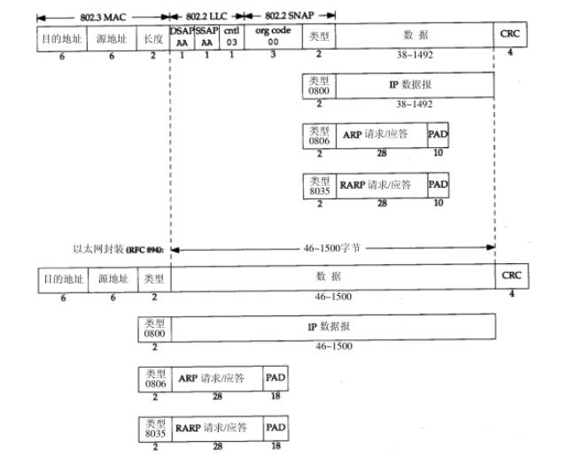

最常用的 MAC 帧是以太网 V2 的格式 :

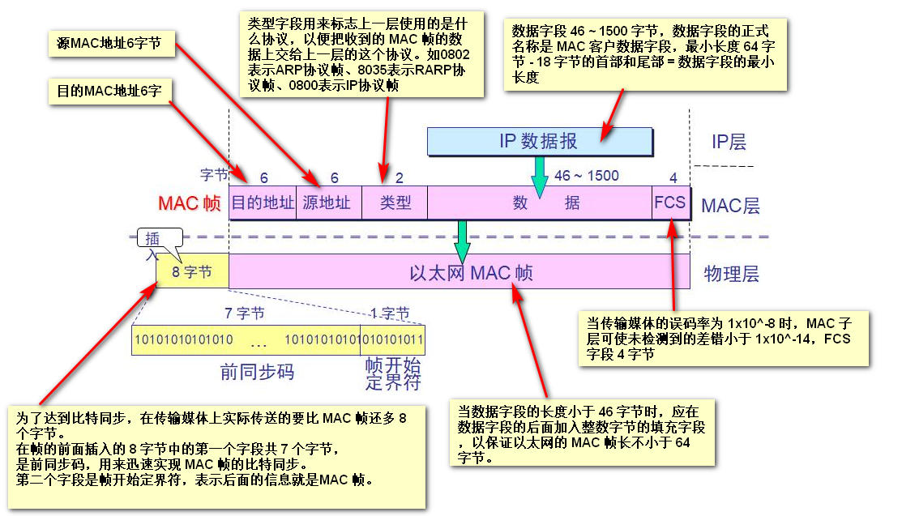

#### MTU

以太网对数据帧的长度有一个限制，最大值是1500。链路层的这个特性称作MTU（最大传输单元）。如果IP层数据报的长度比链路层的MTU还要大，那么IP层就需要进行分片，每一片都要小于MTU。

如果两台主机之间的通信要通过多个网络，那么每个网络的链路层就可能有不同的MTU。两台通信主机路径中的最小MTU，被称为路径MTU。两个方向上的选路不一定对称，因此路径MTU在两个方向上不一定是一致的。

#### ARP地址解析协议

协议格式如下：

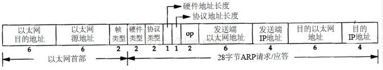

ARP请求报文：

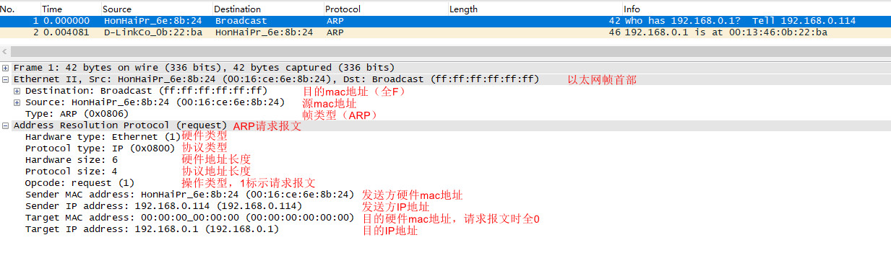

ARP响应报文：

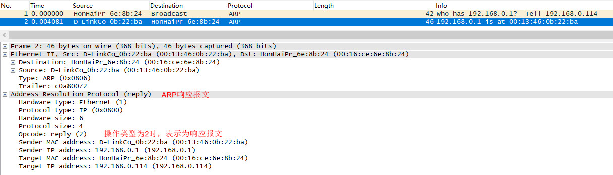

无偿ARP报文：当某一主机ip地址发生更改，通知同一网络中的其他主机更新arp表

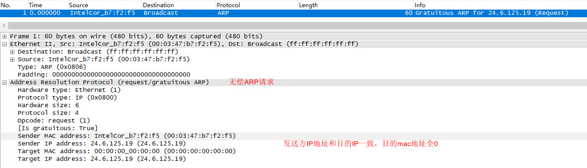

### 网络层

网络层最重要的协议就是网际协议 IP ，网际协议 IP是 TCP/IP 体系中两个最主要的协议之一。与 IP 协议配套使用的还有四个协议 )：

>地址解析协议 ARP (Address Resolution Protocol)
>
>逆地址解析协议 RARP (Reverse Address Resolution Protocol)
>
>网际控制报文协议 ICMP (Internet Control Message Protocol)
>
>网际组管理协议 IGMP(Internet Group Management Protocol)

#### IP数据报的格式

由首部和数据两部分组成。首部的前一部分是固定长度，共 20 字节，是所有 IP 数据报必须具有的。

在首部的固定部分的后面是一些可选字段，其长度是可变的。 

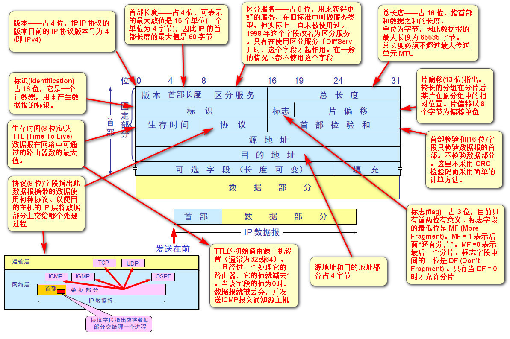

#### IP路由选择

IP路由选择是简单的，对于主机来说，如果目的主机与源主机直接相连或都在一个共享网络上，那么IP数据报就直接送到目的主机上；否则主机就把数据报发往一默认的路由器上，由路由器来转发该数据报。

IP层既可以配置成路由器的功能，也可以配置成主机的功能。IP层在内存中有一个路由表，当收到一份数据报并进行发送时，它都要对该表搜索一次。当数据报来自某个网络接口时，IP首先检查目的IP地址是否为本机的IP地址之一或者IP广播地址。如果是的话，数据报就被送到由IP首部协议字段所指定的协议模块进行处理。如果数据报的目的不是这些地址，如果IP层被设置为路由器的功能，那么就对数据报进行转发，否则数据报被丢弃。

IP路由选择是逐跳进行的，IP并不知道到达任何目的的完整路径，所有IP路由选择只为数据报传输提供下一站路由器的IP地址。IP路由选择主要完成这些功能：

1. 搜索路由表，寻找能与目的IP地址完全匹配的表目。 
2. 搜索路由表，寻找能与目的网络号相匹配的表目。 
3. 搜索路由表，寻找标为"默认"的表目。 

如果上面的步骤都没有成功，数据报就不能被传送。

#### 子网寻址

现在所有主机都要求支持子网编址。不是把IP地址看成单纯的一个网络号和一个主机号组成，而是把主机号再分成一个子网号和一个主机号。

**主机通过子网掩码来确定IP地址多少位用于子网号**，多少位用于主机号。子网掩码是一个32位的值，值为1的位留给网络号和子网号，为0的位留给主机号。

给定IP地址和子网掩码以后，主机就可以确定IP数据报的目的是：

（1）本子网上的主机；

（2）本网络中其它子网的主机；

（3）其它网络上的主机；

### 运输层

### 其他

