### 概述

#### 协议分层

国际标准化组织（International Standard Organization,ISO）公布了开放系统互连参考模型（OSI/RM）。OSI/RM是一种分层的体系结构，参考模型共有7层。 

TCP/IP(Transmission Control Protocol/Internet Protocol)作为Internet的核心协议。它是个协议族，包含多种协议。 对比如下：


TCP/IP协议族中不同层次的协议如下 ：


#### 互联网的地址 

互联网上的每个接口必须有一个唯一的Internet地址（也称作IP地址），IP地址长32bit。五类不同的互联网地址格式以及范围如下： 


**如何确定两个ip地址属于同一个网络？**/

这就要引入网络地址和子网掩码的概念：网络地址 = IP地址  & 子网掩码，当两个ip地址算的网络地址一样是，确认为在同一个网络中

#### 数据进入协议栈的封装过程 


>1. 帧头和帧尾所标注的数字是典型以太网首部的长度
>2. 以太网数据帧的物理特性是其长度必须在46~1500字节之间(原因是因为数据链路层发送出去的包大小最少是64字节 ，减掉以太网首部和尾部的18字节，等于46字节。那为什么数据链路层发送出去的包大小最少是64字节呢？这个问题在数据链路层说明)
>3. 图中IP和网络接口层传送的数据单元应该是分组。分组既可以是一个IP数据报，也可以是IP数据报的一个片
>4. UDP数据和TCP数据基本一致。唯一不同的是UDP传送给IP的信息单元称作UDP数据报，而UDP首部的长度为8位
>5. 由于TCP、UDP、ICMP、IGMP都要向IP传送数据，因此IP必须在生成的IP首部加入某种标识，以表明数据属于那一层。IP在首部存入一个长度为8位的数值，称作协议域。1表示IGMP协议，2表示ICMP协议，6表示TCP协议，17表示UDP协议
>6. TCP、UDP、网络接口也要在首部加入标识符

### 数据链路层

#### 为什么数据链路层发送出去的包大小最少是64字节呢？

1. CSMA/CD

CSMA/CD 表示 Carrier Sense Multiple Access with Collision Detection。

“多点接入”表示许多计算机以多点接入的方式连接在一根总线上。

“载波监听”是指每一个站在发送数据之前先要检测一下总线上是否有其他计算机在发送数据，如果有，则暂时不要发送数据，以免发生碰撞。 

总线上并没有什么“载波”。因此， “载波监听”就是用电子技术检测总线上有没有其他计算机发送的数据信号。  

2. 碰撞检测

“碰撞检测”就是计算机边发送数据边检测信道上的信号电压大小。当几个站同时在总线上发送数据时，总线上的信号电压摆动值将会增大（互相叠加）。当一个站检测到的信号电压摆动值超过一定的门限值时，就认为总线上至少有两个站同时在发送数据，表明产生了碰撞。所谓“碰撞”就是发生了冲突。因此“碰撞检测”也称为“冲突检测”。

在发生碰撞时，总线上传输的信号产生了严重的失真，无法从中恢复出有用的信息来。每一个正在发送数据的站，一旦发现总线上出现了碰撞，就要立即停止发送，免得继续浪费网络资源，然后等待一段随机时间后再次发送。

举例：

A 向 B 发出的信息，要经过一定的时间后才能传送到 B。B 若在 A 发送的信息到达 B 之前发送自己的帧(因为这时 B 的载波监听检测不到 A 所发送的信息)，则必然要在某个时间和 A 发送的帧发生碰撞。碰撞的结果是两个帧都变得无用。  


3. 争用期

最先发送数据帧的站，在发送数据帧后至多经过时间 2t （两倍的端到端往返时延）就可知道发送的数据帧是否遭受了碰撞。以太网的端到端往返时延 2t 称为争用期，或碰撞窗口。经过争用期这段时间还没有检测到碰撞，才能肯定这次发送不会发生碰撞。   

**以太网取 51.2 ms 为争用期的长度。对于 10 Mb/s 以太网，在争用期内可发送512 bit，即 64 字节。以太网在发送数据时，若前 64 字节没有发生冲突，则后续的数据就不会发生冲突。如果发生冲突，就一定是在发送的前 64 字节之内。 由于一检测到冲突就立即中止发送，这时已经发送出去的数据一定小于 64 字节。 以太网规定了最短有效帧长为 64 字节，凡长度小于 64 字节的帧都是由于冲突而异常中止的无效帧。 **

#### 链路层目的

在TCP/IP协议族中，链路层主要有三个目的：

1. 为IP模块发送和接收IP数据报；
2. 为ARP模块发送ARP请求和接收ARP应答；
3. 为RARP发送RARP请求和接收RARP应答。

TCP/IP支持多种不同的链路层协议，这取决于网络所使用的硬件，如以太网、令牌环网、FDDI（光纤分布式数据接口）及RS-232串行线路等。 

#### 以太网的 MAC 层 

在局域网中，硬件地址又称为物理地址，或 MAC 地址。  适配器从网络上每收到一个 MAC 帧就首先用硬件检查 MAC 帧中的 MAC 地址，如果是发往本站的帧则收下，然后再进行其他的处理。否则就将此帧丢弃，不再进行其他的处理。

“发往本站的帧”包括以下三种帧： 

​	单播(unicast)帧（一对一）

​	广播(broadcast)帧（一对全体）

​	多播(multicast)帧（一对多）

#### MAC 帧的格式  

常用的以太网MAC帧格式有两种标准 ：

​	DIX Ethernet V2 标准（RFC894）

​	IEEE 的 802.3 标准（RFC1024）

协议格式如下：


最常用的 MAC 帧是以太网 V2 的格式 :


#### 环回接口

环回接口处理IP数据报的简单过程 ：

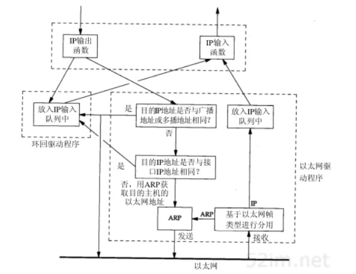

#### MTU

以太网对数据帧的长度有一个限制，最大值是1500。链路层的这个特性称作MTU（最大传输单元）。如果IP层数据报的长度比链路层的MTU还要大，那么IP层就需要进行分片，每一片都要小于MTU。

如果两台主机之间的通信要通过多个网络，那么每个网络的链路层就可能有不同的MTU。两台通信主机路径中的最小MTU，被称为路径MTU。两个方向上的选路不一定对称，因此路径MTU在两个方向上不一定是一致的。

#### ARP地址解析协议

协议格式如下：


ARP请求报文：


ARP响应报文：


无偿ARP报文：当某一主机ip地址发生更改，通知同一网络中的其他主机更新arp表


### 网络层

网络层最重要的协议就是网际协议 IP ，网际协议 IP是 TCP/IP 体系中两个最主要的协议之一。与 IP 协议配套使用的还有四个协议 )：

>地址解析协议 ARP (Address Resolution Protocol)
>
>逆地址解析协议 RARP (Reverse Address Resolution Protocol)
>
>网际控制报文协议 ICMP (Internet Control Message Protocol)
>
>网际组管理协议 IGMP(Internet Group Management Protocol)

#### IP数据报的格式

由首部和数据两部分组成。首部的前一部分是固定长度，共 20 字节，是所有 IP 数据报必须具有的。

在首部的固定部分的后面是一些可选字段，其长度是可变的。 


#### IP路由选择

IP路由选择是简单的，对于主机来说，如果目的主机与源主机直接相连或都在一个共享网络上，那么IP数据报就直接送到目的主机上；否则主机就把数据报发往一默认的路由器上，由路由器来转发该数据报。

IP层既可以配置成路由器的功能，也可以配置成主机的功能。IP层在内存中有一个路由表，当收到一份数据报并进行发送时，它都要对该表搜索一次。当数据报来自某个网络接口时，IP首先检查目的IP地址是否为本机的IP地址之一或者IP广播地址。如果是的话，数据报就被送到由IP首部协议字段所指定的协议模块进行处理。如果数据报的目的不是这些地址，如果IP层被设置为路由器的功能，那么就对数据报进行转发，否则数据报被丢弃。

IP路由选择是逐跳进行的，IP并不知道到达任何目的的完整路径，所有IP路由选择只为数据报传输提供下一站路由器的IP地址。IP路由选择主要完成这些功能：

1. 搜索路由表，寻找能与目的IP地址完全匹配的表目。 
2. 搜索路由表，寻找能与目的网络号相匹配的表目。 
3. 搜索路由表，寻找标为"默认"的表目。 

如果上面的步骤都没有成功，数据报就不能被传送。

#### IP分片

​     物理网络层一般要限制每次发送的数据帧的最大长度。所以，IP层接收到一份要发送的IP数据报时，它要判断向本地哪个接口发送数据（选路），并查询该接口在原始发送端主机上，也可以发送在中间路由器上。

​     对于每一份IP数据报来说，其标识字段都包含一个唯一值。该值在数据报分片时候被复制到每个片中。当数据报分片之后，每个片的总长度要改为该片的长度。（任何运输层首部只出现在第一片数据报中）

#### 子网寻址

现在所有主机都要求支持子网编址。不是把IP地址看成单纯的一个网络号和一个主机号组成，而是把主机号再分成一个子网号和一个主机号。

**主机通过子网掩码来确定IP地址多少位用于子网号**，多少位用于主机号。子网掩码是一个32位的值，值为1的位留给网络号和子网号，为0的位留给主机号。

给定IP地址和子网掩码以后，主机就可以确定IP数据报的目的是：

（1）本子网上的主机；

（2）本网络中其它子网的主机；

（3）其它网络上的主机；

#### ICMP协议

为了提高 IP 数据报交付成功的机会，在网际层使用了网际控制报文协议 ICMP (Internet Control Message Protocol) ，ICMP 报文作为 IP 层数据报的数据，加上数据报的首部，组成 IP 数据报发送出去 。

ICMP报文格式：

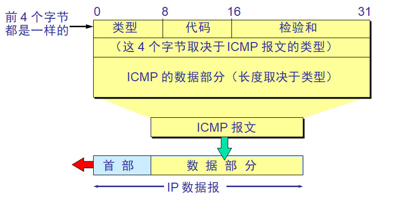

ICMP 差错报告报文种类：

> 终点不可达 
>
> 源点抑制(Source quench)  
>
> 时间超过 
>
> 参数问题 
>
> 改变路由（重定向）(Redirect)  

ICMP 差错报告报文的数据字段的内容 ：

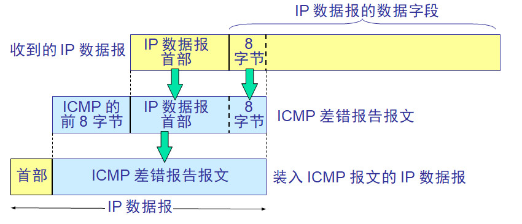

不应发送 ICMP 差错报告报文  的几种情况  ：

> 对 ICMP 差错报告报文不再发送 ICMP 差错报告报文。
>
> 对第一个分片的数据报片的所有后续数据报片都不发送 ICMP 差错报告报文。
>
> 对具有多播地址的数据报都不发送 ICMP 差错报告报文。
>
> 对具有特殊地址（如127.0.0.0 或 0.0.0.0）的数据报不发送 ICMP 差错报告报文

ICMP 询问报文种类:

> 回送请求和回答报文
>
> 时间戳请求和回答报文

下面的几种 ICMP 报文不再使用

> 信息请求与回答报文
>
> 掩码地址请求和回答报文
>
> 路由器询问和通告报文 

应用：ping、tracert

ping请求报文：

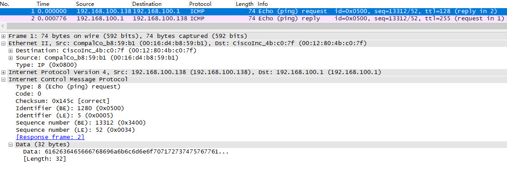

ping响应报文：

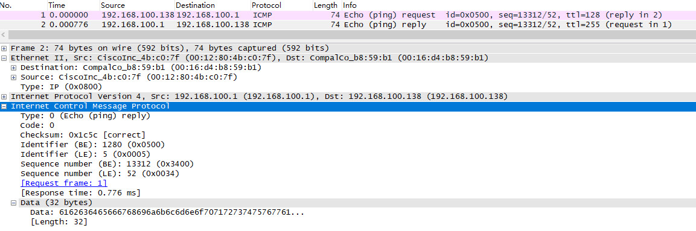

### 运输层

运输层向它上面的应用层提供通信服务，它属于面向通信部分的最高层，同时也是用户功能中的最低层。运输层为相互通信的应用进程提供了逻辑通信 。 主要功能：

> 运输层为应用进程之间提供端到端的逻辑通信（但网络层是为主机之间提供逻辑通信）
>
> 运输层还要对收到的报文进行差错检测
>
> 运输层需要有两种不同的运输协议，即面向连接的 TCP 和无连接的 UDP

UDP 在传送数据之前不需要先建立连接。对方的运输层在收到 UDP 报文后，不需要给出任何确认。虽然 UDP 不提供可靠交付，但在某些情况下 UDP 是一种最有效的工作方式 。

TCP 则提供面向连接的服务。TCP 不提供广播或多播服务。由于 TCP 要提供可靠的、面向连接的运输服务，因此不可避免地增加了许多的开销。这不仅使协议数据单元的首部增大很多，还要占用许多的处理机资源。   

运输层的 UDP 用户数据报与网际层的IP数据报有很大区别。IP 数据报要经过互连网中许多路由器的存储转发，但 UDP 用户数据报是在运输层的端到端抽象的逻辑信道中传送的。

TCP 报文段是在运输层抽象的端到端逻辑信道中传送，这种信道是可靠的全双工信道。但这样的信道却不知道究竟经过了哪些路由器，而这些路由器也根本不知道上面的运输层是否建立了 TCP 连接。 

#### 端口

​	运行在计算机中的进程是用进程标识符来标志的。运行在应用层的各种应用进程却不应当让计算机操作系统指派它的进程标识符。这是因为在因特网上使用的计算机的操作系统种类很多，而不同的操作系统又使用不同格式的进程标识符。为了使运行不同操作系统的计算机的应用进程能够互相通信，就必须用统一的方法对 TCP/IP 体系的应用进程进行标志。

​	由于进程的创建和撤销都是动态的，发送方几乎无法识别其他机器上的进程。有时我们会改换接收报文的进程，但并不需要通知所有发送方。我们往往需要利用目的主机提供的功能来识别终点，而不需要知道实现这个功能的进程。

​	解决这个问题的方法就是在运输层使用协议端口号(protocol port number)，或通常简称为端口(port)。虽然通信的终点是应用进程，但我们可以把端口想象是通信的终点，因为我们只要把要传送的报文交到目的主机的某一个合适的目的端口，剩下的工作（即最后交付目的进程）就由 TCP 来完成。

软件端口与硬件端口 ：

​	在协议栈层间的抽象的协议端口是软件端口。路由器或交换机上的端口是硬件端口。硬件端口是不同硬件设备进行交互的接口，而软件端口是应用层的各种协议进程与运输实体进行层间交互的一种地址

​	端口用一个 16 位端口号进行标志。端口号只具有本地意义，即端口号只是为了标志本计算机应用层中的各进程。在因特网中不同计算机的相同端口号是没有联系的。

#### UDP：用户数据报协议

UDP 只在 IP 的数据报服务之上增加了很少一点的功能，即端口的功能和差错检测的功能 。

特点：

> UDP是一种无连接的， 即发送数据前不需要建立连接，因此减小的开销和发送数据的延迟。
>
> UDP使用尽最大努力交付，即不保证可靠交付，因此主机不需要维持复杂的连接状态表。
>
> UDP是面向报文的，
>
> UDP没有拥塞控制，因此网络出现的拥塞不会使主机的发送率降低。
>
> UDP支持一对一，一对多，多对一和多对多的交互通信。
>
> UDP首部开销小，只有8字节，比TCP的20个字节的首部要短。

面向报文的UDP：

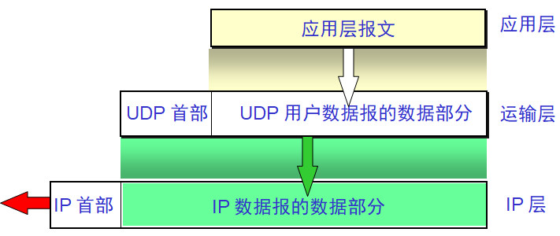

>  发送方 UDP 对应用程序交下来的报文，在添加首部后就向下交付 IP 层。UDP 对应用层交下来的报文，既不合并，也不拆分，而是保留这些报文的边界。
>
> 应用层交给 UDP 多长的报文，UDP 就照样发送，即一次发送一个报文。
>
> 接收方 UDP 对 IP 层交上来的 UDP 用户数据报，在去除首部后就原封不动地交付上层的应用进程，一次交付一个完整的报文。
>
> 应用程序必须选择合适大小的报文。

UDP分用和复用：

 分用：当运输层从IP层收到UDP数据报时，就根据首部中的目的端口，把UDP数据报通过相应的端口，上交到最后的终点——应用进程。 

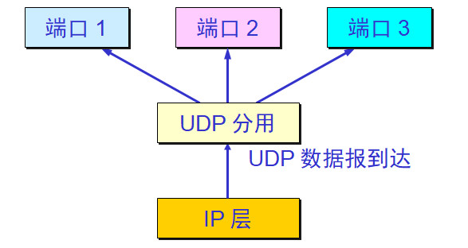

复用：与分用相比，只是数据报的传输方向相反。 

**注意：如果接收方UDP发现收到的报文中的目的端口号不正确（即不存在对应于该端口号的应用进程），就丢弃该报文，并由**网际控制报文协议ICMP**发送“**端口不可达**”差错报文给发送方。 **

UDP协议格式：

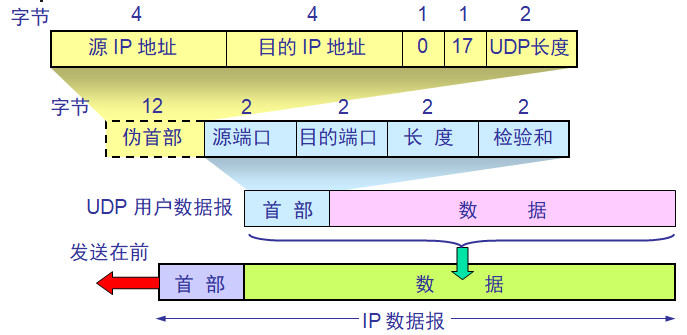

> 用户数据报 UDP 有两个字段：数据字段和首部字段。首部字段有 8 个字节，由 4 个字段组成，每个字段都是两个字节。
>
> UDP长度：该字段表示数据报文的长度（包含首部和数据部分），最小8个字节。 
>
> 在计算检验和时，临时把“伪首部”和 UDP 用户数据报连接在一起。伪首部仅仅是为了计算检验和 。

举例一个dns查询的报文通过UDP来实现：

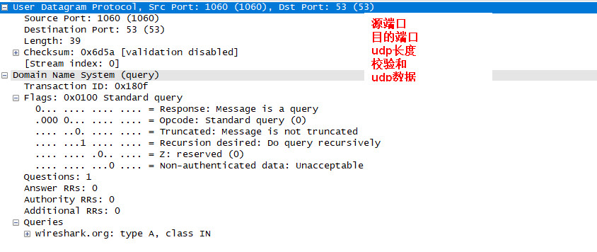

#### TCP：传输控制协议

TCP提供了一种可靠的面向连接的字节流运输层服务。 TCP将用户数据打包成报文段，它发送后启动一个定时器，另一端收到的数据进行确认，对失序的数据重新排序，丢弃重复数据，TCP提供端到端的流量控制，并计算和验证一个强制性的端到端的检验和。许多流行的应用程序如：Telnet， Rlogin， FTP，SMTP 都使用TCP。

特点：

> TCP 是面向连接的运输层协议。
>
> 每一条 TCP 连接只能有两个端点(endpoint)，每一条 TCP 连接只能是点对点的（一对一）。 
>
> TCP 提供可靠交付的服务。
>
> TCP 提供全双工通信。
>
> 面向字节流：虽然应用程序和TCP交互是一次一个数据块，但TCP把应用程序交下来的数据仅仅是一连串的无结构的字节流 

注意：

> TCP 连接是一条虚连接而不是一条真正的物理连接。
>
> TCP 对应用进程一次把多长的报文发送到TCP 的缓存中是不关心的。
>
> TCP 根据对方给出的窗口值和当前网络拥塞的程度来决定一个报文段应包含多少个字节（UDP 发送的报文长度是应用进程给出的）。
>
> TCP 可把太长的数据块划分短一些再传送。TCP 也可等待积累有足够多的字节后再构成报文段发送出去。 

##### TCP面向流的概念

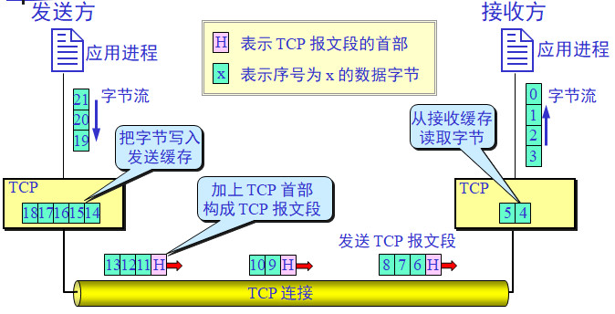

##### TCP 的连接  

TCP 把连接作为最基本的抽象。

每一条 TCP 连接有两个端点。

TCP 连接的端点不是主机，不是主机的IP 地址，不是应用进程，也不是运输层的协议端口。TCP 连接的端点叫做套接字(socket)或插口。端口号拼接到(contatenated with) IP 地址即构成了套接字。   

每一条 TCP 连接唯一地被通信两端的两个端点（即两个套接字）所确定。即：TCP 连接 ::= {socket1, socket2}   = {(IP1: port1), (IP2: port2)}     

##### 可靠传输的工作原理 

**停止等待协议** :  优点是简单，缺点是信道利用率太低 

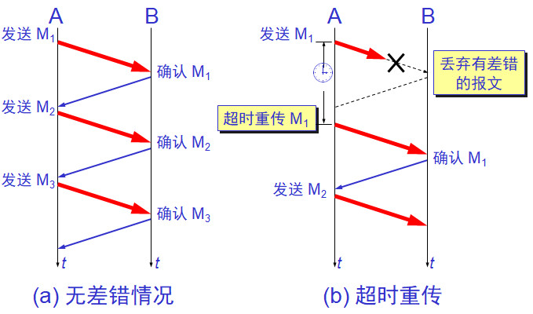

注意：

> 在发送完一个分组后，必须暂时保留已发送的分组的副本。
>
> 分组和确认分组都必须进行编号。
>
> 超时计时器的重传时间应当比数据在分组传输的平均往返时间更长一些。 

**确认丢失和确认迟到 **:

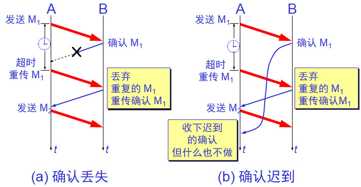

​	使用上述的确认和重传机制，我们就可以在不可靠的传输网络上实现可靠的通信。这种可靠传输协议常称为**自动重传请求ARQ (Automatic Repeat reQuest)**。ARQ 表明重传的请求是自动进行的。接收方不需要请求发送方重传某个出错的分组。

**流水线传输  **：

发送方可连续发送多个分组，不必每发完一个分组就停顿下来等待对方的确认。由于信道上一直有数据不间断地传送，这种传输方式可获得很高的信道利用率。 

**连续ARQ协议**：

由于停止等待ARQ协议信道利用率太低，所以需要使用连续ARQ协议来进行改善。这个协议会连续发送一组数据包，然后再等待这些数据包的ACK。发送方采用流水线传输。流水线传输就是发送方可以连续发送多个分组，不必每发完一个分组就停下来等待对方确认。连续ARQ协议通常是结合滑动窗口协议来使用的，发送方需要维持一个发送窗口，如下图所示： 

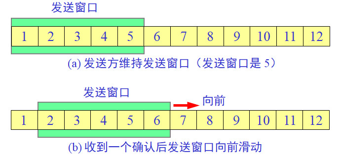

**累积确认 **：

接收方一般采用累积确认的方式。即不必对收到的分组逐个发送确认，而是对按序到达的最后一个分组发送确认，这样就表示：到这个分组为止的所有分组都已正确收到了。

累积确认有的优点是：容易实现，即使确认丢失也不必重传。缺点是：不能向发送方反映出接收方已经正确收到的所有分组的信息。

##### TCP 可靠通信的具体实现 

> TCP 连接的每一端都必须设有两个窗口——一个发送窗口和一个接收窗口。
>
> TCP 的可靠传输机制用字节的序号进行控制。TCP 所有的确认都是基于序号而不是基于报文段。
>
> TCP 两端的四个窗口经常处于动态变化之中。
>
> TCP连接的往返时间 RTT 也不是固定不变的。需要使用特定的算法估算较为合理的重传时间。  

##### TCP报文段的格式

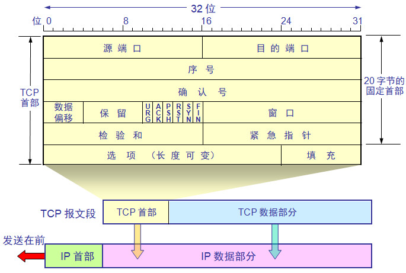

各字段含义：

> 1. 源端口和目的端口字段——各占 2 字节。端口是运输层与应用层的服务接口。运输层的复用和分用功能都要通过端口才能实现。
>
> 2. 序号字段——占 4 字节。TCP 连接中传送的数据流中的每一个字节都编上一个序号。序号字段的值则指的是本报文段所发送的数据的第一个字节的序号。
>
> 3. 确认号字段——占 4 字节，是期望收到对方的下一个报文段的数据的第一个字节的序号。
>
> 4. 数据偏移（即首部长度）——占 4 位，它指出 TCP 报文段的数据起始处距离 TCP 报文段的起始处有多远。“数据偏移”的单位是 32 位字（以 4 字节为计算单位）。
>
> 5. 保留字段——占 6 位，保留为今后使用，但目前应置为 0。
>
> 6. 紧急 URG —— 当 URG = 1 时，表明紧急指针字段有效。它告诉系统此报文段中有紧急数据，应尽快传送(相当于高优先级的数据) 。
>
> 7. 确认 ACK —— 只有当 ACK = 1 时确认号字段才有效。当 ACK = 0 时，确认号无效 。
>
> 8. 推送 PSH (PuSH) —— 接收 TCP 收到 PSH = 1 的报文段，就尽快地交付接收应用进程，而不再等到整个缓存都填满了后再向上交付 。
>
> 9. 复位 RST (ReSeT) —— 当 RST = 1 时，表明 TCP 连接中出现严重差错（如由于主机崩溃或其他原因），必须释放连接，然后再重新建立运输连接 。
>
> 10. 同步 SYN —— 同步 SYN = 1 表示这是一个连接请求或连接接受报文 。
>
> 11. 终止 FIN (FINis) —— 用来释放一个连接。FIN = 1 表明此报文段的发送端的数据已发送完毕，并要求释放运输连接 。
>
> 12. 窗口字段 —— 占 2 字节，用来让对方设置发送窗口的依据，单位为字节。 
>
> 13. 检验和 —— 占 2 字节。检验和字段检验的范围包括首部和数据这两部分。在计算检验和时，要在 TCP 报文段的前面加上 12 字节的伪首部。 
>
> 14. 紧急指针字段 —— 占 16 位，指出在本报文段中紧急数据共有多少个字节（紧急数据放在本报文段数据的最前面）。
>
> 15. 选项字段 —— 长度可变。TCP 最初只规定了一种选项，即最大报文段长度 MSS。MSS 告诉对方 TCP：“我的缓存所能接收的报文段的数据字段的最大长度是 MSS 个字节。”  MSS (Maximum Segment Size)是 TCP 报文段中的数据字段的最大长度。数据字段加上 TCP 首部才等于整个的 TCP 报文段。mss = mtu -ip首部20字节-tcp首部20字节。其他选项：
>
>     窗口扩大选项 ——占 3 字节，其中有一个字节表示移位值 S。新的窗口值等于TCP 首部中的窗口位数增大到(16 + S)，相当于把窗口值向左移动 S 位后获得实际的窗口大小。
>
>     时间戳选项——占10 字节，其中最主要的字段时间戳值字段（4 字节）和时间戳回送回答字段（4 字节）。
>
>     选择确认选项
>
> 16. 填充字段 —— 这是为了使整个首部长度是 4 字节的整数倍。  

##### TCP滑动窗口协议

为方便描述可靠传输原理，假定数据传输只在一个方向上进行，即A发送数据，B给出确认 。

##### 以字节为单位的滑动窗口 

TCP的滑动窗口是以字节为单位的。为了便于说明，字节编号取得很小。先假定A收到B发来的确认报文字段，其中窗口是20字节，而确认号是31字节。（表明B期望接收到的下一个序号是31，序号30之前的数据已经收到了）。如图所示：

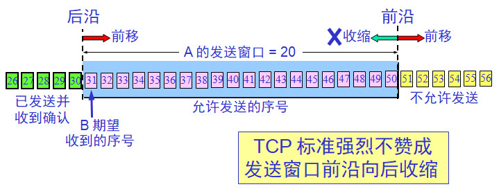

A的发送窗口 ：在没有收到B的确认的情况下，可以连续把窗口内的数据发送出去。凡是已经发送过的数据，在未收到确认之前都必须暂时保留，以便超时重传使用。 

发送窗口有如下特点：

1. 发送窗口里面的序号表示允许发送的序号（如31~50）
2. 发送窗口的位置由窗口的前沿和后沿的位置共同确定。发送窗口的后沿可能不动（没有收到确认），或者前移（收到新的确认）。发送窗口的前沿通常是不断的向前移动，但也可能不动。

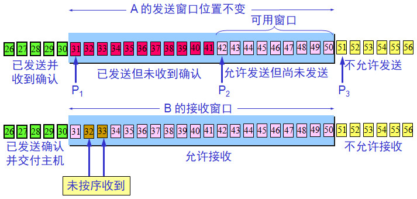

如上图，A 发送了 11 个字节的数据 （31-41），可以看出要描述一个发送窗口的状态需要三个指针P1， P2， P3  ，小于P1的是已发送并收到确认的部分，大于P3的是不允许发送部分。

​     P3-P1 = A的发送窗口（又称为通知窗口）

​     P2-P1 = 已发送但尚未收到确认的字节数

​     P3-P2 = 允许发送但尚未收到的字节数（又称为可用窗口或有效窗口）

B接收过程：

B的接收窗口大小为20。在接收窗口外面，到30号为止的数据均发送过确认并交付主机使用，因此B不再保留（之前的数据）。 同时B未按序收到32-33数据，因为31数据还没收到，B只能对按序到达的数据中的最高序号给出确认，因此B的发送的确认号仍然是31，而不能是32或33。 

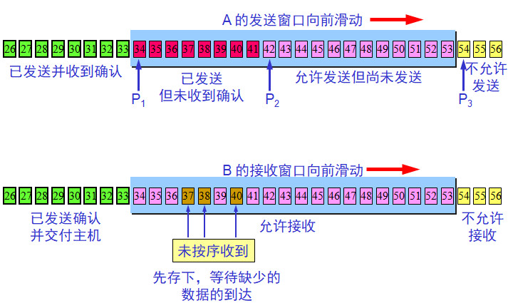

B收到序号为31的数据并把序号为31-33的数据交付给主机，然后B删除这些数据。接着把接收窗口向前移动3个序号，同时给A发出确认。其窗口值仍为20，但确认号34，表明B已经接收到序号33为止的数据。而B收到的37 38 40的数据没有按序到达，先暂存在接收窗口中。 A 收到新的确认号（33），发送窗口向前滑动 。

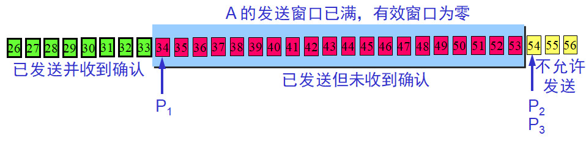

如果A按照以上的方式进行发送数据。A 的发送窗口内的序号都已用完，但还没有再收到确认，必须停止发送。如果发送窗口内所有数据都正确到达B,而发出的确认由于网络问题没有到达A，为保证传输，此时A只能认为B还没有收到这部分数据。于是A经过一段时间过（由超时计时器控制）重传这部分数据，直到收到B的确认为止。 

 ##### 发送缓存与接收缓存 

发送缓存用来暂时存放：

> 发送应用程序传送给发送方 TCP 准备发送的数据
>
> TCP 已发送出但尚未收到确认的数据

 发送窗口通常只是发送缓存的一部分。已被确认的数据应当从发送缓存中删除，因此发送缓存与发送窗口的后沿是重合的。发送应用程序必须控制写入缓存的速率，不能太快，否则发送缓存就会没有存放数据的空间。 

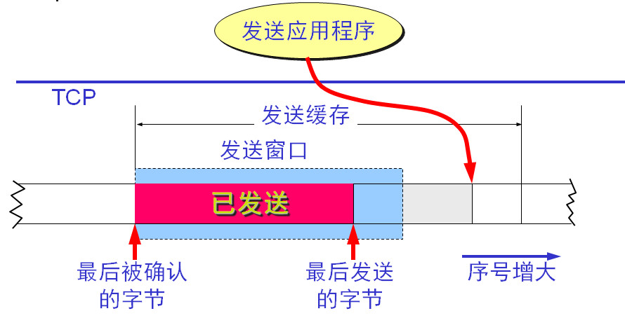

接收缓存用来暂时存放：
>
> 按序到达的、但尚未被接收应用程序读取的数据
>
> 不按序到达的数据

如果收到的分组检测出有差错，则要丢弃。如果接收应用程序来不及读取收到的数据，接收缓存最终就会被填满。使接收窗口减小到0。反之，接收应用程序能够及时从接收缓存中读取收到数据，接收窗口就会变大，但最大也不能超过接收缓存的大小。 

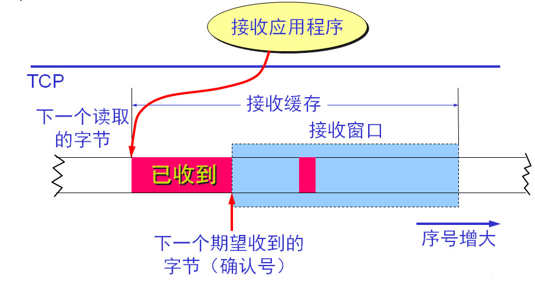

注意：

> A 的发送窗口并不总是和 B 的接收窗口一样大（因为有一定的时间滞后）。
>
> TCP 标准没有规定对不按序到达的数据应如何处理。通常是先临时存放在接收窗口中，等到字节流中所缺少的字节收到后，再按序交付上层的应用进程。
>
> TCP 要求接收方必须有累积确认的功能，这样可以减小传输开销。  

##### 超时重传的时间选择 

 TCP每发送一个报文段，就对这个报文段设置一次计时器。只要计时器设置的重传时间到还没有收到确认，就要重传这个报文段。由于数据链路层和运输层的往返时延概率分布存在很大差异，因此有必要选择合适的超时重传时间。报文段的往返时延是指收到确认报文的时间与每一个报文段发出的时间之差。报文段的平均往返时延RTT是由各个报文段的往返时延样本加权平均得出来的。

**加权平均往返时间 **

TCP 保留了 RTT 的一个加权平均往返时间 RTTS（这又称为平滑的往返时间）。

第一次测量到 RTT 样本时，RTTS 值就取为所测量到的 RTT 样本值。以后每测量到一个新的 RTT 样本，就按下式重新计算一次 RTTS：

新的 RTTS = (1 - a)  x (旧的 RTTS)   + a  (新的 RTT 样本) ，式中，0 < a < 1。若 a 很接近于零，表示 RTT 值更新较慢。若选择 a 接近于 1，则表示 RTT 值更新较快。RFC 2988 推荐的 a 值为 1/8，即 0.125。 

**超时重传时间 RTO**

RTO 应略大于上面得出的加权平均往返时间 RTTS。

RFC 2988 建议使用下式计算 RTO：

​                   RTO = RTTS + 4 x RTTD                  

RTTD 是 RTT 的偏差的加权平均值。

RFC 2988 建议这样计算 RTTD。第一次测量时，RTTD 值取为测量到的 RTT 样本值的一半。在以后的测量中，则使用下式计算加权平均的 RTTD：

新的 RTTD = (1 - b) x (旧的RTTD)  + b x |RTTS - 新的 RTT 样本|

b 是个小于 1 的系数，其推荐值是 1/4，即 0.25。

##### Karn 算法  

在计算平均往返时间 RTT 时，只要报文段重传了，就不采用其往返时间样本。这样得出的加权平均平均往返时间 RTTS 和超时重传时间 RTO 就较准确。

修正的 Karn 算法 ：

报文段每重传一次，就把 RTO 增大一些：新的 RTO = g x (旧的 RTO)      

系数 g 的典型值是 2 。当不再发生报文段的重传时，才根据报文段的往返时延更新平均往返时延 RTT 和超时重传时间 RTO 的数值。实践证明，这种策略较为合理。 

##### 选择确认 SACK 

接收方收到了和前面的字节流不连续的两个字节块。如果这些字节的序号都在接收窗口之内，那么接收方就先收下这些数据，但要把这些信息准确地告诉发送方，使发送方不要再重复发送这些已收到的数据。 

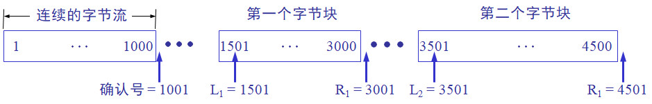

•  和前后字节不连续的每一个字节块都有两个边界：左边界和右边界。图中用四个指针标记这些边界。

•  第一个字节块的左边界 L1 = 1501，但右边界 R1 = 3001。

•  左边界指出字节块的第一个字节的序号，但右边界减 1 才是字节块中的最后一个序号。

•  第二个字节块的左边界 L2 = 3501，而右边界 R2 = 4501。 

**RFC 2018 的规定 **

如果要使用选择确认，那么在建立 TCP 连接时，就要在 TCP 首部的选项中加上“允许 SACK”的选项，而双方必须都事先商定好。

如果使用选择确认，那么原来首部中的“确认号字段”的用法仍然不变。只是以后在 TCP 报文段的首部中都增加了 SACK 选项，以便报告收到的不连续的字节块的边界。

由于首部选项的长度最多只有 40 字节，而指明一个边界就要用掉 4 字节，因此在选项中最多只能指明 4 个字节块的边界信息（8个边界x4）。

##### TCP的流量控制

一般说来，我们总是希望数据传输得更快一些。但如果发送方把数据发送得过快，接收方就可能来不及接收，这就会造成数据的丢失。

流量控制(flow control)就是让发送方的发送速率不要太快，既要让接收方来得及接收，也不要使网络发生拥塞。

利用滑动窗口机制可以很方便地在 TCP 连接上实现流量控制。 举例如下：

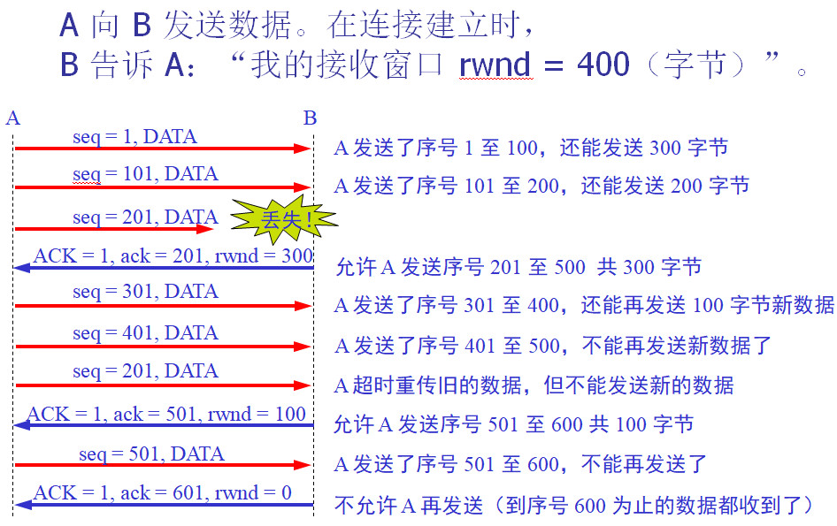

##### TCP持续计时器 

TCP 为每一个连接设有一个持续计时器。只要 TCP 连接的一方收到对方的零窗口通知，就启动持续计时器。若持续计时器设置的时间到期，就发送一个零窗口探测报文段（仅携带 1 字节的数据），而对方就在确认这个探测报文段时给出了现在的窗口值。若窗口仍然是零，则收到这个报文段的一方就重新设置持续计时器。若窗口不是零，则死锁的僵局就可以打破了。

**考虑传输效率**

可以用不同的机制来控制 TCP 报文段的发送时机:

第一种机制是 TCP 维持一个变量，它等于最大报文段长度 MSS。只要缓存中存放的数据达到 MSS 字节时，就组装成一个 TCP 报文段发送出去。

第二种机制是由发送方的应用进程指明要求发送报文段，即 TCP 支持的推送(push)操作。

第三种机制是发送方的一个计时器期限到了，这时就把当前已有的缓存数据装入报文段（但长度不能超过 MSS）发送出去。

##### TCP的拥塞控制 

在某段时间，若对网络中某资源的需求超过了该资源所能提供的可用部分，网络的性能就要变坏——产生拥塞(congestion)。出现资源拥塞的条件：对资源需求的总和 > 可用资源  

若网络中有许多资源同时产生拥塞，网络的性能就要明显变坏，整个网络的吞吐量将随输入负荷的增大而下降。  

**拥塞控制和流量控制的差别**:

​     所谓拥塞控制就是防止过多的数据注入到网络中，这样可以使网络中的路由器或链路不致过载。拥塞控制所要做的都有一个前提，就是网络能承受现有的网络负荷。

​     流量控制往往指的是点对点通信量的控制，是个端到端的问题。流量控制所要做的就是控制发送端发送数据的速率，以便使接收端来得及接受。

**拥塞控制设计**

开环控制方法就是在设计网络时事先将有关发生拥塞的因素考虑周到，力求网络在工作时不产生拥塞。 

闭环控制是基于反馈环路的概念。属于闭环控制的有以下几种措施： 

​	监测网络系统以便检测到拥塞在何时、何处发生。

​	将拥塞发生的信息传送到可采取行动的地方。

​	调整网络系统的运行以解决出现的问题。

**拥塞控制方法**

因特网建议标准RFC2581定义了进行拥塞控制的四种算法，即慢开始（Slow-start)，拥塞避免（Congestion Avoidance)快重传（Fast Restrangsmit)和快回复（Fast Recovery）。

1. 慢开始和拥塞避免 

发送方维持一个叫做拥塞窗口 cwnd (congestion window)的状态变量。拥塞窗口的大小取决于网络的拥塞程度，并且动态地在变化。发送方让自己的发送窗口等于拥塞窗口。如再考虑到接收方的接收能力，则发送窗口还可能小于拥塞窗口。

发送方控制拥塞窗口的原则是：只要网络没有出现拥塞，拥塞窗口就再增大一些，以便把更多的分组发送出去。但只要网络出现拥塞，拥塞窗口就减小一些，以减少注入到网络中的分组数。 

**慢开始算法的原理**

在主机刚刚开始发送报文段时可先设置拥塞窗口 cwnd = 1，即设置为一个最大报文段 MSS 的数值。

在每收到一个对新的报文段的确认后，将拥塞窗口加 1，重传的不算在内，即增加一个 MSS 的数值。

用这样的方法逐步增大发送端的拥塞窗口 cwnd，可以使分组注入到网络的速率更加合理。 

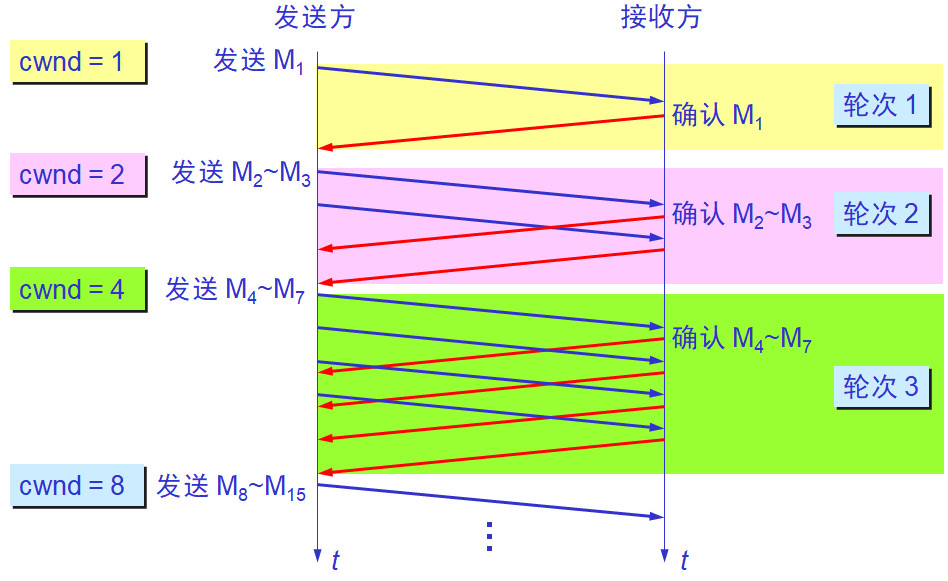

**传输轮次 **

使用慢开始算法后，每经过一个传输轮次，拥塞窗口 cwnd 就加倍。一个传输轮次所经历的时间其实就是往返时间 RTT。“传输轮次”更加强调：把拥塞窗口 cwnd 所允许发送的报文段都连续发送出去，并收到了对已发送的最后一个字节的确认。例如，拥塞窗口 cwnd = 4，这时的往返时间 RTT 就是发送方连续发送 4 个报文段，并收到这 4 个报文段的确认，总共经历的时间。 

**慢开始门限状态变量ssthresh**

慢开始门限 ssthresh 的用法如下：

​	当 cwnd < ssthresh 时，使用慢开始算法。

​	当 cwnd > ssthresh 时，停止使用慢开始算法而改用拥塞避免算法。

​	当 cwnd = ssthresh 时，既可使用慢开始算法，也可使用拥塞避免算法。

拥塞避免算法的思路是让拥塞窗口 cwnd 缓慢地增大，即每经过一个往返时间 RTT 就把发送方的拥塞窗口 cwnd 加 1，而不是加倍，使拥塞窗口 cwnd 按线性规律缓慢增长。

**网络出现拥塞时**

无论在慢开始阶段还是在拥塞避免阶段，只要发送方判断网络出现拥塞（其根据就是没有按时收到确认），就要把慢开始门限 ssthresh 设置为出现拥塞时的发送方窗口值的一半（但不能小于2）。然后把拥塞窗口 cwnd 重新设置为 1，执行慢开始算法。这样做的目的就是要迅速减少主机发送到网络中的分组数，使得发生拥塞的路由器有足够时间把队列中积压的分组处理完毕。 

举例：

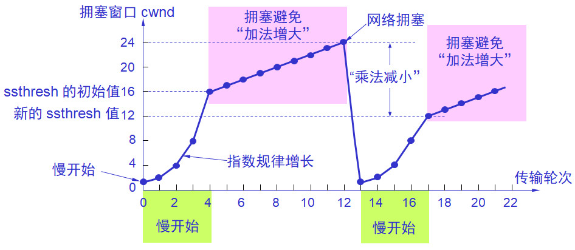

> 1. 当 TCP 连接进行初始化时，将拥塞窗口置为 1。图中的窗口单位不使用字节而使用报文段。慢开始门限的初始值设置为 16 个报文段，即 ssthresh = 16。
> 2. 发送端的发送窗口不能超过拥塞窗口 cwnd 和接收端窗口 rwnd 中的最小值。我们假定接收端窗口足够大，因此现在发送窗口的数值等于拥塞窗口的数值。 
> 3. 在执行慢开始算法时，拥塞窗口 cwnd 的初始值为 1，发送第一个报文段 M0。   
> 4. 发送端每收到一个确认 ，就把 cwnd 加 1。于是发送端可以接着发送 M1 和 M2 两个报文段。  
> 5. 接收端共发回两个确认。发送端每收到一个对新报文段的确认，就把发送端的 cwnd 加 1。现在 cwnd 从 2 增大到 4，并可接着发送后面的 4 个报文段。  
> 6. 发送端每收到一个对新报文段的确认，就把发送端的拥塞窗口加 1，因此拥塞窗口 cwnd 随着传输轮次按指数规律增长。  
> 7. 当拥塞窗口 cwnd 增长到慢开始门限值 ssthresh 时（即当 cwnd = 16 时），就改为执行拥塞避免算法，拥塞窗口按线性规律增长。 
> 8. 假定拥塞窗口的数值增长到 24 时，网络出现超时，表明网络拥塞了。 
> 9. 更新后的 ssthresh 值变为 12（即发送窗口数值 24 的一半），拥塞窗口再重新设置为 1，并执行慢开始算法。  
> 10. 当 cwnd = 12 时改为执行拥塞避免算法，拥塞窗口按按线性规律增长，每经过一个往返时延就增加一个 MSS 的大小。 

**乘法减小**

“乘法减小“是指不论在慢开始阶段还是拥塞避免阶段，只要出现一次超时（即出现一次网络拥塞），就把慢开始门限值 ssthresh 设置为当前的拥塞窗口值乘以 0.5。当网络频繁出现拥塞时，ssthresh 值就下降得很快，以大大减少注入到网络中的分组数。 

**加法增大**

“加法增大”是指执行拥塞避免算法后，在收到对所有报文段的确认后（即经过一个往返时间），就把拥塞窗口 cwnd增加一个 MSS 大小，使拥塞窗口缓慢增大，以防止网络过早出现拥塞。

注意：“拥塞避免”并非指完全能够避免了拥塞。利用以上的措施要完全避免网络拥塞还是不可能的。

“拥塞避免”是说在拥塞避免阶段把拥塞窗口控制为按线性规律增长，使网络比较不容易出现拥塞。 

2. 快重传和快恢复 

快重传算法首先要求接收方每收到一个失序的报文段后就立即发出重复确认。这样做可以让发送方及早知道有报文段没有到达接收方。 

发送方只要一连收到三个重复确认就应当立即重传对方尚未收到的报文段。 不难看出，快重传并非取消重传计时器，而是在某些情况下可更早地重传丢失的报文段。 

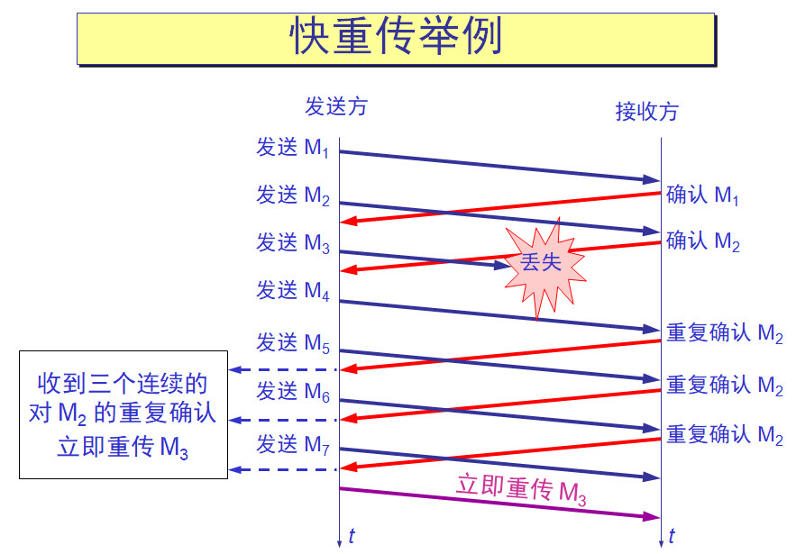

**快恢复算法 **

(1)当发送端收到连续三个重复的确认时，就执行“乘法减小”算法，把慢开始门限 ssthresh 减半。但接下去不执行慢开始算法。 

(2)由于发送方现在认为网络很可能没有发生拥塞，因此现在不执行慢开始算法，即拥塞窗口 cwnd 现在不设置为 1，而是设置为慢开始门限 ssthresh 减半后的数值，然后开始执行拥塞避免算法（“加法增大”），使拥塞窗口缓慢地线性增大。 

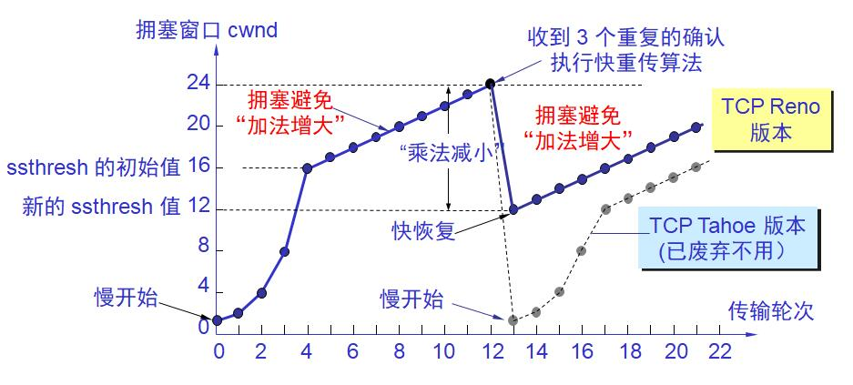

发送窗口的上限值 ：

发送方的发送窗口的上限值应当取为接收方窗口 rwnd 和拥塞窗口 cwnd 这两个变量中较小的一个，即应按以下公式确定：发送窗口的上限值 = Min [rwnd, cwnd]            

当 rwnd < cwnd 时，是接收方的接收能力限制发送窗口的最大值。

当 cwnd < rwnd 时，则是网络的拥塞限制发送窗口的最大值。 

##### TCP 的运输连接管理

运输连接就有三个阶段，即：连接建立、数据传送和连接释放。运输连接的管理就是使运输连接的建立和释放都能正常地进行。

连接建立过程中要解决以下三个问题：

​	要使每一方能够确知对方的存在。

​	要允许双方协商一些参数（如最大报文段长度，最大窗口大小，服务质量等）。

​	能够对运输实体资源（如缓存大小，连接表中的项目等）进行分配。  

**TCP连接建立**

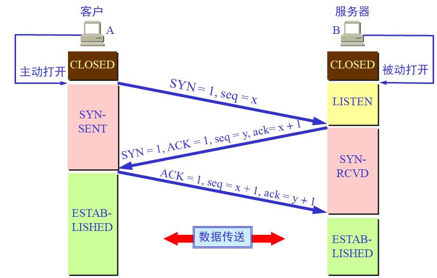

1. A 的 TCP 向 B 发出连接请求报文段，其首部中的同步位 SYN = 1，并选择序号 seq = x，表明传送数据时的第一个数据字节的序号是 x。

2. B 的 TCP 收到连接请求报文段后，如同意，则发回确认。

   B 在确认报文段中应使 SYN = 1，使 ACK = 1，其确认号ack = x + 1，自己选择的序号 seq = y。

3. A 收到此报文段后向 B 给出确认，其 ACK = 1，确认号 ack = y + 1，A 的 TCP 通知上层应用进程，连接已经建立。   

4. B 的 TCP 收到主机 A 的确认后，也通知其上层应用进程：TCP 连接已经建立。

**TCP连接释放**

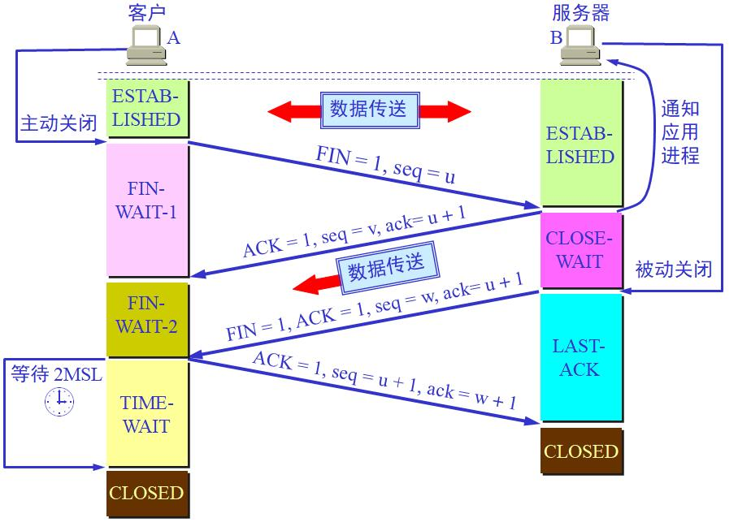

1. 数据传输结束后，通信的双方都可释放连接。现在 A 的应用进程先向其 TCP 发出连接释放报文段，并停止再发送数据，主动关闭 TCP连接。A 把连接释放报文段首部的 FIN = 1，其序号seq = u，等待 B 的确认。
2. B 发出确认，确认号 ack = u + 1，而这个报文段自己的序号 seq = v。TCP 服务器进程通知高层应用进程。从 A 到 B 这个方向的连接就释放了，TCP 连接处于半关闭状态。B 若发送数据，A 仍要接收。
3. 若 B 已经没有要向 A 发送的数据，其应用进程就通知 TCP 释放连接。seq=w，ack=u+1 
4. A 收到连接释放报文段后，必须发出确认，在确认报文段中 ACK = 1，确认号 ack = w + 1，自己的序号 seq = u + 1。 
5. TCP 连接必须经过时间 2MSL 后才真正释放掉。 

A 必须等待 2MSL 的时间 原因：

第一，为了保证 A 发送的最后一个 ACK 报文段能够到达 B。

第二，防止 “已失效的连接请求报文段”出现在本连接中。A 在发送完最后一个 ACK 报文段后，再经过时间 2MSL，就可以使本连接持续的时间内所产生的所有报文段，都从网络中消失。这样就可以使下一个新的连接中不会出现这种旧的连接请求报文段。

tcp有效状态机：

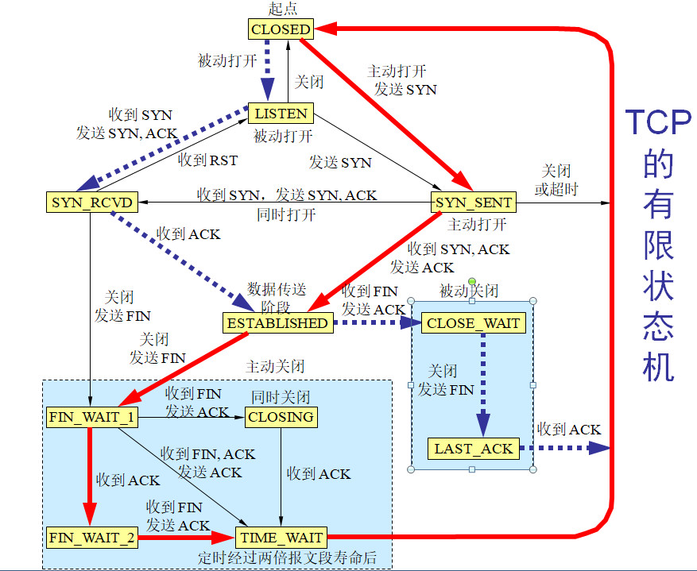

##### TCP半打开连接及同时打开同时关闭

1. 半打开连接

​	如果一方已经关闭或异常终止连接而另一方却还不知道，我们将这样的 TCP连接称为半打开（H a l f - O p e n）的。任何一端的主机异常都可能导致发生这种情况。只要不打算在半打开连接上传输数据，仍处于连接状态的一方就不会检测另一方已经出现异常。

​	半打开连接的一个常见的原因是客户端或者服务器突然掉电而不是正常的结束应用程序后再关机，这样即使重新启动后，原来的连接信息已经消失了，对端仍然保持半打开状态，如果需要发数据的话，这边收到之后 其实发现这个连接并不存在了，就会回复RST包告知，这个时候就需要重新建立连接了！ 

2. 同时打开

​        两个应用程序同时彼此执行主动打开的情况是可能的，尽管发生的可能性极小。每一方必须发送一个S Y N，且这些S Y N必须传递给对方。这需要每一方使用一个对方熟知的端口作为本地端口。这又称为同时打开（ simultaneous open）。

​        例如，主机A中的一个应用程序使用本地端口7 7 7 7，并与主机B的端口8 8 8 8执行主动打开。主机B中的应用程序则使用本地端口8 8 8 8，并与主机A的端口7 7 7 7执行主动打开。
这与下面的情况不同：主机A中的Te l n e t客户程序和主机B中Te l n e t的服务器程序建立连接，与此同时，主机B中的Te l n e t客户程序与主机A的Te l n e t服务器程序也建立连接。在这个 Te l n e t例子中，两个Te l n e t服务器都执行被动打开，而不是主动打开，并且 Te l n e t客户选择的本地端口不是另一端Te l n e t服务器进程所熟悉的端口。
         TCP是特意设计为了可以处理同时打开，对于同时打开它仅建立一条连接而不是两条连接（其他的协议族，最突出的是O S I运输层，在这种情况下将建立两条连接而不是一条连接）。一个同时打开的连接需要交换 4个报文段，比正常的三次握手多一个。此外，要注意的是我们没有将任何一端称为客户或服务器，因为每一端既是客户又是服务器。

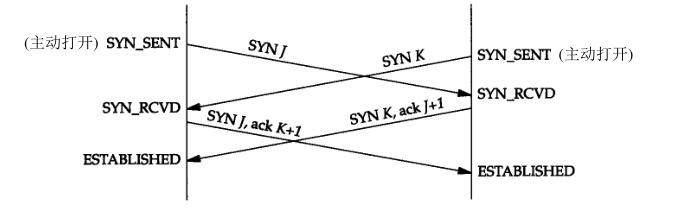

3. 同时关闭

双方都执行主动关闭也是可能的，TCP协议也允许这样的同时关闭（simultaneous close）。同时发送FIN包，两端同时执行主动关闭，进入FIN_WAIT_1的状态，从FIN_WAIT_1状态收到FIN包的时候进入CLOSING状态，然后回复ACK，进入TIME_WAIT状态。 

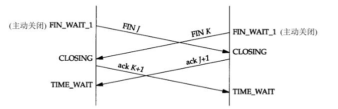

##### TCP 选项

TCP选项的格式：

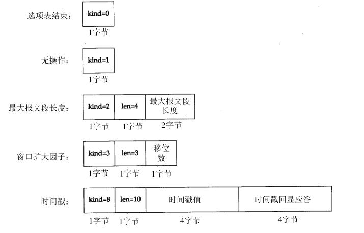

每个选项的开始是1字节k i n d字段，说明选项的类型。k i n d字段为0和1的选项仅占1个字节。其他的选项在k i n d字节后还有l e n字节。它说明的长度是指总长度，包括 k i n d字节和l e n字节。其他k i n d值为4、5、6和7的四个选项称为选择A C K及回显选项。由于回显选项已被时间戳选项取代，而目前定义的选择 A C K选项仍未定论，并未包括在RFC 1323中。

##### Delay ACK 

TCP传输的数据流的分类：

TCP交互数据流：一般情况下数据总是以小于MSS的分组发送，做的是**小流量**的数据交互，常见的应用比如SSH,Telnet等。

TCP成块数据流：TCP尽最大能力的运载数据，数据基本都是按照MSS发送，常见的应用有FTP，Iperf等。

**Delay Ack就是延时发送ACK**，在收到数据包的时候，会检查是否需要发送ACK，如果需要的话，进行快速ACK还是延时ACK，在无法使用快速确认的条件下，就会使用Delay Ack。 

TCP在何时发送ACK的时候有如下规定：

1. 当有响应数据发送的时候，ACK会随着数据一块发送
2. 如果没有响应数据，ACK就会有一个延迟，以等待是否有响应数据一块发送，但是这个延迟一般在40ms~500ms之间，**一般情况下在40ms左右**，如果在40ms内有数据发送，那么ACK会随着数据一块发送，对于这个延迟的需要注意一下，**这个延迟并不是指的是收到数据到发送ACK的时间延迟，而是内核会启动一个定时器，每隔200ms就会检查一次**，比如定时器在0ms启动，200ms到期，180ms的时候data来到，那么200ms的时候没有响应数据，ACK仍然会被发送，这个时候延迟了20ms.
3. 如果在等待发送ACK期间，第二个数据又到了，这时候就要立即发送ACK！

优点：减少了数据段的个数，提高了发送效率

缺点：过多的delay会拉长RTT

**关闭Delay ACK**

如果需要立即回复ACK，那么可以使用TCP_QUICKACK这个选项来启动快速ACK ，注意：

**1. 如果在快速的ACK模式下，ACK被立即发送**

**2. 这个flag并不是永久的，系统会判定是交互数据流，仍然会启动delay ACK，所以这个flag在recv之后需要重新设置**

##### Nagle算法

在使用一些协议通讯的时候，比如Telnet，会有一个字节字节的发送的情景，每次发送一个字节的有用数据，就会产生41个字节长的分组，20个字节的IP  Header 和 20个字节的TCP  Header，这就导致了1个字节的有用信息要浪费掉40个字节的头部信息，这是一笔巨大的字节开销，而且这种Small  packet在广域网上会增加拥塞的出现。

如果解决这种问题？ 

Nagle就提出了一种通过减少需要通过网络发送包的数量来提高TCP/IP传输的效率，这就是Nagle算法。Nagle算法主要是避免发送小的数据包，要求**TCP连接上最多只能有一个未被确认的小分组，在该分组的确认到达之前不能发送其他的小分组**。相反，TCP收集这些少量的小分组，并在确认到来时以一个分组的方式发出去。 

**禁用Nagle算法**

在默认的情况下,Nagle算法是默认开启的，Nagle算法比较适用于发送方发送大批量的小数据，并且接收方作出及时回应的场合，这样可以降低包的传输个数。同时协议也要求提供一个方法给上层来禁止掉Nagle算法

当你的应用不是连续请求+应答的模型的时候，而是需要实时的单项的发送数据并及时获取响应，这种case就明显不太适合Nagle算法，明显有delay的。

linux提供了TCP_NODELAY的选项来禁用Nagle算法。

禁用方法：

```c
setsockopt(client_fd, SOL_TCP, TCP_NODELAY,(int[]){1}, sizeof(int));
```

Nagle指出Nagle算法与Delay ACK机制有共存的情况下会有一些非常糟糕的状况，比如举一个场景：PC1和PC2进行通信，PC1发数据给PC2，PC1使用Nagle算法，PC2有delay ACK机制

1. PC1发送一个数据包给PC2，PC2会先不回应，delay ACK
2. PC1再次调用send函数发送小于MSS的数据，这些数据会被保存到Buffer中，等待ACK，才能再次被发送

从上面的描述看，显然已经死锁了，PC1在等待ACK，PC2在delay ACK，那么**解锁的代价就是Delay ACK的Timer到期**，至少40ms[40ms~500ms不等]，也就是2种算法在通信的时候，会产生不必要的延时！

如何来解决这种问题？

其实Nagle算法本身的立意是好的，避免网络充斥着过多的小包，提高网络传输的效率，同时Delay  ACK也是为了提高TCP的性能，不过二者遇到了，就比较悲剧了。其实在RFC中已经提供了一个用户级别的解决方案，即避免  write--write--read的这种写法，write--read--write--read  以及write--write--write都是OK的。假设这里有数据要发送，这个数据分为头部和数据部分，2部分发送，然后再回读响应，写法如下

1. write（header）
2. write（body）
3. read（response）

服务器read写法如下

1. read（request）
2. process（request）
3. write（response）

应用程序使能了Nagle算法，第一个header是一定能够发送出去的，因为前面没有带确认的数据，服务器端接收到header之后，也发现是不完全的，还会再次等待request，同时要delay  ACK，再次发write的时候，发现没有ACK，也会等待ACK延迟发送。**这样只能超时才能再次传输。**

这个问题的产生，主要是Nagle和delay ACK 副作用以及write write  read的程式造成的。一般写程序的时候不推荐这样的写法。如何解决？  可能想到的就是上面的禁止掉Nagle算法，这也是一种办法，不过这种办法同时也会让网络充斥小包，降低效率。对于应用程序来讲，只要避免write-wirte-read的这种写法就可以避免掉问题，比如write一块去写，一次写成功，就一个包发过去了，就没有等待delay的过程了！所以写程序的时候还是要注意再注意。

##### 糊涂窗口综合症（Silly Window syndrome)

**原因**

这个问题可以归结为小包的问题，就是由于发送端和接收端上的处理不一致，导致网络上产生很多的小包，之前也介绍过避免网络上产生过多小包的措施，比如Nagle算法。在滑动窗口机制下，如果发送端和接收端速率很不一致，也会产生这种比较犯傻的状态：发送方发送的数据，只要一个大大的头部，携带数据很少。

对于接收端来讲，如果接收很慢，一次接收1个字节或者几个字节，这个时候接收端  缓冲区很快就会被填满，然后窗口通告为0字节，这个时候发送端停止发送，应用程序收上去1个字节后，发出窗口通告为1字节，发送方收到通告之后，发出1个字节的数据，这样周而复始，传输效率会非常低。同时如果发送端程序一次发送一个字节，虽然窗口足够大，但是发送仍是一个字节一个字节的传输，效率很低。

**解决措施**

对于接收端的优化 ：

1. 接收端，窗口为0时，应用程序有收上去数据，但是并不立即会送窗口为1的通告，而是等待窗口大小满足一定的条件之后【**能够接收一个最大报文，或者缓冲区的一半**】，再来发送窗口通告，这样就不会产生小报文。
2. Delay ACK，这个机制可以参考前面的文章，接收端不立即回，是否有数据回复进行捎带ACK，这个也能降低ACK的数量 
3. 累计ACK，并不是每一个数据都回复ACK，可以多个数据段一起回复ACK 

对于发送端的优化 ：

解决发送端发送小包的问题，之前我们也有讨论过，TCP提供了Nagle算法 

1. 对于从应用程序中接收到的第一块数据【没有任何等待ACK的包】，立即发送，一个字节的数据也需要发送出去
2. 对于后面的数据，协议栈会进行累计并等待，**或者收到一个接收端发出一个ACK，或者累计到一个最大报文段**，然后再发送数据

除了Nagle算法发送端还可以通过1个字节的数据来探测Windowsize的变化


